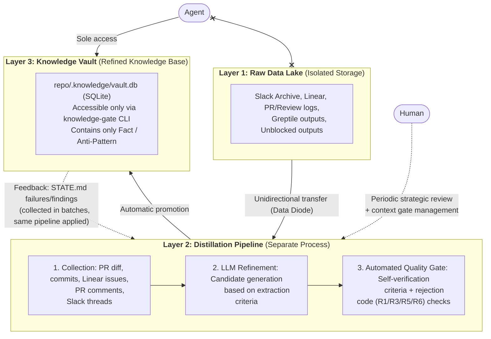

# Knowledge Distillery Implementation Design Document

**Refinement Pipeline Design — Rails + Claude Code Reference**

> This document covers the design for implementing the philosophy defined in [Knowledge Distillery: A Knowledge Distillation System That Delivers Only the Essentials to Agents](./design-philosophy.md).

---

## 1. Overall Architecture



**Core constraint:** Agents cannot directly access Layer 1. For areas not covered in the Knowledge Vault, non-structural modifications proceed normally, while structural changes trigger the question protocol (Soft miss principle, §7.2).

---

## 2. Tool Roles

All tools are used solely for **"evidence collection," not "truth production."** Accepting tool output directly into the Knowledge Vault would break the knowledge air gap.

### 2.1 Slack Archive — Layer 1 Only, Source of Evidence

**Collection Method**

- Workspace export (JSON) — periodic exports available depending on plan/permissions
- API: `conversations.history` (channels), `conversations.replies` (threads), `chat.getPermalink` (links)

**Operational Rules**

- **Stored in Layer 1 only.** Raw Slack dumps are prohibited in the Knowledge Vault.
- Select only channels where code-related discussions actually occur (others have low information value)
- DMs/private channels are excluded by default. Use only through an approval-based workflow when necessary.

**Position in the refinement pipeline:** When a Slack thread linked to a PR exists, only that thread is included in the Evidence Bundle

### 2.2 Linear — Anchor for Refinement, Secondary Trigger

**Role**

- Include the body/comments/status changes of issues linked to PRs in the Evidence Bundle
- Linking Slack discussions to Linear issues reduces the need to search through all of Slack

**Integration**

- Webhook: notifications on issue status changes, label additions (`decision`, `postmortem`)
- Start with read-only API keys. Principle of least privilege.
- Slack-Linear integration (creating issues from Slack + thread sync) strongly recommended

**Position in the refinement pipeline:** Collect the Evidence Bundle at the time of merging to the default branch, and enhance the bundle's quality with context from linked Linear issues.

### 2.3 Greptile — Per-PR Code Evidence Provider

**Role**

- Review PRs in the context of the entire repo to extract the meaning/risk/patterns of changes
- Provide change summaries, line comments, and suggested fixes

**Usage in the refinement pipeline**

1. **Include Greptile review results in the Evidence Bundle at PR merge** — input for extracting "new rules/anti-patterns/test strategies from this PR"
2. **Upload the Knowledge Vault as Greptile Custom Context** — detect existing rule violations early during PR review. Refined knowledge is not just "in documents" but "enforced in reviews."
3. **Automatically collect PR/comment data via API/MCP** — Distiller bundles "recently merged PRs + Greptile comments" to generate knowledge candidates

### 2.4 Unblocked — Reference Link Provider (Not a Knowledge Vault)

**Role**

- Provide **reference links** to related documents/conversations/code from cross-source searches across Slack/Linear/code
- Reduce the exploration cost of "where to look"

**Operational Rules**

- When Distiller queries Unblocked, the goal is **"collecting reference links," not "getting answers"**
- If agents query Unblocked directly and code based on results, **the air gap is broken** — prohibited
- Path: Unblocked → reference links → Distiller → verification/decomposition → Knowledge Vault

**Security**

- Data Shield: responses are scoped to the querying user's access permissions
- Restrict data source configuration changes via RBAC, leverage Audit Logs

### 2.5 git-memento — AI Session Context Capture (Layer 1 Infrastructure)

**Dependency level: Optional.** The refinement pipeline operates normally even without git-memento installed. If memento notes are absent, AI session context is simply excluded from the Evidence Bundle, and refinement proceeds with the remaining evidence (PR diff, commit messages, Linear issues, PR comments) (graceful degradation).

**Role**

- Attach AI coding session transcripts to commits via `git notes`, preserving the context of "why changes were made this way"
- `git memento commit <session-id> -m "message"` — atomically creates a commit and attaches session notes
- Provider extensibility: supports Codex, Claude Code (`MEMENTO_AI_PROVIDER=claude`)

**Storage Structure**

- `refs/notes/commits` — LLM summaries (structured via custom Summary Skill)
- `refs/notes/memento-full-audit` — full transcripts (for auditing)
- Dual storage separates "easy-to-read summaries" and "auditable originals"

**Notes Retention Policy**

- Both refs are pushed to the main repository as-is (`git memento push` pushes all `refs/notes/*`, no additional configuration needed)
- At 20 sessions/day, approximately ~1.5GB/year (30-40% with packfile compression). No practical impact on Git usage
- **Archiving after refinement completion:** Notes that the refinement pipeline has finished processing (commits associated with PRs labeled `knowledge:collected`) are archived to external storage in text format and then cleaned from the repository. The `knowledge:collected` label indicates that **both pipeline processing (vault INSERT) and Report PR creation have completed** (transitions after Report PR creation in §3.1 step B-7). Since the refined entries are the final output, the raw material (notes) does not need to persist in the repository. Storage is chosen based on the project environment (S3, GCS, NAS, separate repo, etc.)
- Cleanup: `git notes --ref=<ref> remove <commit>` + `git push --force origin refs/notes/<ref>` (same for both refs)
- Cleanup cycle of 1-3 months recommended. Long-term accumulation of notes in the repository increases git object size, degrading clone/fetch performance and approaching GitHub repository size limits (soft 1GB). Reference the `knowledge:collected` label to prevent accidental deletion of unrefined notes

**Squash merge survival**

- `git memento notes-carry --onto <merge-commit> --from-range <base>..<head>` — transfers notes from individual commits to the merge commit
- GitHub Action `mode: merge-carry` — automatic transfer upon PR merge
- Fundamentally solves the squash merge note loss problem inherent in the git trailer approach

**CI Gate (Optional)**

- `git memento audit --range main..HEAD --strict` — note coverage verification
- GitHub Action `mode: gate` — fails PR if commits without notes exist
- CI gate is enabled only in projects that have adopted git-memento. This step is skipped in projects without it

**Custom Summary Skill (Required)**

The default summary skill (Goal/Changes/Decisions/Validation/Follow-ups) produces generic summaries, so a custom skill optimized for Knowledge Distillery is written to generate summaries in a compaction context structure suitable for Fact/Anti-Pattern candidate extraction. This skill is the key component that determines evidence quality at the Layer 1 → Layer 2 boundary. See the appendix "Custom Summary Skill" for output structure and extraction rule details.

**Air gap compatibility**

- `git notes` are not fetched during `git fetch` without an explicit refspec
- If the agent runtime environment does not fetch `refs/notes/*`, the air gap is naturally maintained
- Only the refinement pipeline (Layer 2) explicitly fetches summary notes via `git fetch origin 'refs/notes/commits:refs/notes/commits'` (full-audit is not fetched)

**Security**

- Session transcripts are treated as untrusted data (injection defense built into the summary prompt)
- Full transcripts (`memento-full-audit`) exist only in Layer 1; entry to Layer 3 is prohibited

**Position in the refinement pipeline:** After notes are transferred to the merge commit via `merge-carry` at PR merge time, the summaries from `refs/notes/commits` are included as AI session context during Evidence Bundle collection.

**Reference:** [mandel-macaque/memento](https://github.com/mandel-macaque/memento)

---

## 3. Refinement Pipeline (Layer 2) Details

### 3.1 Trigger: Two-Stage Pipeline

The refinement pipeline consists of two stages: **merge-time marking** and **batch-time collection + refinement**. Since source data (PR diff, Linear issues, Slack threads, git notes) persists in its original sources after merging, only identifiers are recorded without intermediate storage, and actual collection is performed at refinement time.

**A. Merge-Time Marking (PR merge trigger, lightweight Action)**

For merged PRs, **only the identifiers** of the Evidence Bundle are extracted and recorded in the PR. No actual data collection is performed.

1. Extract Evidence Bundle identifiers from PR metadata:
   - Linear issue ID (extracted from PR title/body/commits)
   - Slack thread links (extracted from PR body or Linear issues)
   - Commit SHAs with git-memento notes attached
   - Greptile review ID (if linked)
2. Record a structured identifier list (Evidence Bundle Manifest) as a **PR comment**
3. Apply **`knowledge:pending` label** — marks as a collection target

**B. Batch Collection + Refinement (cron trigger, weekly/biweekly)**

Performs actual evidence collection and refinement for PRs with the `knowledge:pending` label.

1. Query the list of PRs with the `knowledge:pending` label
2. Read each PR's Evidence Bundle Manifest (PR comment) to confirm identifiers
3. Collect actual evidence based on identifiers (GitHub API, Linear API, git notes fetch, etc.)
4. Assemble Evidence Bundle → 1st refinement (LLM candidate extraction) → 2nd refinement (quality gate) → comparison with existing entries
5. Insert promoted entries into `.knowledge/vault.db` via `knowledge-gate _pipeline-insert` on a separate branch (domains are auto-created if not present in `domain_registry`). For manual/human-oriented loading, use `knowledge-gate add`
5.5. **Batch report file generation:** Always generate `.knowledge/reports/batch-YYYY-MM-DD.md`. Even if zero entries are promoted, a report file is generated to guarantee a git diff and ensure a Report PR can always be created
6. Commit and push vault.db changes (if any) + batch report file, then create a **Report PR** (once per batch). The PR body includes a summary of added/rejected entries (entry name, type, rejection reason). **The point at which the Report PR is merged is the L3 (Knowledge Vault) promotion point** — until merged, entries exist only on the branch and are not exposed to agents
7. Replace the processed PR's label with `knowledge:collected` (transitioned after Report PR creation to prevent a state where only the label changes but the Report PR is missing)
8. **Domain review/reorganization:** Diagnose the domain registry with `domain-report`, and review/update overcrowded/underpopulated/orphan domains (see §4.5). In the actual implementation, `domain-report` output is included in the Report PR body, so it runs before step 6 (Report PR) (see `batch-refine.prompt.md` for detailed ordering). On first run, if domains are not yet set up, execute in the order: step 1 (seed setup) → step 4 (refinement) → step 8 (domain review/reorganization)

**Benefits of deferred collection:** By collecting at batch time rather than immediately after merge, more mature experience data can be included, such as follow-up comments on Linear issues or additional Slack discussions that accumulate over time.

**Concurrency policy:** No separate locking mechanism is provided for overlapping batch runs or conflicts between mark-evidence and batch processing. Since the `knowledge:pending` → `knowledge:collected` label transition is idempotent, PRs that fail to process due to race conditions are naturally handled in the next batch. This is an intentional optimistic design, and locks can be added when operational data shows that contention becomes a real problem.

**Secondary triggers (optional, for batch priority adjustment)**

- Linear issues with `decision` / `postmortem` / `incident` labels added
- Threads in specific Slack channels containing decision tags/emojis (anchor to Linear when possible)

### 3.2 Evidence Bundle: Unit of Collection

The input to refinement is not "a dump of conversation logs" but a **structured evidence bundle**.

```
bundle_id: PR#1234 (or Linear Issue ID)

Pre-collected evidence:
├── Commit messages
├── Linked Linear issue body/comments/status changes (when linked issues exist)
└── PR comments (review discussions) — marked `no_review_discussion` if absent

On-demand evidence (persisted in git — not passed directly to prompts):
└── PR diff — since it persists in git history, the extraction LLM selectively queries only the needed changes using tools (`gh pr diff`, `git diff`, `git show`). Injecting the entire diff into the prompt is an anti-pattern.

Optional evidence:
├── AI session context (git-memento notes) — see §2.5
│   ├── refs/notes/commits: summaries structured via custom Summary Skill
│   └── refs/notes/memento-full-audit: full transcripts (for auditing)
├── Linked Slack threads
├── Greptile review results (summaries/line comments/suggested fixes)
└── Unblocked reference links (related document/conversation references)

If pre-collected evidence cannot be secured at batch collection time, the PR's label is changed to `knowledge:insufficient` and it is not passed to the candidate generation stage. On-demand evidence (PR diff) always exists in git history, so it is not subject to sufficiency determination.

Retention policy for deferred PRs:
- **Automatic retry**: On the next refinement cycle, `knowledge:insufficient` PRs are re-collected to attempt evidence supplementation
- **SLA**: If required evidence is not secured within a maximum of 2 refinement cycles (~2-4 weeks), transition to `knowledge:abandoned`
- **Escalation**: PRs expected to have high value (linked to secondary trigger issues) escalate to humans for evidence supplementation
- **Reporting**: Deferred/abandoned PR status is included in the air gap review report
```

### 3.3 1st Refinement: LLM Extracts Candidates

**Extraction principle: No simple summarization, type-based decomposition**

The LLM extracts the following two types of candidates from the Evidence Bundle.

| Type | Description | Example |
|---|---|---|
| **Fact** | Rules agreed upon by the team, backed by code/tests/operations | "Payment transactions must only be performed in Service Objects" |
| **Anti-Pattern** | Failed approach + failure mechanism + non-repetition conditions + alternative | "External API call in AR callback → DB lock failure. Alternative: Service Object" |

The LLM determines whether to generate candidates based on **extraction criteria**. Confidence levels are not explicitly classified.

- **Extraction targets**: Merged PRs + CI passed, decisions with confirmed review consensus, rules explicitly documented in documents/ADRs
- **Extraction exclusions**: Hypotheses at the Slack discussion level, ongoing experiments, opinions without explicit consensus

Information with weak evidence is either not generated as a candidate or has its evidence field sparsely populated, and is subsequently filtered objectively by the quality gate (R1/R3/R5/R6).

Additionally, the LLM:
- Flags **conflicts/duplicates** with the existing Knowledge Vault
- **Pre-filters** duplicate/unnecessary/low-value information

#### Candidate Required Schema

```yaml
# Candidate Required Schema
id: "kebab-case slug (generated by LLM based on title, 3-5 words). On conflict (UNIQUE constraint), append numeric suffix (e.g., payment-service-object-2)"
type: fact | anti-pattern
title: "Entry title (maps to entries.title, NOT NULL)"
claim: "Core claim in one line"
body: "Detailed content — generated by LLM following §4.3 body template (maps to entries.body, NOT NULL)"
applies_to:
  domains: ["Assigned via LLM domain derivation (cli.md §6). References existing domain registry and domain_paths, but final judgment is made by the LLM. If no matching domain exists, propose a new domain"]
evidence:
  - { type: pr|linear|slack|greptile|memento, ref: "reference" }
alternative: "Alternative (required for MUST-NOT)"
conflict_check: "Conflict status with existing vault (for warning tags, not a rejection reason)"
considerations: "Considerations — concerns, caveats, applicability conditions, etc. If none, explicitly state 'No special considerations'"
```

Candidates that do not meet this schema are eliminated before entering the automated quality gate.

**Implementation tool: Claude Code native (Skill + Subagent)**

The "pass Evidence Bundle through LLM to extract candidates" step of 1st refinement is implemented using Claude Code's Skill system. The Skill file itself is the extraction prompt, executed via `anthropics/claude-code-action` in GitHub Actions. Since Claude Code itself is the LLM, no separate API wrapper or external prompt runner is needed.

> **Reason for not adopting Fabric CLI:** [Fabric](https://github.com/danielmiessler/fabric) is a prompt runner that manages system prompts as files and calls LLM APIs via CLI. In this project, Fabric's role would be limited to "one-shot execution of an extraction prompt," but in the Claude Code native path, the Skill is the prompt and the LLM is itself, so Fabric provides no value. It would only add unnecessary complexity: Go binary dependency, separate API key setup, glue code for parsing Fabric output, and shell/Rake orchestration.

When designing the extraction prompt, reference [obra/claude-memory-extractor](https://github.com/obra/claude-memory-extractor)'s multi-dimensional extraction structure (Five Whys, psychological motivations, prevention strategies, uncertainty notation). In particular, the constraint "do not force lessons when evidence is insufficient" aligns with this design's extraction criterion of "extract only confirmed decisions, not hypotheses." However, since it is a Node.js/TypeScript-based tool for Claude CLI local logs only, it is leveraged through prompt pattern borrowing rather than direct integration. Furthermore, prompts are designed separately on the premise that the coding agent and Distiller have different tasks (acting in context where decisions are in progress vs. distilling conclusions from completed results).

**The output of 1st refinement is an intermediate artifact passed to the automated quality gate.**

### 3.4 2nd Refinement: Automated Quality Gate Enforces Cherry-Pick Criteria

The candidate list left by the LLM is verified at the refinement pipeline's automated quality gate. Rather than a process where humans approve individual entries, the pipeline uniformly applies defined criteria and promotes only passing entries to the Knowledge Vault.

- Automatically **selects** only high-value core information
- Automatically **eliminates** unnecessary or incorrect information
- Automatically **promotes** only passing entries to the Knowledge Vault

**The human role is not individual approver, but periodic strategic reviewer and context gate manager.**

**Cherry-pick approval criteria (automated pipeline verification criteria, all must be met for promotion)**

- Evidence sufficiency: Do the information sources linked in evidence (PR diff, review comments, Linear issues, etc.) contain supporting evidence or consensus among contributors for the claim?
- Scope: Is a domain specified in `applies_to`? Since domains are always assigned via LLM domain derivation (cli.md §6), there is no separate rejection code — if no matching domain exists, a new domain is added as active (presumption of innocence principle: post-correction is possible, over-blocking cost > acceptance cost)
- Prohibition completeness: Are alternatives provided alongside MUST-NOT statements?
- Considerations deliberation: Does the considerations field record concerns/caveats/applicability conditions, or explicitly state that none apply? (empty values not allowed)

**Rejection codes (used by the automated quality gate — block loading when not met)**

- `R1_EVIDENCE_INSUFFICIENT`: Insufficient supporting evidence or contributor consensus in the evidence sources for the claim
- `R3_NO_ALTERNATIVE`: Prohibition without an alternative
- `R5_UNCONSIDERED`: considerations field is empty or shows no evidence of deliberation
- `R6_DUPLICATE`: A semantically identical entry detected during the existing entry comparison step

> **PoC flexibility note:** R3 (rejection of prohibitions without alternatives) and R5 (rejection for missing considerations) operate as guidelines during the PoC phase and will be progressively strengthened based on operational data.

**Existing entry comparison (R6 + conflict detection integrated):** As the final step of the quality gate, new candidates are compared against related entries in the existing Knowledge Vault.

1. **Narrow comparison scope:** Filter existing active entries by the new candidate's domains (`entry_domains`) to extract only related entries
2. **LLM 3-class judgment:** Pass the candidate and related existing entries through the LLM to classify each pair
   - **Duplicate:** Semantically identical claim → `R6_DUPLICATE` rejection, loading blocked
   - **Conflict:** Contradictory directions or contradiction → append-only loading allowed, record conflict pair (new entry + related existing entry) in `curation_queue`
   - **Unrelated:** No relationship → pass
3. **Conflict handling:** Conflicts are high-value signals requiring human intervention, making them the top priority for human curation review

When there are no entries to compare (first entry in a new domain area), this step is skipped.

---

## 4. Knowledge Vault (Layer 3) Design

### 4.1 Storage Location and Format

- **Storage:** `repo_root/.knowledge/vault.db` (SQLite)
- **Format:** Single SQLite file. No dual management of Markdown + YAML frontmatter.
- **Principle:** Append-only oriented. The body of entries (claim, body, evidence) is not modified after INSERT as a default. Management metadata (status, domain mapping) allows UPDATE during curation and domain changes. The system does not enforce append-only, and exceptional body modifications are permitted, but the default behavior is addition (INSERT). Selecting what is correct is performed when humans curate on a non-periodic basis.
- **Deployment:** Committed as a binary to the master branch. Using the latest Knowledge Vault should require only `git pull`.
- **Git binary tradeoff:** Git cannot apply delta diffs to binary files. Therefore, every time vault.db changes, a new snapshot of the entire file is stored in `.git/objects`, and content changes cannot be verified via `git diff` (only "Binary files differ" is displayed). This means the repository grows linearly by commit count × file size.
  - **Current assessment:** vault.db is in the tens-to-hundreds KB range, and commit frequency is weekly/biweekly batches, so at most tens of times per year. Cumulative storage of several to tens of MB per year is negligible for modern Git repositories, and the deployment simplicity benefit (using the latest vault with just `git pull`) outweighs this cost.
  - **Transition point:** When vault.db exceeds several MB in size or noticeably impacts clone time. See [Deferred Item A-1](#a-1-vaultdb-deployment-method-transition) for transition candidates and details.
- **De facto enforcement of context gate:** Since the format is binary, an LLM reading it via `Read` would get meaningless data. Access is only possible through the knowledge-gate CLI. This is incidental isolation provided by the binary format's characteristics, separate from convention-based access prohibition.
   > **Note:** In the design philosophy (§4.2), "air gap" refers to the structure that isolates the history archive (raw data) from the agent's access path. The binary format of vault.db, separately from this, **de facto enforces that the context gate (knowledge-gate CLI) is the sole access path between the vault and agents**. The air gap (raw data isolation) and the context gate (selective delivery of refined knowledge) are separate mechanisms operating at different boundaries.

#### 4.1.1 Schema Migration Strategy

Since vault.db is deployed as a binary on the master branch, schema changes must automatically migrate the existing vault.db. **`PRAGMA user_version`-based migration** is adopted.

**How it works:**
1. Specify the current version number in the schema DDL (e.g., `PRAGMA user_version = 1;`)
2. When the knowledge-gate CLI or refinement pipeline accesses vault.db, query the current version via `PRAGMA user_version`
3. If current version == latest version, return immediately (fast path)
4. If current version < latest version, execute `ALTER TABLE` and other migrations sequentially
5. After migration, set `PRAGMA user_version = {latest version}`

**Advantages:**
- Built-in SQLite feature, no external migration tools needed
- Maintains vendor-neutral principle (works with any sqlite3 CLI)
- Idempotency guaranteed (version comparison prevents duplicate execution)

**Version management:**
- Schema version is linked to the Knowledge Vault version. Schema breaking changes require incrementing the Knowledge Vault major version.
- Migration paths are documented in the design document or a separate migration guide.

### 4.2 Knowledge Vault Schema

The Knowledge Vault has **no metadata representing confidence levels.** Existing here means it has passed through the refinement pipeline. This is not a guarantee of absolute truth, but knowledge refined to a level where agents can trust it and act upon it.

```sql
PRAGMA user_version = 1;
PRAGMA foreign_keys = ON;

-- Knowledge entries (Fact / Anti-Pattern)
CREATE TABLE entries (
  id              TEXT PRIMARY KEY,
  type            TEXT NOT NULL CHECK(type IN ('fact', 'anti-pattern')),
  status          TEXT NOT NULL DEFAULT 'active'
                  CHECK(status IN ('active', 'archived', 'deprecated', 'superseded')),
  title           TEXT NOT NULL,
  claim           TEXT NOT NULL,        -- TL;DR one-liner (MUST/MUST-NOT core)
  body            TEXT NOT NULL,        -- Detailed content (background, rules, alternatives, Stop Conditions)
  alternative     TEXT,                 -- Required for MUST-NOT: alternative
  considerations  TEXT NOT NULL,        -- Considerations (concerns, caveats, applicability conditions). 'No special considerations' if none
  archived_at     TEXT,                 -- Status transition timestamp
  archive_reason  TEXT,                 -- Why it was removed (preserves curation context)
  created_at      TEXT NOT NULL DEFAULT (datetime('now')),
  updated_at      TEXT NOT NULL DEFAULT (datetime('now')),
  CHECK(type != 'anti-pattern' OR alternative IS NOT NULL),
  CHECK((status = 'active' AND archived_at IS NULL) OR (status IN ('archived','deprecated','superseded') AND archived_at IS NOT NULL))
);

-- Domain dictionary (controlled vocabulary)
CREATE TABLE domain_registry (
  domain      TEXT PRIMARY KEY,
  description TEXT NOT NULL,
  status      TEXT NOT NULL DEFAULT 'active'
              CHECK(status IN ('active', 'deprecated')),
  created_at  TEXT NOT NULL DEFAULT (datetime('now'))
);

-- Domain-path mapping (1-depth hierarchy)
CREATE TABLE domain_paths (
  domain  TEXT NOT NULL REFERENCES domain_registry(domain),
  pattern TEXT NOT NULL,  -- Directory prefix: 'app/services/payments/', 'tests/'. Use '*' for global domains
  PRIMARY KEY (domain, pattern)
);

-- Entry-domain mapping
CREATE TABLE entry_domains (
  entry_id TEXT NOT NULL REFERENCES entries(id),
  domain   TEXT NOT NULL REFERENCES domain_registry(domain),
  PRIMARY KEY (entry_id, domain)
);

-- Evidence links
CREATE TABLE evidence (
  entry_id TEXT NOT NULL REFERENCES entries(id),
  type     TEXT NOT NULL CHECK(type IN ('pr', 'linear', 'slack', 'greptile', 'memento')),
  ref      TEXT NOT NULL CHECK(length(trim(ref)) > 0),
  PRIMARY KEY (entry_id, type, ref)
);

-- Human decision queue (entries requiring human intervention, such as conflicts)
CREATE TABLE curation_queue (
  id           TEXT PRIMARY KEY,
  type         TEXT NOT NULL,  -- conflict
  entry_id     TEXT NOT NULL REFERENCES entries(id),  -- Newly loaded entry
  related_id   TEXT REFERENCES entries(id),            -- Related existing entry
  reason       TEXT NOT NULL,                          -- Reason for queue entry
  status       TEXT NOT NULL DEFAULT 'pending'
               CHECK(status IN ('pending', 'resolved')),
  resolved_at  TEXT,
  created_at   TEXT NOT NULL DEFAULT (datetime('now'))
);

-- Full-text search (FTS5) — excludes id, external content mode
CREATE VIRTUAL TABLE entries_fts USING fts5(
  title, claim, body,
  content='entries',
  content_rowid='rowid'
);

-- FTS5 sync triggers
CREATE TRIGGER entries_ai AFTER INSERT ON entries BEGIN
  INSERT INTO entries_fts(rowid, title, claim, body)
  VALUES (new.rowid, new.title, new.claim, new.body);
END;

CREATE TRIGGER entries_ad AFTER DELETE ON entries BEGIN
  INSERT INTO entries_fts(entries_fts, rowid, title, claim, body)
  VALUES ('delete', old.rowid, old.title, old.claim, old.body);
END;

CREATE TRIGGER entries_au AFTER UPDATE ON entries BEGIN
  INSERT INTO entries_fts(entries_fts, rowid, title, claim, body)
  VALUES ('delete', old.rowid, old.title, old.claim, old.body);
  INSERT INTO entries_fts(rowid, title, claim, body)
  VALUES (new.rowid, new.title, new.claim, new.body);
END;

-- Indexes
CREATE INDEX entries_status_idx ON entries(status);
CREATE INDEX entry_domains_domain_idx ON entry_domains(domain, entry_id);
CREATE INDEX domain_paths_pattern_idx ON domain_paths(pattern);
CREATE INDEX curation_queue_status_idx ON curation_queue(status, created_at);
```

**Schema design principles:**

- **Domain-only mapping:** The `entry_domains` table only references domains registered in `domain_registry`. File path-based mapping is not used; file path → domain resolution is performed at query time through prefix matching in `domain_paths`.
- **Domain registry lifecycle:** `domain_registry` is a controlled vocabulary dictionary that maintains domain consistency. Domain creation is allowed, but proliferation is managed through smart merging. After each refinement batch, density adequacy is assessed by referencing AGENTS.md, directory structure, and existing/new entries, and domains are merged/split/created/deprecated. On the first run, seed setup is performed before refinement.
  - `deprecated`: Domains no longer used due to merging/splitting.
- **Bulk domain correction when domains change:** When domains are merged/split, domains of affected entries are bulk-UPDATE'd to the new domain. Since domains are "classification" not "content" of entries, this is explicitly permitted as an exception to the append-only principle.
- `domain_paths` is an N:N mapping between domains and directory prefixes. The `pattern` column is a directory prefix string ending with `'/'`, and does not use globs or regex. Once a path pattern is registered, all subpaths starting with that pattern are matched (pure prefix matching). Both `query-paths` and `domain-resolve-path` include global domains (`*`) in results. A single file can belong to multiple domains, and a single domain can cover multiple prefixes. When a new service is added, simply adding domain-path relationships automatically applies all related entries.
- `alternative` is required for Anti-Pattern types. The `CHECK` constraint and quality gate R3 double-verify this.
- Consistency between `status` and `archived_at` is enforced via `CHECK` constraints — active requires archived_at to be NULL; archived/deprecated requires archived_at to be NOT NULL.
- Composite PK and type CHECK on `evidence` structurally prevent duplicate evidence insertion and unsupported types.
- FTS5 does not index `id` (eliminates search noise). INSERT/DELETE/UPDATE triggers synchronize with the entries table.
- `status` transitions only from `active` → `archived` / `deprecated` (append-only, see §5).

#### FTS5 Korean Search Limitations and Mitigations (PoC)

SQLite FTS5's default tokenizer operates on whitespace/punctuation-based splitting and does not support Korean morphological analysis. This limits the full-text search quality for Korean text (e.g., searching for a Korean word may not match compound words containing it). In the PoC phase, this limitation is acknowledged and its impact is contained through the following mitigations:

1. **Domain-based lookup is the primary discovery path:** The agent's default query pattern is `query-paths` → `domain-resolve-path` → `query-domain`, and FTS5 `search` is a secondary path. Since domain-based lookup does not depend on FTS5, the impact of Korean limitations is contained
2. **Partial mitigation through English technical terms:** Not only technical terms (Service Object, ActiveRecord, callback, etc.) but also business terms and in-service terms (Payment, Subscription, Fulfillment, etc.) have code implementations, so English notation is natural. If terms likely to be used as search keywords in claim/title/body are written in English, the FTS5 default tokenizer works sufficiently. However, consistent Korean-English term correspondence may require a project-specific glossary — this can be incrementally built during operation via the domain registry's description field or separate term mapping
3. **Leveraging the claim field:** Explicitly including key terms in the `claim` field increases FTS5 matching probability
4. **Future morphological analyzer integration path:** Korean search quality can be improved by integrating a mecab or kiwi-based FTS5 custom tokenizer. This will be initiated when the FTS5 miss rate becomes problematic during PoC operation
5. **Miss rate monitoring during PoC operation:** Observe usage patterns and miss frequency of the `search` command to determine the necessity of morphological analyzer adoption

**Entry example (Fact):**

| Field | Value |
|---|---|
| id | `payment-service-object` |
| type | `fact` |
| title | Payment transactions must only be processed in Service Objects |
| claim | MUST: Payment transactions (authorization/cancellation/refund) must only be performed in Service Objects. MUST-NOT: External payment API calls from AR callbacks/controllers are prohibited. |
| body | (See §4.3 body template — Background: Context of failures due to scattered payment logic and team consensus process. Details: Target operations, callback prohibition scope, testing approach. Rejected Alternatives: Concern modules, event-based async. Stop Conditions: When extending beyond payment domain, when introducing multi-PG) |
| alternative | Use PaymentService |
| considerations | Whether to apply the same pattern in non-payment domains (shipping, settlement, etc.) is undecided. Currently limited to the payment domain. |
| entry_domains | `{payment}` |
| evidence | `{pr, PR#1234}`, `{linear, LIN-123}` |

**Entry example (Anti-Pattern):**

| Field | Value |
|---|---|
| id | `no-ar-callback-external-api` |
| type | `anti-pattern` |
| title | Do not call external APIs from AR callbacks |
| claim | MUST-NOT: External API calls from AR callbacks (after_save, etc.) are prohibited. External calls within DB transactions cause lock holding + timeout → failure. |
| body | (See §4.3 body template — Background: Connection pool exhaustion failure caused by PG API calls in after_save. Details: Prohibited callback list, scope of prohibited behavior, detection methods. Open Questions: Whether gRPC calls apply, whether Turbo broadcast is affected. Stop Conditions: Confirm priority when refactoring existing callbacks, confirm when external API boundary is unclear) |
| alternative | Separate into PaymentVerificationService. Call asynchronously or explicitly after AR save. |
| considerations | Whether gRPC calls between internal microservices are subject to the same constraints as external APIs requires further discussion. |
| entry_domains | `{activerecord}`, `{payment}` |
| evidence | `{pr, PR#1201}`, `{linear, INC-45}` |

### 4.3 Addressing Positional Bias: Output Structure

Considering Lost in the Middle positional bias, placement rules are applied to the knowledge-gate CLI output and `body` field structure:

- **CLI output (claim)**: The core one-liner that the agent reads first. MUST/MUST-NOT essentials.
- **Top of body**: Background, detailed rules (primacy effect — core context as first impression)
- **Middle of body**: Rejected alternatives, Open Questions (supplementary information)
- **Bottom of body**: Stop Conditions (recency effect — concluding with action guidelines)

> `considerations` is an independent field returned by the CLI alongside `claim`, so it is not restated within body.

#### body Field Structure Template

The body is structured according to the template below. Section headings are fixed in English to ensure token efficiency and LLM native interpretation performance. Body content is written in the language primarily used in evidence and conversations (Korean for Korean teams, English for English teams).

```markdown
## Background
[Fact: context and rationale behind the agreed rule]
[Anti-Pattern: what happened and why it failed]

## Details
[specific conditions, exceptions, scope, code-level constraints beyond the claim]
[if applicability conditions exist, state them explicitly:
 "applies only when ~", "does not apply to ~"]

## Rejected Alternatives
[approaches considered but not adopted, and why. omit section if none]

## Open Questions
[unresolved items requiring further discussion. omit section if none]

## Stop Conditions
[conditions under which the agent must stop and ask a human before proceeding.
 omit section if none]
```

**Required sections:** Background, Details
**Optional sections:** Rejected Alternatives, Open Questions, Stop Conditions (omit the section entirely if not applicable)

**Content principles:**
- Do not include information that agents can discover through repo scanning (directory structure, tech stack, existing code patterns)
- If applicability conditions/exceptions exist, they must be stated explicitly in Details — rules with stated conditions are high-value entries
- Keep only confirmed content in claim and Details; separate unresolved items into Open Questions

### 4.4 Guardrail Principles

- **"Prohibitions without alternatives" are prohibited.** All MUST-NOTs must include an alternative.
- **Include only information that agents cannot discover on their own.** Do not include content discoverable through repo scanning (directory structure, tech stack).
- **Separate unresolved/under-review items into the body's Open Questions section.** Keep only confirmed content in claim and rule body.

### 4.5 Resolving Cross-Cutting Concerns: Unified Scoping Model

**Problem:** The previous `file_scopes` direct mapping model caused path explosion for cross-cutting concerns and could not handle rules that are fundamentally unsuitable for path-based representation (security policies, testing practices, etc.). Automatic path prefix extraction also failed to produce meaningful results beyond single-directory changes.

**Resolution:** The domain-only model from §4.2 (`entry_domains` + `domain_registry` + `domain_paths`) structurally resolves this problem:

- **Domain-only mapping:** Entries have only domains. File path → domain resolution is performed at query time through `domain_paths`. The path prefix extraction problem is fundamentally eliminated.
- **Controlled vocabulary and lifecycle of `domain_registry`:** After each refinement batch, domain density adequacy is assessed by referencing AGENTS.md, directory structure, and entries, and domains are merged/split/created/deprecated. If no matching domain exists at refinement time, a new domain is added as `active`, and if unnecessary, it is merged/deprecated in subsequent domain reviews.

**Domain proliferation allowed + smart merging:** The barrier to domain creation is lowered, but proliferation is managed through post-hoc merging. Excessive pre-emptive control harms the flexibility of the domain model, so the principle of "keep creation open, strengthen merging" is followed.

Smart merging workflow:
1. `knowledge-gate domain-report` — surface underpopulated/similar domain candidates
2. LLM performs semantic similarity analysis — determines merge targets based on name, description, and entry content
3. `knowledge-gate domain-merge <source> <target>` — bulk transfer entries and domain_paths
4. `knowledge-gate domain-deprecate <domain>` — deprecate source after merge completion
5. Include merge results in the Report PR to notify humans

- **N:N mapping of `domain_paths`:** A single file can belong to multiple domains, and a single domain can cover multiple path patterns. When a new service is added, simply adding domain-path relationships automatically applies all related entries.

This model achieves the value that the Graph DB's Concept intermediate layer was originally intended to provide (reducing the Entry × Path product, automatic propagation) with a pure relational model.

**Domain management tools:** Domain registry changes (merge/split/add/deprecate) and pattern management are performed through standardized knowledge-gate CLI commands. The LLM makes judgments, and the CLI mechanically manipulates the DB to ensure consistency. The `domain-report` command surfaces adjustment candidates based on density evaluation criteria (overcrowded/underpopulated/orphan/underused new/overextended patterns/structural mismatch), and batch-refine adds batch-specific "uncovered pattern" findings from recent PR diffs to the human report. See [docs/cli.md §3-4](cli.md#3-domain-management-commands-for-refinement-pipeline--llm-skills) for tool details.

**Domain setup procedure (§3.2 Step B, item 8):**

1. Run `knowledge-gate domain-report` — diagnose current state
2. LLM references the report + AGENTS.md + directory structure + existing/new entries to make adjustment decisions
3. Execute CLI commands based on decisions: `domain-merge`, `domain-split`, `domain-add`, `domain-paths-set`, etc.
4. On first run (domains not yet set up): LLM analyzes the codebase and bulk-registers seed domains + patterns via `domain-add` + `domain-paths-set`

**Domain derivation principle:** Domain assignment for candidates is performed by the LLM. Path patterns in `domain_paths` are reference material, not mechanical matching rules — path matching alone cannot judge cross-cutting concerns, business context, or appropriate abstraction levels. The extraction LLM comprehensively references the PR change context, existing domain registry, and `domain_paths` patterns to determine domains. To this end, **domain definition guidelines** that clarify the definition level of domains must be included in the extraction prompt (extract-candidates Skill):

- **Domain granularity:** The unit at which the team makes independent decisions. "payment" is appropriate, but over-splitting into "payment-refund" and "payment-charge" should be avoided
- **Cross-cutting concerns:** Rules not confined to a specific directory (security policies, testing practices, error handling, etc.) are classified as technical cross-cutting domains
- **Naming convention:** Lowercase kebab-case, distinguishing business domains from technical domains (e.g., `payment` vs `activerecord`)
- **New domain proposals:** When no existing domain matches, the LLM proposes in `{name, description, suggested_patterns}` format. batch-refine applies via `domain-add` + `domain-paths-set`

**Transition point:** When the current model is no longer sufficient, consider transitioning to a graph DB. See [Deferred Item B-1](#b-1-scoping-model-graph-db-transition) for details.

---

## 5. Knowledge Vault Management Lifecycle

### 5.1 Entry Policy: Conservative on Addition, Append-Only

- Information that has not gone through the refinement pipeline cannot enter
- Only Fact or Anti-Pattern types are allowed
- Entries with undeliberated considerations are not admitted — entries with documented concerns/caveats/applicability conditions, or entries where their absence is confirmed, are treated as high-value entries
- **Append-only oriented:** The body of entries (claim, body, evidence) is not modified after INSERT as a default. Exceptional modifications are permitted, but addition is the default behavior.

### 5.2 Human Curation (Non-Periodic)

Selecting only what is correct from entries accumulated in the Knowledge Vault is **performed by humans on a non-periodic, as-needed basis**. This is not a periodic obligation but curation driven by need.

**Curation tasks:**
- Prioritize reviewing `pending` items in the `curation_queue` — entries requiring human decision-making such as conflicts are recorded alongside related entries
- Review accumulated entries via `SELECT`
- Transition incorrect, duplicate, or low-value entries to `archived` or `deprecated` status
- Remove high-risk security/incident entries immediately upon discovery

### 5.3 State Management: Transition, Not Deletion

Entries are not deleted but have their status transitioned to preserve history. Archived/deprecated entries can serve as reference material during the human curation process.

**State flow:**

```
Pipeline INSERT → active
                      ↓
        Human curation: active → archived  (incorrect/duplicate/low value — restorable)
                             → deprecated (no longer valid — historical value only)
                      ↓
        Restore if needed:  archived → active
                      ↓
        Repo cleanup:    deprecated → DELETE (optional, for long-term accumulation)
```

- **archived**: "Not currently used but not incorrect" — possibility of restoration
- **deprecated**: "No longer true" — value only as history
- knowledge-gate CLI returns only `WHERE status = 'active'`. Archived/deprecated entries are not exposed to agents.
- The Knowledge Vault growing in size is itself a risk — monitor the active entry count.

---

## 6. Feedback Loop (Operational Direction)

> The feedback loop is an operational direction for effectively running Knowledge Distillery, not an architectural core but an operational guideline.

Failure patterns or issues discovered by agents during work can be used as input for the next refinement cycle.

**Core constraints:**

| Constraint | Description |
|---|---|
| **Same process** | Back-flowed information must go through the same refinement pipeline (LLM autonomous refinement + quality verification) |
| **Batch processing** | Not real-time backflow. Collected and processed per refinement cycle |
| **Duplicate detection** | Content identical to existing Knowledge Vault entries or previous feedback is automatically eliminated |

Agents are not allowed any path to directly modify the Knowledge Vault — any path that bypasses the refinement pipeline breaks the air gap. Using agent work status records (STATE.md, etc.) as the input medium for feedback is recommended. See [Deferred Item A-2](#a-2-feedback-loop-backflow-path-detailed-design) for detailed backflow path design.

---

## 7. Agent Runtime Policy

### 7.1 Read Only the Knowledge Vault

The agent's sole knowledge source is the Knowledge Vault (`.knowledge/vault.db`) accessed through the `knowledge-gate` CLI.

- If agents directly query Slack/Unblocked/Linear, the air gap is broken.
- If needed information is not in the Knowledge Vault, respond according to the change scope per the Soft miss principle (§7.2).

### 7.2 Soft Miss Principle

A miss (no matching result) from the Knowledge Vault is a normal state. The vault does not cover every code path, and a miss itself does not block agent work. Instead, **the response varies based on the structural scope of the change**:

- **Non-structural modifications** (bug fixes, local refactoring, changes within existing patterns): Proceed normally while maintaining existing code structure
- **Structural changes** (adding new modules, architectural changes, introducing new patterns): Confirm intent with a human and record in `STATE.md` that "judgment was deferred due to no related information in the Knowledge Vault" → trigger §7.3 question protocol

### 7.3 Question Protocol

When a question is needed outside the Knowledge Vault scope, record and communicate in the following format.

```yaml
question_type: "scope_gap | conflict | risk_check"
blocking_scope: "Impact scope (files/modules/features)"
needed_decision: "Decision that a human must make"
fallback: "Safe default behavior to maintain until answer is received"
evidence_link:
  - "Related PR/issue/log"
```

Questions are left in both `STATE.md` and review comments for reuse as input in the next refinement cycle.

### 7.4 Relationship with CLAUDE.md / AGENTS.md

CLAUDE.md defines the agent's **session-level behavioral rules** (commands, testing methods, prohibitions), while the Knowledge Vault contains **domain-level knowledge** (architecture decisions, anti-patterns, verification criteria).

Add a Knowledge Vault section to CLAUDE.md (or equivalent agent configuration file) to enforce that the agent references the Knowledge Vault. See §7.5 for specific code blocks and Skill templates.

### 7.5 Context Gate: knowledge-gate Skill + CLI

The context gate is the interface through which agents query relevant rules before modifying code. The **knowledge-gate CLI** (shell script, at Plugin's `scripts/knowledge-gate`) queries SQLite, and the **agent Skill file** (Plugin's `skills/knowledge-gate/SKILL.md`) provides the query protocol.

> **Detailed spec:** See **[docs/cli.md](cli.md)** for the full CLI command list, SQL implementation, and domain management/report commands.

#### Design Principles

- **Vendor-neutral orientation (runtime) / Claude-first (deployment)**: Agent runtime commands use only `sqlite3` (pre-installed) to maintain vendor neutrality. Pipeline/management commands additionally require `jq` (separate installation needed). Deployed as a Claude Code Plugin, but the CLI itself can be executed from any agent
- **Context gate enforcement**: Agents cannot directly `Read` `.knowledge/vault.db` (binary). The knowledge-gate CLI is the sole access path (see §4.1)
- **Domain matching**: File paths are resolved to domains via `domain_paths`, then entries for those domains are queried
- **Soft miss principle**: When there are no matching results, non-structural modifications proceed normally maintaining existing code structure. The §7.3 question protocol is triggered only for structural changes (see §7.2)
- **Standardized DB manipulation**: The LLM makes judgments, and the CLI manipulates the DB. Direct SQL execution is prohibited.

#### Command Overview

| Category | Command | Purpose |
|---|---|---|
| **Knowledge query** | `query-paths`, `query-domain`, `search`, `get`, `list` | Agent queries rules before code modification |
| **Knowledge loading** | `add` | Add entries (for manual and pipeline loading). Required field validation + vault.db INSERT |
| **Domain query** | `domain-info`, `domain-list`, `domain-resolve-path` | Domain details/reverse lookup |
| **Domain management** | `domain-add`, `domain-merge`, `domain-split`, `domain-deprecate` | Domain registry changes (for refinement pipeline) |
| **Pattern management** | `domain-paths-set`, `domain-paths-add`, `domain-paths-remove` | Domain-path mapping management |
| **Report** | `domain-report` | Density evaluation + adjustment candidate surfacing |

#### Agent Skill

Add the following to CLAUDE.md (or equivalent agent configuration file) to enforce that the agent references the Knowledge Vault. See [docs/cli.md §5](cli.md#5-agent-skill-template) for the Skill template.

```markdown
## Knowledge Vault
- Before modifying code, query related rules with `knowledge-gate query-paths <file-path>`
- Domain-level rule query: `knowledge-gate query-domain <domain-name>`
- Domain lookup: `knowledge-gate domain-info <domain-name>`, `domain-resolve-path <path>`
- MUST/MUST-NOT rules from related entries must be strictly followed
- For structural changes in areas without related rules, confirm with a human first
- Do not directly read files in the .knowledge/ directory
```

> **Path resolution:** The `knowledge-gate` CLI is located at the Plugin's `scripts/knowledge-gate`, and is invoked within Skills as `${CLAUDE_PLUGIN_ROOT}/scripts/knowledge-gate`. CLAUDE.md uses a shorthand form for user convenience, and actual path resolution is handled by the knowledge-gate Skill.

#### Auxiliary Path: `.claude/rules/` and Other Human-Promoted Content

`.claude/rules/` (or equivalent agent configuration directory) is an auxiliary path for delivering strategically promoted content by humans to agents. This is compatible with the context gate principle — the context gate controls **access paths to the Knowledge Vault that has gone through the refinement pipeline**, and content directly judged and promoted by humans is a legitimate path outside the refinement pipeline.

However, if this auxiliary path expands into a means of bulk-replicating Knowledge Vault content to the filesystem, the context gate's selective filtering becomes nullified. Only the highest-value behavioral guidelines selected by humans should be placed in `.claude/rules/`, not the entire vault.

---

## 8. Operations/Governance

### 8.1 Permission Minimization

| Tool | Permission Principle |
|---|---|
| Linear API | Start with read-only. Expand to minimum scope only when commenting is needed |
| Slack API | Only the minimum necessary channels/scopes. DMs/private excluded by default |
| Unblocked | Restrict data source configuration changes via RBAC. Leverage Audit Logs |
| Greptile | Read review results + upload Custom Context |

### 8.2 Security Boundary

- Agents cannot access Layer 1 (operational isolation — conceptual air gap)
- Only the refinement pipeline has permission to read Layer 1 and write to the Knowledge Vault
- Knowledge Vault changes are only possible through the refinement pipeline (append-only INSERT)

The history archive is stored in separate storage that agents do not have access to, and only the refinement pipeline reads it and delivers it unidirectionally to the Knowledge Vault (data diode principle). Convention-based access prohibition maintains this unidirectional flow, and if convention violations are observed in operational data, enforcement can be strengthened through execution environment permission controls.

### 8.3 Technical Isolation Implementation Direction (TBD)

Currently, isolation is maintained through convention-based access prohibition. The following are defense-in-depth layers that can be progressively applied when convention violations are observed in operational data.

- File boundary: Allow only the `knowledge-gate` CLI as the knowledge access path in the agent runtime. `.knowledge/vault.db` is binary, so direct Read is meaningless (see §4.1)
- Tool boundary: Separate runtime agent and Layer 1 collection tool permissions
- Network/token boundary: Do not inject Layer 1 data source tokens into runtime sessions
- Data diode boundary: Allow only Layer 1 → refinement pipeline → Layer 3 unidirectional transfer; block reverse write/query paths
- Audit boundary: Log policy violation attempts for re-review in the refinement pipeline

Specific implementation technologies will be determined after infrastructure environment is finalized. See [Deferred Item B-2](#b-2-technical-enforcement-implementation-technology-selection) for details.

---

## 9. Implementation Roadmap

The target state of the roadmap is **AI autonomous refinement + automated quality gate + human strategic oversight**. The two phases below are transitional segments for converging toward this goal.

### 9.1 Start with Manual Refinement

**Goal:** Establish Plugin structure, finalize schema, manually author a minimum of 10 Knowledge Vault entries

**Plugin build:**
- Implement `plugin.json`, `schema/vault.sql`, `scripts/knowledge-gate` CLI
- Generate `skills/knowledge-gate/SKILL.md`, `skills/init/SKILL.md` using `@creating-skills`

**Validation in adopting projects:**
- `claude plugin install` → Run `/knowledge-distillery:init` to auto-generate vault.db + CLAUDE.md block
- Select 10 PRs with recent decisions/incidents/architecture changes and manually load via `knowledge-gate add` CLI. The CLI performs required field validation (schema CHECK constraints + R3/R5 rules) to ensure manual loading also meets quality standards
- Record perceived quality changes when team members use agents

### 9.2 Transition to Automated Collection + AI Autonomous Refinement

**Goal:** Transition from human-centric manual selection to AI autonomous refinement + automated quality gate system

- GitHub webhook: Automatically collect identifiers at default branch merge (Evidence Bundle Manifest)
  - Record **identifiers** of PR diff/commit messages + linked Linear issues/comments + PR comments, with actual collection performed at batch time (see §3.1 Phase A)
- Upload collected bundles to the refinement queue at batch intervals (weekly/biweekly) for candidate generation
- Pass Evidence Bundle through LLM to generate Fact/Anti-Pattern candidates based on extraction criteria
- Verify candidates through the automated quality gate (R1/R3/R5/R6 + approval criteria) to determine promotion/elimination
- **Transitional operation:** Initially, verify automated refinement quality through sampling review, then move to strategic oversight without individual entry approval

**Implementation tool:** Deployed as a Claude Code Plugin (Skill + `anthropics/claude-code-action`). Extraction prompts are managed as Skill files within the Plugin and executed via claude-code-action in GitHub Actions batches. Extraction prompts are designed referencing the multi-dimensional structure of obra/claude-memory-extractor. See appendix for detailed implementation specifications.

Extension items beyond this design scope (evidence collection efficiency, automated validity verification, feedback loop operation, etc.) will be initiated after operational experience is accumulated. See [Deferred Items](#deferred-items) for initiation triggers and specification requirements for each item.

---

## 10. Determining Effectiveness (Operational Direction)

> The following is a directional guide for evaluating Knowledge Distillery's effectiveness. Specific target values will be finalized after baseline measurements ([Deferred Item A-4](#a-4-evaluation-target-value-finalization)).

### 10.1 Primary Assessment: User Experience

Quality changes perceived by developers using the Knowledge Vault are the top-priority signal. Observe whether agents understand context better, whether they stop repeating the same mistakes, and whether unnecessary questions have decreased. Be mindful of confirmation bias and combine with objective metrics.

### 10.2 Supplementary Metrics

| Metric | Meaning |
|---|---|
| Agent retry count | Decrease indicates direct evidence of information quality improvement |
| Agent question frequency and appropriateness | Decrease in unnecessary questions + maintenance of appropriate questions |
| Knowledge Vault entry count trend | Continuous increase only signals that removal is not working |
| Validity verification issue detection rate | High rate indicates refinement quality needs review |

---

## Appendix

- [Tool evaluation results document](./tool-evaluation.md): Document organizing adoption/non-adoption decisions and rationale
- [knowledge-gate CLI spec](./cli.md): Full CLI command list, SQL implementation, domain management/report
- [Skill design spec](./skill-prompts/README.md): Pipeline Skill prompt spec and dependency graph

### Deferred Items

> Items excluded from this design scope. Classified by two reasons.
>
> - **A. Operational data-based:** Items where decisions are only possible after actual operational data is accumulated
> - **B. Functional deferral:** Items where application is deferred as functionally excessive at this point

| ID | Item | Classification | Initiation Trigger |
|---|---|---|---|
| A-1 | vault.db deployment transition | Operational data | When DB size exceeds several MB |
| A-2 | Feedback loop backflow details | Operational data | When patterns are identified after automated refinement operation |
| A-3 | Automated validity verification | Operational data | When vault accumulates 50+ entries |
| A-4 | Evaluation target values | Operational data | When baseline measurement is complete |
| A-5 | Air gap review report | Operational data | When reporting need arises post-operation |
| A-6 | curation_queue interface | Operational data | When queue items accumulate |
| B-1 | Graph DB transition | Functional deferral | When 3-hop+ relationship traversal is needed |
| B-2 | Technical enforcement implementation | Functional deferral | When infrastructure environment is finalized |
| B-3 | Evidence collection efficiency | Functional deferral | After refinement pipeline stabilization |

#### A-1. vault.db Deployment Method Transition

**Current:** `.knowledge/vault.db` is committed as a binary to the master branch. Latest vault available with just `git pull`.

**Initiation trigger:** When vault.db exceeds several MB in size or commit frequency increases to noticeably impact clone time.

**Transition candidates:** Git LFS, shallow clone (`--depth 1`), CI artifact separate deployment

#### A-2. Feedback Loop Backflow Path Detailed Design

**Current:** Only direction defined (§6). Three core constraints established (same process, batch processing, duplicate detection).

**Initiation trigger:** When the volume and types of failure patterns actually discovered by agents become known after automated refinement operation.

**Specification needed:** STATE.md record format standardization, backflow collection triggers, agent → refinement pipeline input path

#### A-3. Automated Validity Verification + Management Cycle Automation

**Current:** Partially covered by human non-periodic curation (§5.2) and domain-report (cli.md §4).

**Initiation trigger:** When 50+ Knowledge Vault entries accumulate and manual review inefficiency becomes noticeable.

**Specification needed:** Knowledge Vault vs. codebase cross-referencing, dead letter detection, feedback loop input, structural verification automation

#### A-4. Evaluation Target Value Finalization

**Current:** Evaluation direction and supplementary metrics defined (§10). Primary assessment is user experience, with 4 supplementary metrics.

**Initiation trigger:** When initial operational baseline measurement is complete.

**Specification needed:** Specific target values for each supplementary metric, measurement methods/tools, evaluation frequency

#### A-5. Air Gap Review Report Format

**Current:** Only the necessity is mentioned. Direction to include deferred/abandoned PR status in air gap review reporting.

**Initiation trigger:** When air gap violations or reporting needs become concrete after automated refinement operation.

**Specification needed:** Report generation frequency/format, included items, generation automation

#### A-6. curation_queue Operational Interface

**Current:** Basic CLI interface implemented (`knowledge-gate curate` — interactive sequential review, see [cli.md §7](./cli.md#7-utility-commands)).

**Initiation trigger:** When items actually accumulate in curation_queue and operational patterns emerge.

**Specification needed:** Expand action types based on operational experience, batch processing mode, priority sorting, and other enhancements

#### B-1. Scoping Model Graph DB Transition

**Current:** Domain-only mapping (`entry_domains` + `domain_registry` + `domain_paths`). Pure relational model.

**Initiation trigger:** When queries not expressible with the current model are needed, such as 3-hop+ relationship traversal or inter-domain dependency graphs.

**Transition candidates:** SQLite graph extensions, separate graph DB adoption

#### B-2. Technical Enforcement Implementation Technology Selection

**Current:** Five enforcement directions (file/tool/network-token/data diode/audit boundaries) are defined (§8.3). Specific implementation technologies are undetermined.

**Initiation trigger:** When infrastructure constraints are concretized and the agent runtime environment is finalized.

**Specification needed:** Technology selection for MCP gateway/proxy/permission broker, per-environment implementation differences

#### B-3. Evidence Collection Efficiency (Greptile / Unblocked Integration)

**Current:** PR diff, Linear issues, and git-memento notes are the primary evidence sources.

**Initiation trigger:** When the refinement pipeline is stabilized and the need for evidence quality improvement is confirmed.

**Specification needed:** Automatic inclusion of Greptile PR review results, Knowledge Vault → Greptile Custom Context, Unblocked reference link collection integration, Linear webhook secondary trigger

### Deployment Format: Claude Code Plugin

Knowledge Distillery is deployed as a **Claude Code Plugin**. Installing via `claude plugin install` in an adopting project provides runtime Skills, pipeline Skills, and CLI tools as an integrated package.

#### Plugin Directory Structure

```
knowledge-distillery/
├── .claude-plugin/
│   └── plugin.json               # Plugin manifest (name, version, description)
├── skills/
│   ├── init/                     # Adopting project initial setup
│   │   └── SKILL.md              #   vault.db creation + workflows + CLAUDE.md block
│   ├── knowledge-gate/           # Runtime: agent queries vault
│   │   └── SKILL.md
│   ├── mark-evidence/            # Pipeline A: merge-time marking
│   │   └── SKILL.md
│   ├── collect-evidence/         # Pipeline B-1: evidence collection
│   │   └── SKILL.md
│   ├── extract-candidates/       # Pipeline B-2: candidate extraction
│   │   └── SKILL.md
│   ├── quality-gate/             # Pipeline B-3: quality gate
│   │   └── SKILL.md
│   ├── batch-refine/             # Pipeline B-orch: batch orchestrator
│   │   └── SKILL.md
│   └── memento-summary/          # Pre-pipeline: session summary
│       └── SKILL.md
├── scripts/
│   └── knowledge-gate            # CLI (bash + sqlite3)
├── schema/
│   └── vault.sql                 # DDL (includes PRAGMA user_version)
├── docs/                         # Design documents
│   ├── skill-prompts/            # Skill design specs (input for @creating-skills during implementation)
│   └── ...
└── README.md
```

#### Skill Execution Context

| Context | Skills | Execution Subject | Invocation Example |
|---|---|---|---|
| **Runtime** (during development) | `knowledge-gate`, `memento-summary` | Developer's Claude Code session | `/knowledge-distillery:knowledge-gate` |
| **Pipeline** (CI) | `mark-evidence`, `collect-evidence`, `extract-candidates`, `quality-gate`, `batch-refine` | GitHub Actions `claude-code-action` | `"Use skill /knowledge-distillery:batch-refine"` |
| **Initial adoption** | `init` | Developer's Claude Code session (one-time) | `/knowledge-distillery:init` |

- When the Plugin is installed at project scope (`.claude/settings.json`), Skills are also available in `claude-code-action`
- All Skills are invoked under the `knowledge-distillery:` namespace
- CLI is accessed via `${CLAUDE_PLUGIN_ROOT}/scripts/knowledge-gate`

#### init Skill

Running `/knowledge-distillery:init` in an adopting project auto-generates the following:

1. `.knowledge/vault.db` — initialized with `schema/vault.sql`
2. `.github/workflows/mark-evidence.yml` — Pipeline A workflow
3. `.github/workflows/batch-refine.yml` — Pipeline B workflow
4. Knowledge Vault section inserted into CLAUDE.md (§7.5)
5. `.knowledge/` related settings added to `.gitignore`

#### Skill File Generation Path

Prompt specs (`.prompt.md`) under `docs/skill-prompts/` are Skill design documents; actual `skills/*/SKILL.md` files are generated using the `@creating-skills` skill during implementation.

```
docs/skill-prompts/*.prompt.md  →(design input)→  @creating-skills  →(output)→  skills/*/SKILL.md
```

### Claude Code Native Implementation Reference

The entire pipeline is implemented using Claude Code native features (Skill + Subagent + claude-code-action). No separate external tools (Fabric CLI, Ruby Rake, etc.) are needed (see §3.3 for non-adoption rationale). Below are verified technical specifications.

#### Design Component Mapping

| Design Component | Reviewed Alternatives | Adopted (Claude Code Native) |
|---|---|---|
| **Deployment** | npm package, GitHub Action, template | **Claude Code Plugin** (`claude plugin install`) |
| Trigger | GitHub webhook | GitHub Actions + `anthropics/claude-code-action` |
| Evidence collection | Ruby Rake + API | Skill + `gh` CLI + MCP servers |
| LLM extraction | Fabric CLI | Skill (extraction prompt is the skill content itself) |
| Quality gate | Custom code | Subagent + hooks |
| Knowledge vault | `docs/agent_context/` | `.knowledge/vault.db` (SQLite) |
| Context gate | Custom filter | knowledge-gate Skill + CLI (`sqlite3`). `.claude/rules/` path-scoping available as auxiliary |
| Air gap (conceptual isolation) | Repository isolation | Binary DB + environment/token separation + `disallowedTools` |

Key insight: Since Claude Code itself is the LLM, a separate prompt runner (Fabric) is unnecessary. The Skill is the extraction prompt, and the entire Layer 2 pipeline can be expressed as skills + subagents + hooks. The Layer 3 context gate is implemented vendor-neutrally at runtime via knowledge-gate Skill + CLI (`sqlite3`), while deployment is Claude-first (Claude Code Plugin). In the Claude Code environment, `.claude/rules/` path-scoping can be used as an auxiliary approach.

#### MCP Server Configuration (Verified)

**GitHub MCP** — HTTP transport:
```json
{
  "type": "http",
  "url": "https://api.githubcopilot.com/mcp/",
  "headers": {
    "Authorization": "Bearer ${GITHUB_TOKEN}",
    "X-MCP-Toolsets": "pull_requests",
    "X-MCP-Readonly": "true"
  }
}
```

**Linear MCP** — stdio transport:
```json
{
  "type": "stdio",
  "command": "npx",
  "args": ["-y", "mcp-linear"],
  "env": {
    "LINEAR_API_KEY": "${LINEAR_API_KEY}"
  }
}
```

- `.mcp.json` is not committed to the repo — dynamically generated at runtime in CI workflows (air gap principle)
- Claude Code expands environment variables via `${ENV_VAR}` syntax (in headers, url, env, args, command fields)

#### GitHub Actions Workflow Patterns

```yaml
# A. Merge-time marking (lightweight — identifier extraction + PR comment + label)
on:
  pull_request:
    types: [closed]
    branches: [main, master]

jobs:
  mark-evidence:
    if: github.event.pull_request.merged == true
    steps:
      - uses: actions/checkout@v4
        with: { fetch-depth: 0 }
      - name: Write dynamic MCP config
        run: cat > .mcp.json << 'EOF'
        # ... MCP server configuration ...
        env:
          GITHUB_TOKEN: ${{ secrets.GITHUB_TOKEN }}
          LINEAR_API_KEY: ${{ secrets.LINEAR_API_KEY }}
      - uses: anthropics/claude-code-action@beta
        with:
          anthropic_api_key: ${{ secrets.ANTHROPIC_API_KEY }}
          prompt: "Use skill /knowledge-distillery:mark-evidence for PR #${{ github.event.pull_request.number }}. Extract evidence identifiers, write Evidence Bundle Manifest as PR comment, and add 'knowledge:pending' label."
          claude_args: "--allowedTools mcp__github__*,mcp__linear__*,Bash(gh:*),Read,Glob,Grep"
```

```yaml
# B. Batch collection + refinement (cron — actual evidence collection + refinement + vault.db loading)
on:
  schedule:
    - cron: '0 9 * * 1'  # Every Monday 09:00 UTC
  workflow_dispatch:       # Manual execution also allowed

jobs:
  collect-and-refine:
    steps:
      - uses: actions/checkout@v4
        with: { fetch-depth: 0 }
      - name: Write dynamic MCP config
        run: cat > .mcp.json << 'EOF'
        # ... MCP server configuration ...
        env:
          GITHUB_TOKEN: ${{ secrets.GITHUB_TOKEN }}
          LINEAR_API_KEY: ${{ secrets.LINEAR_API_KEY }}
      - uses: anthropics/claude-code-action@beta
        with:
          anthropic_api_key: ${{ secrets.ANTHROPIC_API_KEY }}
          prompt: "Use skill /knowledge-distillery:batch-refine. Find all PRs with 'knowledge:pending' label, collect evidence using each PR's Evidence Bundle Manifest, run refinement pipeline, insert into vault.db via knowledge-gate _pipeline-insert, update labels to 'knowledge:collected', and create a Report PR with change summary."
          claude_args: "--allowedTools mcp__github__*,mcp__linear__*,Bash(gh:*,sqlite3:*,git:*),Read,Write,Glob,Grep"
```

- `anthropics/claude-code-action` verified inputs: `prompt`, `claude_args`, `settings`, `anthropic_api_key`
- No `mcp_config` input — MCP must be configured via `.mcp.json`
- Phase A is a lightweight Action minimizing LLM token consumption. Phase B runs as a batch on a separate branch, modifying vault.db then creating a Report PR. When a human reviews and merges the Report PR, vault.db is reflected in the default branch

#### AI Session Context Capture: git-memento

[git-memento](https://github.com/mandel-macaque/memento) is adopted as the single path for attaching AI coding session decision context to commits.

**Operational flow:**
1. Developer commits with `git memento commit <session-id> -m "message"` or `git memento commit <session-id> --summary-skill default -m "message"`
2. git-memento collects sessions via provider CLI (`claude sessions get <id> --json`)
3. Generates structured summary via custom Summary Skill → stored in `refs/notes/commits`
4. Full transcript stored in `refs/notes/memento-full-audit`
5. Upon PR merge, `merge-carry` action transfers notes to the merge commit (squash merge survival)
6. During Evidence Bundle collection, `git fetch origin 'refs/notes/commits:refs/notes/commits'` fetches summary notes → included in the bundle

**Replaces previous A+B+E strategy:**
- Strategy A (CLAUDE.md trailer rules) + B (PreToolUse deny hook) + E (Stop hook → PR description) is fully replaced by git-memento
- Since git notes survive squash merge, the trailer loss problem itself is resolved
- CI gate (`mode: gate`) enforces note coverage before merge

**Custom Summary Skill (required implementation):**

Instead of the default skill (Goal/Changes/Decisions/Validation/Follow-ups), a custom skill optimized for Knowledge Distillery is written. It adopts a compaction context form of session conversations, generating a structure optimized as refinement pipeline input.

```markdown
# Knowledge Distillery Session Summary

## Output Structure
- `## Decisions Made` — Confirmed design/implementation decisions and their rationale (Fact candidates)
- `## Problems Encountered` — Failed approaches, causes, lessons learned (Anti-Pattern candidates)
- `## Constraints Identified` — Discovered constraints, applicability conditions, user-specified requirements
- `## Open Questions` — Unresolved items, items requiring follow-up discussion
- `## Context` — Related files, change scope, associated issue/PR identifiers

## Extraction Rules
- Record only confirmed decisions. Exclude exploration/experimentation processes.
- Specify evidence (code, tests, documentation, conversations) for each decision.
- MUST-NOT entries must always include an alternative.
- If decision applicability conditions/exceptions exist, state them in Constraints.
- Write content in the language primarily used during the session.
```

#### Evidence Bundle Collection Skill Pattern

Evidence collection procedure through Skills:

1. Collect PR metadata + commit messages via `gh pr view <number> --json ...`
2. Extract Linear issue IDs from PR title/body/commits → collect issue context via Linear MCP
3. Collect review comments via `gh api repos/{owner}/{repo}/pulls/<number>/comments`
4. `git fetch origin 'refs/notes/commits:refs/notes/commits'` → extract AI session summaries from the merge commit's git notes
5. Evidence sufficiency determination → `ready_for_refinement` or `insufficient_evidence`
6. Evidence Bundle output (structured intermediate artifact — pre-collected evidence + on-demand access references)

> **PR diff is not pre-collected.** Since diff persists in git history, the extraction LLM selectively queries only the needed changes via `gh pr diff`, `git diff`, `git show`, etc. Injecting the entire diff into the prompt is a token waste and an anti-pattern.
