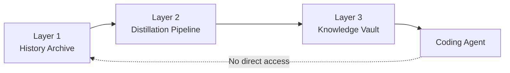

# Knowledge Distillery Implementation Design Document

**Refinement Pipeline Design Overview**

> This document is an architecture overview, not the canonical implementation spec.
> For exact schema details, see [`schema/vault.sql`](../schema/vault.sql). For CLI behavior, run `knowledge-gate help` or see the [README CLI Quick Reference](../README.md#cli-quick-reference). For pipeline behavior, see [`skills/`](../skills/).

---

## 1. Overall Architecture

Knowledge Distillery separates raw information from agent runtime context through a 3-layer structure.



- **Layer 1: History Archive**
  Stores raw evidence such as Slack, Linear, PRs, reviews, and AI session summaries.
- **Layer 2: Distillation Pipeline**
  Extracts only reusable rules and validated failure patterns from raw evidence.
- **Layer 3: Knowledge Vault**
  Stores distilled results in SQLite. Agents query only this layer.

The key constraint is simple: the agent does not read Layer 1 directly. It receives only knowledge that has survived distillation into Layer 3. That separation is the knowledge air gap.

---

## 2. Tool Roles

In this design, external tools are treated as evidence collectors, not truth generators.

### 2.1 Slack Archive — Layer 1 Only, Source of Evidence

- Preserves the original team discussion.
- Raw Slack text does not enter the Knowledge Vault directly.
- Only threads linked to a PR or issue are relevant refinement input.

### 2.2 Linear — Anchor for Refinement, Secondary Trigger

- Anchors refinement around issues explicitly tied to PRs.
- Body text, comments, and status changes strengthen the evidence bundle.
- Acts as a more structured decision trace than Slack alone.

### 2.3 Greptile — Per-PR Code Evidence Provider

- Supplies PR review output interpreted in repository context.
- Helps the pipeline infer what changed in practice and which patterns became stable.

### 2.4 Unblocked — Reference Link Provider

- Finds related code, docs, and conversations across sources.
- Its output is treated as a set of references to inspect, not as accepted truth.

### 2.5 Notion — Team Knowledge Base Evidence

- Provides design documents, decision records, and meeting notes as evidence context.
- URLs serve as identifiers at marking time; content fetched via Notion MCP at collection time.
- Optional source: pipeline proceeds without it.

### 2.6 git-memento — AI Session Context Capture

- Optionally preserves why a code change was made by attaching structured AI session summaries to commits.
- The pipeline works without it, but when present it improves recovery of decision context.

---

## 3. Refinement Pipeline (Layer 2) Details

The goal of the refinement pipeline is not to preserve everything. It is to keep only knowledge stable enough to hand to an agent.

### 3.1 Trigger: Two-Stage Pipeline

Refinement is split into merge-time marking and later batch refinement.

1. **Merge-time marking**
   Record only the identifiers needed to collect evidence later. This step marks what should be refined without doing the expensive collection immediately.
2. **Batch collection + refinement**
   Gather evidence for `knowledge:pending` PRs, extract candidates, and keep only the entries that pass the quality gate.

This structure exists for two reasons.

- It avoids heavy synchronous work at merge time.
- It allows later context such as follow-up comments, review outcomes, or retrospective discussion to mature before refinement.

### 3.2 Evidence Bundle: Unit of Collection

The unit of refinement is not a dump of conversations. It is an **Evidence Bundle** centered on a PR or issue.

Typical bundle inputs include:

- Core evidence: PR metadata, commit messages, review discussion, linked Linear issue
- Optional evidence: Slack thread, Greptile output, git-memento summary
- On-demand evidence: large change context such as PR diffs

The important rule is that raw evidence is not delivered to the agent. The bundle exists only as input to the distillation pipeline.

### 3.3 1st Refinement: LLM Extracts Candidates

The first refinement stage extracts knowledge candidates from the Evidence Bundle. There are only two allowed output types.

- **Fact**: a rule the team actually adopted and backed with code, review, or operations
- **Anti-Pattern**: a failed approach with a clear failure mechanism and a stated alternative

#### 3.3.1 Refinement Candidate Required Schema

A candidate must contain, at minimum:

- `id`
- `type`
- `title`
- `claim`
- `body`
- `applies_to.domains`
- `evidence`
- `alternative` for anti-patterns
- `considerations`

The exact field constraints and insertion format belong to the schema and CLI docs. This document only defines the shape of a valid candidate at the architectural level. The key point is that the output must already look like something the vault can safely ingest, not a loose summary.

### 3.4 2nd Refinement: Automated Quality Gate Enforces Cherry-Pick Criteria

The second refinement stage automatically filters extracted candidates. Instead of item-by-item human approval, the pipeline applies the same rules every time.

The main checks are:

- Is the claim grounded in actual evidence?
- Is the domain of application clear?
- If it is a prohibition, is there an alternative?
- Are considerations present and non-empty?
- Is it meaningfully distinct from existing vault entries?

Duplicates are rejected. Conflicts are surfaced for human curation. The purpose of the quality gate is not perfect judgment. It is to block entries that would be unsafe to expose to agents.

---

## 4. Knowledge Vault (Layer 3) Design

### 4.1 Storage Location and Format

- The vault lives at `repo/.knowledge/vault.db`.
- The format is a single SQLite file.
- Agents query it through `knowledge-gate`, not by reading it directly.

The reason for this choice is operational simplicity. A repository can distribute the latest vault with an ordinary `git pull`. The binary format also makes ad hoc agent reads impractical, which incidentally reinforces the context gate.

#### 4.1.1 Schema Migration Strategy

Schema evolution is tracked with SQLite `PRAGMA user_version`.

- Read the current schema version
- Apply only the needed migrations in order
- Update the database to the newest version

The design intentionally prefers SQLite-native migration mechanics over an additional migration framework.

### 4.2 Knowledge Vault Schema

The exact DDL lives in [`schema/vault.sql`](../schema/vault.sql). Conceptually, the schema has five parts.

- **entries**: the Fact / Anti-Pattern content itself
- **domain_registry / domain_paths**: controlled vocabulary plus path-to-domain resolution
- **entry_domains**: mapping between entries and domains
- **evidence**: links back to supporting sources
- **curation_queue**: items that need human review because of conflict or cleanup

This schema is optimized less for perfect archival fidelity and more for the runtime flow of querying relevant knowledge before a code change.

### 4.3 Output Format

Vault entries are not free-form notes. They are structured so an agent can read them quickly and turn them into action.

The core principles are:

- Put the TL;DR in `claim`
- Keep a stable reading order in the body: background, rule details, rejected alternatives, open questions, stop conditions
- Place important information early so it does not get buried in long contexts

The output format is therefore a runtime optimization, not a documentation style preference.

### 4.4 Guardrail Principles

The vault deliberately restricts expressive freedom.

- Only two entry types exist: Fact and Anti-Pattern
- There are no confidence scores
- The default operating model stays close to append-only

These constraints are meant to reduce ambiguous, partially trusted knowledge from entering the runtime path.

### 4.5 Domain Registry Lifecycle

This design uses **domains** as an intermediate layer rather than attaching entries directly to file paths.

- File paths resolve to domains through `domain_paths`
- Entries attach to domains through `entry_domains`
- Domains can be added, merged, split, or deprecated over time

The reason is cross-cutting knowledge. Rules about payments, testing strategy, or ActiveRecord behavior often span many paths. Direct file mapping becomes unwieldy quickly. The domain layer absorbs that complexity.

### 4.6 Domain Derivation (LLM-based)

The flow in which the refinement pipeline creates entries in the `entry_domains` table. Domain assignment is **decided by the LLM**. The path patterns in `domain_paths` are reference material, not mechanical matching rules — path matching alone cannot determine cross-cutting concerns, business context, or appropriate levels of abstraction.

```
PR change context (commit messages, review discussions, Linear issues)
+ Existing domain registry (domain_registry)
+ Path pattern reference (domain_paths)
    ↓
  The extraction LLM makes a comprehensive judgment to assign domains
    e.g.: Payment service refactoring PR → domain: payment
    e.g.: AR callback failure fix PR → domain: payment, activerecord
    ↓
  INSERT into entry_domains table with assigned domains
    ↓
  When no matching domain exists:
    → LLM proposes {name, description, suggested_patterns}
    → Applied via knowledge-gate domain-add + domain-paths-set
    → Reviewed manually later if merge/deprecate/path cleanup is needed
```

**Domain definition guidelines (included in the extraction prompt):**

- **Granularity:** The unit at which a team makes independent decisions. "payment" is appropriate, but over-splitting into "payment-refund" and "payment-charge" should be avoided
- **Cross-cutting concerns:** Rules not confined to a specific directory (security policies, testing practices, error handling, etc.) are classified as technical cross-cutting domains
- **Naming convention:** Lowercase kebab-case, distinguishing business domains from technical domains (e.g., `payment` vs `activerecord`)

After each refinement batch, the domain setup references `domain-report` results to review both the domain registry and `domain_paths` patterns. In the current PoC, those adjustments are performed manually.

---

## 5. Knowledge Vault Management Lifecycle

### 5.1 Entry Policy: Conservative on Addition, Append-Only

False positives inside the vault directly contaminate agent behavior. Because of that, the system prefers to miss some knowledge rather than admit weak knowledge too early.

The default operating stance is:

- be conservative about promotion
- favor state transitions over in-place rewriting
- represent new judgment through new entries plus archival, rather than mutation

### 5.2 Human Curation UX

Humans are not item-by-item approvers. They are strategic reviewers.

The main signals for human review are:

- conflicting entries
- outdated entries
- low-value or duplicated entries
- domains that have become overcrowded or too sparse

Human curation is a periodic correction mechanism, not the everyday bottleneck in the pipeline.

### 5.3 State Management: Transition, Not Deletion

Vault entries are managed by status transition where possible rather than hard deletion.

- `active`: visible to runtime queries
- `archived`: retained for historical context but excluded from normal runtime lookup

This preserves the reason an entry stopped applying, which reduces future decision cost.

---

## 6. Feedback Loop (Operational Direction)

Failures or new constraints found during agent work can become future refinement input. The important rule is unchanged: feedback must return to Layer 1 and pass through the same distillation path. The agent does not get a direct write path into the vault.

---

## 7. Agent Runtime Policy

### 7.1 Read Only the Knowledge Vault

The standard runtime knowledge path is the vault only. Raw evidence, conversation logs, and refinement intermediates are not part of the default agent path.

### 7.2 Soft Miss Principle

If a relevant rule is not found, the agent does not automatically stop all work.

- **Non-structural changes**
  Bug fixes, narrow refactors, and changes that follow existing patterns usually proceed.
- **Structural changes**
  New modules, new abstractions, architecture shifts, or new patterns trigger the question protocol.

Soft miss therefore means "be conservative only when the missing knowledge creates durable design risk," not "halt whenever the vault is silent."

### 7.3 Question Protocol

The agent should ask when:

- a structural change is needed but the vault provides no grounding
- vault entries conflict and it is unclear which one is current
- the requested change would establish a new project convention

The purpose of the question is not to defer all judgment to humans. It is to avoid inventing project-level decisions at runtime outside the vault.

### 7.4 Relationship with CLAUDE.md / AGENTS.md

`CLAUDE.md` and `AGENTS.md` are agent operating instructions. The Knowledge Vault is a distilled project knowledge store. They complement each other, but they are not the same layer.

- Operating instructions define how the agent should behave
- The vault communicates project-specific rules and failure patterns

### 7.5 Context Gate: knowledge-gate Skill + CLI

The context gate implements the rule that agents should query only the entries relevant to the current task, not read the whole vault.

- The Skill defines the query workflow
- The CLI performs the actual read and write operations
- For command-level details, run `knowledge-gate help` or see the [README CLI Quick Reference](../README.md#cli-quick-reference)

What matters in this document is not command syntax. It is why `knowledge-gate` must remain the sole runtime access path.

**Design principles governing the CLI:**

- **Vendor-neutral runtime / Claude-first delivery**: Agent runtime commands use only `sqlite3` (pre-installed) to maintain vendor neutrality. Pipeline/management commands additionally require `jq` (for JSON processing). Delivery is via Claude Code Plugin, but the CLI itself can run from any agent.
- **Standard plugin packaging**: The plugin uses `.claude-plugin/plugin.json` only for metadata. Bundled assets such as `skills/`, `scripts/`, and `schema/` live at the plugin root and are referenced through `${CLAUDE_PLUGIN_ROOT}`.
- **Standardized DB manipulation**: The LLM decides, and the CLI manipulates the DB. Direct SQL execution is prohibited.

### 7.6 Agent Skill Template

The CLI and data are shared across all agents; only the Skill file is provided per agent.

```markdown
# knowledge-gate Skill Example (for Claude Code)

---
description: Queries related rules from the knowledge vault before code modification.
  Must be used when modifying files or making structural changes.
---

## When to Use

- Before modifying code files
- Before creating new files/modules
- When performing tasks that require architectural decisions

## Query Protocol

### When modifying a single file
knowledge-gate query-paths "<file path to modify>"

### When modifying multiple files (PR-scale changes)
# 1. Identify related domains (a few representative files suffice)
knowledge-gate domain-resolve-path "<file path>"
# 2. Query rules by domain (efficient, no duplicates)
knowledge-gate query-domain "<domain name>"

### Search by keyword (when path matching yields no results)
knowledge-gate search "<keyword>"

### When detailed rule inspection is needed
knowledge-gate get "<entry ID>"

### When the domain/keyword is unknown (exploration reference)
knowledge-gate list
# -> Summary list of all active entries. Identify relevant domains or keywords here,
#    then perform precise queries with query-paths / query-domain / search

### Domain lookup
knowledge-gate domain-info "<domain name>"
knowledge-gate domain-resolve-path "<file path>"

## Behavioral Rules

- If knowledge-gate returns no results:
  - Non-structural modifications (bug fixes, local refactoring, etc.): preserve existing code structure and proceed
  - Structural changes (new modules, architecture changes, pattern introductions, etc.): invoke the question protocol ([§7.3](./design-implementation.md#73-question-protocol))
- If a MUST-NOT rule exists: comply unconditionally. Follow the alternative
- If Stop Conditions apply: confirm with a human before proceeding
- Do not directly read files in the .knowledge/ directory
```

---

## 8. Operations/Governance

### 8.1 Permission Minimization

Collection tools and pipeline components should receive read-oriented permissions wherever possible. Evidence collection and vault promotion should remain separate so that one misbehaving path does not dissolve the entire boundary.

### 8.2 Security Boundary

The core security goal is not perfect lockout. It is preventing raw data from appearing in the agent's default path. In the PoC stage, that operational boundary matters more than heavy enforcement.

### 8.3 Technical Isolation Implementation Direction (TBD)

Filesystem, network, and runtime-level hard barriers remain future options. For now, convention-based isolation is the default because it preserves design flexibility while the system is still evolving.

---

## 9. Implementation Roadmap

The roadmap prioritizes a usable minimum flow over full automation.

### 9.1 Start with Manual Refinement

Early on, some collection and promotion steps may remain manual. What matters first is validating the refinement criteria, the vault structure, and the runtime query experience.

### 9.2 Transition to Automated Collection + AI Autonomous Refinement

Once the flow proves useful, merge marking, batch collection, candidate extraction, quality gating, and report generation can be automated incrementally. The purpose of automation is not to remove humans entirely, but to move repetitive checks into the pipeline.

---

## 10. Determining Effectiveness (Operational Direction)

### 10.1 Primary Assessment: User Experience

The first signal is whether the agent feels better in practice: fewer repeated mistakes, fewer unnecessary questions, and faster access to the rules that matter before a change.

### 10.2 Supplementary Metrics

That subjective signal should be supported with concrete observations:

- change in retry count for similar tasks
- frequency and quality of clarification questions
- outcome comparison before and after vault use

The goal of metrics is not a perfect scorecard. It is to verify whether this structure actually improves agent performance.

---

## Appendix

This document intentionally omits detailed implementation material. Use these as the canonical sources:

- CLI commands and I/O behavior: `knowledge-gate help` and [README CLI Quick Reference](../README.md#cli-quick-reference)
- Exact SQLite schema: [`schema/vault.sql`](../schema/vault.sql)
- Pipeline skill details: [`skills/`](../skills/)
- Adopted and rejected tool analysis: [`docs/tool-evaluation.md`](./tool-evaluation.md)
