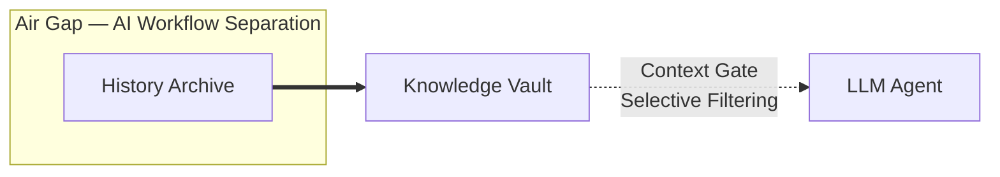

# Knowledge Distillery: A Knowledge Distillation System That Delivers Only the Essentials to Agents

**An operational philosophy for AI agent-based development — the principle of delivering only verified information, minimally and to the point**

---

The moment you adopt a coding agent, two choices present themselves.

- **Choice A:** Provide the agent with rich context and trust the model's reasoning ability to select the relevant information on its own.
- **Choice B:** Acknowledge the risk of performance degradation as context grows, and selectively provide only verified information.

This document explains **the rationale and philosophy behind choosing B**, along with its intent.

> **Scope note:** This document covers the design philosophy of Knowledge Distillery — a knowledge distillation system for agents, from collection to delivery. Specific implementation mechanisms such as CLAUDE.md or AGENTS.md can leverage the Knowledge Vault, but they are not interdependent with this design and exist as separate elements.

---

## 1. A Flood of Information Becomes "Noise," Not "Knowledge"

Words exchanged daily on Slack, requirements shifting in Linear, hypotheses skimmed in PR comments — these are natural to humans. When reading a conversation, we intuitively judge who said what, in what context, and with what degree of confidence. In other words, humans can **identify the essentials even from incomplete information**.

But LLMs/agents are different. Of course, when sufficiently relevant context is provided, model performance improves. The problem arises **when quantity increases without controlling for relevance**.

- When the proportion of irrelevant information grows, the model can **miss the essentials**. ([arXiv](https://arxiv.org/abs/2404.08865))
- As input length increases, performance does not uniformly improve but rather becomes unstable (**Context Rot**). ([research.trychroma.com](https://research.trychroma.com))
- The more critical issue is that when important information is buried in the "middle" of a long context, performance drops significantly — a **positional bias** repeatedly reported in the literature (**Lost in the Middle**). ([arXiv](https://arxiv.org/abs/2307.03172))

The key insight is not "more input makes things worse," but rather **"an increase in information without relevance control actually becomes harmful."** A flood of information becomes noise rather than knowledge for the agent, causing hallucinations, misunderstandings, and false confidence — resulting in higher costs and risks.

However, this does not mean raw information is valueless. If preserved without loss, it can be processed and utilized in various ways depending on the purpose. The problem is not the existence of raw data, but its exposure to the agent without refinement.

---

## 2. Context Should Be Used as the Criterion That Determines "What the Model Focuses On"

The context window is often mistaken for "a large memory," but the model's bottleneck occurs not at the window size but at **the amount of information it can effectively process at once**. As input grows longer, the model cannot attend equally to all information, and important information gets buried under less important information.

One of the principles Anthropic consistently emphasizes in context engineering is:

> The range a model can focus on at once is finite. To maximize the probability of desired outcomes within that range, you must remove unnecessary information and find the minimal input that retains only what is essential. — [Anthropic](https://www.anthropic.com)

This system follows the above operational principle.

- Context is **not "a repository that holds everything related"** but rather
- **"a means for deciding what the model should focus on for the current task."**

This principle is applied most rigorously when **deciding what to expose to the agent through the Context Gate**.

---

## 3. Raw Information Is Dangerous for Agents — Why Operational Isolation Is Needed

LLMs cannot determine the factual accuracy of text. A hypothesis like "I think we should go with A" on Slack and a confirmed team decision can be read with equal weight by the agent. Even if the direction changes to "B would be better" the next day, the agent will write code on top of the retracted hypothesis unless it is reflected in the context.

Therefore, delivering unconfirmed or unverified information to the agent can produce unintended outcomes.

This problem cannot be solved with prompts. The instruction "ask if you're not sure" only works when the agent recognizes its own uncertainty. But the factual status of unverified information exists in an undetermined state — neither true nor false — until verification is complete. The agent cannot perceive this undetermined state — it immediately treats the given text as established fact and builds actions upon it. An instruction to "ask" about something the agent cannot doubt on its own simply cannot work.

Therefore, this design **aims for operational isolation (convention-based access prohibition)**. It separates the paths through which raw information can be accessed from the agent's normal workflow, providing only refined information. Perfect technical enforcement is unrealistic (bypass routes such as direct sqlite3 access exist), and defending against intentional circumvention is not cost-effective. Instead, the design controls access paths through convention, requiring explicit intent to violate them, thereby achieving de facto isolation. The reason for not relying on the agent's own filtering is that when it fails, it **fails silently** — a small misunderstanding cascades into large changes, and the later the discovery, the greater the damage.

---

## 4. The Structure of the Knowledge Air Gap

This architecture places three layers according to the nature of information, structurally separating noise from knowledge at the air gap boundary.

### 4.1 History Archive — Preserving the Raw

Raw information is first loaded into the **History Archive**. The principle of this layer is simple: **discard nothing.**

The History Archive is a space separated from the AI coding agent's default workflow. It preserves raw data as-is, serving as input material for the refinement process and as an evidence store that can be revisited later for the basis of decisions. Hypotheses, incorrect guesses, and overturned decisions all remain in their original form. Since the path through which uncertain information could influence the agent's judgment is severed, any information can safely exist here.

Requiring a judgment of "is this worth keeping?" for every piece of work demands excessive vigilance. Moreover, from the perspective of a single task, it is difficult to discover patterns or insights embedded in the context of successive tasks. Raw data is preserved as raw data, and a unified refinement process is performed separately.

### 4.2 Air Gap — Operational Isolation (Convention-based Access Prohibition)

Between the History Archive and the Knowledge Vault exists an **air gap**. The term borrows its concept from cybersecurity's air gap, but it does not imply physical network isolation. The key is that **no path exists for the coding agent to access the History Archive from its default workflow**. It is sufficient that the agent can only reach it by deliberately using tools — a level at which normal coding workflows do not naturally make contact. This is the origin of the architecture's name, "Knowledge Air Gap."

Rationale for choosing convention-based isolation:
1. **Cost asymmetry:** The implementation and maintenance cost of perfect technical enforcement (filesystem permissions, network isolation, etc.) is disproportionate to the actual probability of convention violations
2. **Impracticality of blocking intentional circumvention:** Decisive bypass routes such as direct sqlite3 access or environment variable queries cannot be technically blocked entirely
3. **Effectiveness of convention:** Since agents are designed to follow instructions, explicit conventions alone effectively guarantee isolation from the normal workflow

Refinement is performed by a separate pipeline, isolated from the coding agent's normal workflow. It is conceptually similar to a data diode in cybersecurity — a unidirectional transmission device. The refinement pipeline reads from the History Archive and writes to the Knowledge Vault, while the coding agent can only reference the Knowledge Vault. Even if the refinement pipeline uses the same LLM runtime, unidirectional flow is maintained because it accesses the History Archive only through explicitly permitted tools and access paths.

Filtering uncertain information during refinement does not work by having AI explicitly classify confidence levels, but rather operates through **a combination of extraction criteria and quality gates**. When extraction criteria such as "extract only confirmed decisions, do not extract hypotheses or items under discussion" are applied, the AI either does not generate weakly supported information as candidates in the first place, or fills evidence fields sparsely. The confidence level implicitly reflected in this way is then objectively filtered by subsequent quality gates — structural criteria such as evidence sufficiency, scope clarity, alternative documentation, and deliberation of considerations.

The air gap is built on the premise that "AI cannot independently determine the certainty of information." Requiring AI to explicitly classify confidence during the refinement process would contradict that very premise. Instead, extraction criteria constrain the AI's behavior, and quality gates structurally verify the results. The principle that uncertainty is controlled through **structural constraints rather than AI's discernment** applies equally to the refinement stage.

> **Intentional flexibility at the PoC stage:** "Air gap" is a conceptual design principle, not a physical or technical enforcement barrier. The essence is operational isolation at a level where the agent does not naturally contact the History Archive in its normal workflow, and the PoC stage adopts convention-based isolation. Rationale for this choice: (1) the cost of implementing and maintaining perfect technical enforcement is disproportionate to the actual probability of convention violations, (2) decisive bypass routes such as direct sqlite3 access cannot be technically blocked entirely, (3) since agents are designed to follow instructions, explicit conventions alone effectively guarantee isolation from the normal workflow. If convention violations are observed in PoC operational data, technical reinforcement will be considered.

### 4.3 Knowledge Vault — Refined Insights

Information is deposited in the History Archive when a task is completed (finished). The completion of a specific task implies that we have secured at minimum the consensus and confirmed context needed to perform that task. Therefore, by synthesizing the context up to the point the task is completed and deployed, most uncertain information can be filtered out.

Raw data from the History Archive reaches the Knowledge Vault through **distillation (refinement)**. Distillation is not extremely conservative gatekeeping. It is the process of cleanly stripping away noise from raw data and recording more valuable, condensed decisions and insights.

The Knowledge Vault does not aim to store only absolutely perfect information. The value of information changes over time, and yesterday's fact can become an entirely different situation today. The realistic goal of the Vault is to refine large volumes of raw information with low accuracy into compressed context that the agent can trust and act upon. The design's aspiration is not perfection but **structurally maintaining sufficient accuracy**, and periodic verification (6.1) is proposed as an operational direction to sustain this over time.

The Knowledge Vault **contains no metadata indicating confidence levels.** Being in the Vault itself means the item has passed through distillation. Only two types of information are recorded. This dichotomy is not intended to restrict the structure of information (simple/conditional), but is a design to **prevent uncertainty from being conveyed in a concealed manner**. Rules with explicitly stated conditions or information clearly marked as estimates are treated as high-value items. What is excluded is when unverified estimates are described as if they were facts.

- **Fact** (confirmed truth): Rules or decisions agreed upon by the team and verified through code, tests, or operational records. Alternatives that were reviewed but not adopted, along with the reasons, are also documented.
- **Anti-Pattern** (rejected attempt): Approaches that were tried in the past but failed, along with the reasons and alternatives.

Estimates whose uncertainty is not indicated are not placed in the Vault. Since agents cannot independently determine the uncertainty of given text, if uncertain information is described as fact, the agent will treat it as fact and act accordingly. Conversely, if uncertainty or conditions are explicitly stated, the agent can also act accordingly.

The rationale for conservative distillation lies in cost asymmetry. A false positive (incorrect knowledge entering the Vault) steers the agent's actions in the wrong direction and is difficult to detect. A false negative (missing valid knowledge), on the other hand, can be re-extracted in the next distillation cycle, and the agent operates safely in areas without knowledge following the Soft miss principle ([Design Implementation §7.2](./design-implementation.md#72-soft-miss-principle)). The fear of "missing something" (FOMO) is always less risky than "including something wrong" in this system.

The Knowledge Vault is a knowledge source that AI can access. However, it exists in a state with **indexing and metadata management** so that only items relevant to the task are queried. Rather than having the entire contents read at once, only items matching the domain and context of the current task are selectively referenced.

### 4.4 Context Gate — Selective Exposure

While the air gap separates access paths as isolation, the **Context Gate** is different in nature. Not all contents of the Knowledge Vault are delivered to the LLM at once. When the agent queries the relevant domain just before a task, only items matching that domain are selectively exposed.

> Perfection is achieved not when there is nothing more to add, but when there is nothing left to take away. — Antoine de Saint-Exupery

Both AI and humans follow 3 rules better than 100 rules. As the number of directives increases, the weight of each one diminishes, and truly important rules get buried among less important ones. The Context Gate is the structural application of this principle — **because when everything is important, nothing is important**.

This principle leads to a fundamental constraint on how the Knowledge Vault is delivered. The Knowledge Vault contains Facts and Anti-Patterns accumulated across various domains throughout the project, and its total volume is of a scale that no single task needs to reference in its entirety. If this content is exported to the filesystem as skill files or markdown, the agent gains the ability to read all files directly, neutralizing the Context Gate's selective filtering. As a result, rules unrelated to the current task are loaded into context, reproducing the very problem described in Sections 1 and 2 — performance degradation due to an increase in information without relevance control. Therefore, **knowledge not promoted by a human should only be accessible through the Context Gate (knowledge-gate CLI)**. Content strategically promoted by humans (e.g., highest-value directives placed in `.claude/rules/`) can be delivered to the agent independently of the refinement pipeline, which is a legitimate path via human judgment. However, care must be taken that such auxiliary paths do not expand into a means of bypassing the Context Gate and exposing the entire Vault.

In this way, uncertainty control is **not a single line of prompt, but rather** operates through **four structural layers**: History Archive isolation, extraction criteria and quality gates in distillation, type restrictions in the Vault, and selective exposure through the Context Gate.

---

## 5. Principles of Distillation: Collect Broadly, Distill Autonomously

To maintain the Knowledge Air Gap, a refinement process is needed between the History Archive and the Knowledge Vault.

### 5.1 Evidence Is Collected Broadly

Information generated during work processes — code changes, review discussions, issue tracking, team conversations — is loaded into the History Archive as raw data. If evidence is lost, the very basis for future judgment disappears.

At this point, the role of tools that facilitate information access (Slack archives, issue trackers, code review tools, etc.) is redefined. These tools are **not "tools that produce truth" but "tools that collect and connect evidence."** The information these tools find is merely input to the History Archive, and does not go directly into the Knowledge Vault.

### 5.2 Distillation Is Performed Autonomously by AI

The distillation from the History Archive to the Knowledge Vault is **performed by AI/LLM without human intervention**. The AI analyzes raw data from multiple angles to verify validity and value, removes duplicates, and selects only concepts and claims that are certain or at least plausible.

This appears paradoxically contradictory on the surface — isolating AI that is vulnerable to noise, yet entrusting the distillation task to AI. However, the two tasks are fundamentally different. The coding agent must reason and act within context where undetermined states are intermixed, but the input to distillation is the output at the point a task has been completed — data in a state where uncertainty has been largely resolved. Extracting and compressing confirmed conclusions from extensive context is an area where LLMs excel, and human-defined distillation criteria (type classification, extraction criteria, quality gate rules) constrain the degrees of freedom in distillation. Moreover, it is practically impossible for humans to individually refine and review this vast raw data. The key is not a question of whether to trust AI, but **distinguishing between tasks AI can do well and those it cannot, and deploying it where appropriate**.

The essence of this distillation is not gatekeeping but **distillation** itself.

- From hypotheses and discussions, it extracts **consensus and decisions**
- From scattered failure experiences, it derives **repeatable lessons**
- From verbose context, it condenses into **concise insights**
- It detects conflicts and duplicates with the existing Vault to maintain consistency

There are risks in autonomous AI distillation. The AI may extract incorrect consensus, lose nuance, or misjudge important context as noise. These risks are mitigated by the strategic human review described in Section 6.3 and periodic validity verification of the Knowledge Vault.

---

## 6. The Lifespan of Knowledge and the Role of Humans

Knowledge loses its validity over time. Codebases change, decisions are overturned, and what was once a valid Anti-Pattern sometimes becomes the right answer.

> **Scope:** Sections 6.1 and 6.2 are recommended directions for operating the Knowledge Distillery. They are not core design elements of this architecture, but propose operational principles for maintaining the quality of distilled knowledge over time.

### 6.1 Validity Is Managed Through Verification, Not Prediction

Predicting the expiration of knowledge in advance is impossible. The recommended direction is to maintain the validity of the Knowledge Vault through periodic verification of consistency with the codebase, coherence among items, and detection of obsolescence.

### 6.2 Feedback Is Permitted, but Goes Through the Same Process

Issues or failure patterns discovered by the agent during work can be used as input for the next distillation cycle. The key constraint is singular: feedback must go through the same distillation process, and a path for the agent to directly modify the Knowledge Vault is not permitted, as it would break the air gap.

### 6.3 The Role of Humans: Strategic Overseers, Not Approvers of Individual Items

In this design, humans are not gatekeepers who approve individual knowledge items one by one. The human role is that of a **strategic overseer who surveys the whole**.

Key activities humans perform:

- **Overall review of the Knowledge Vault:** Periodically review the entire Knowledge Vault to clean up incorrect, duplicate, or low-value items. This is not a fixed schedule but is performed when humans deem it necessary.
- **Quality management of Vault content:** Archive items that are no longer valid, duplicated, or otherwise should not be exposed, and clean up conflicting items. Since the Context Gate is an interface through which the agent automatically queries based on domain at runtime, humans take on the role of managing the quality of content loaded in the Vault.
- **Utilizing air gap review reports:** As the basis and starting point for this work, a tool is needed that periodically reports on the state of the Knowledge Vault. This tool summarizes trends in Vault changes, newly added insights, and areas requiring attention, supporting the human's strategic review.

The Knowledge Vault itself is managed autonomously by AI, but **what goes into the agent's always-on context** is decided by humans. This is the balance point between minimizing human intervention and quality control.

---

## 7. Determining Whether It Works

How do we know this system is "working"?

### 7.1 Primary Assessment: User Experience

The **perceived quality change** experienced by developers who actually use the coding agent with the Knowledge Vault applied is an important starting point. Whether the agent understands context better, avoids repeating the same mistakes, or asks fewer unnecessary questions is detected fastest by the person using it.

However, when the designer is also the evaluator, there is vulnerability to confirmation bias. It is difficult to distinguish whether "it seems to work well" is actual quality improvement or a placebo effect. Therefore, subjective experience must always be accompanied by the objective metrics below.

In the early operational stages, rather than fixing target numbers first, we first measure **baselines** for observation items. We then repeatedly measure the same items in the same way to determine whether improvement has occurred.

### 7.2 Supplementary Verification: Objective Metrics

To compensate for the limitations of subjective experience, the following objective metrics are used in parallel.

- Comparison of **agent retry counts** on identical tasks before and after Knowledge Vault application
- **Frequency and appropriateness** of questions generated by the agent
- If possible, **quality comparison of outputs** in a state where the presence of the Knowledge Vault is unknown (blind test)

### 7.3 Structural Verification: Research-Based Automated Review

Based on research findings and recognized guides on context management, it is possible to automatically review whether the structure and content of the Knowledge Vault align with known best practices.

- Whether the total token count of the Knowledge Vault is within the recommended range
- Whether the content is composed primarily of information that the agent would have difficulty determining on its own
- Whether prohibitions are accompanied by alternatives
- Whether important information is placed at the beginning and end of the context

This automated review is a **supplementary measure**, and the final judgment is based on cross-verification of user experience and objective metrics.

---

## 8. Known Trade-offs of This Design

Every design has costs. The trade-offs this approach has chosen are stated explicitly.

### 8.1 Systematic Limitations of Autonomous AI Distillation

As explained in Section 5.2, distillation is a task where AI excels, but it is not without risk. The AI may extract incorrect consensus, lose important nuance, or incorrectly resolve conflicting information. In particular, these errors can manifest as **systematic and consistent biases**, unlike human mistakes, making them harder to detect.

These risks are mitigated by strategic human review (6.3), periodic validity verification of the Knowledge Vault (6.1), and the agent feedback loop (6.2). However, they cannot be entirely eliminated, and the quality of AI distillation itself must be continuously monitored.

### 8.2 Unknown Unknowns

The premise that "the agent asks when it doesn't know" only holds when the agent can recognize that it does not know something. When there is no awareness of what lies beyond the Knowledge Vault's boundaries, no questions arise either. This limitation can be reduced by explicitly declaring the scope of the Knowledge Vault and designing the agent to be aware of that scope, but it is not fundamentally resolved.

### 8.3 Operational Costs

The full cycle of collection, distillation, verification, and retirement incurs operational costs. While autonomous AI distillation significantly reduces the human time burden, costs arise from LLM API calls and automation infrastructure maintenance. Whether these costs are justified by improvements in agent quality must be continuously verified.

### 8.4 Information Freshness

Code changes in real time, but distillation is performed asynchronously. Autonomous AI distillation can run more frequently than human batches, but a gap between the time of distillation and the time of code changes still exists. Codebase reconciliation (6.1) catches this after the fact, but does not guarantee real-time consistency.

These trade-offs are not weaknesses of this design, but **costs that this design has consciously accepted**. The actual impact of each item is measured during operation, and if a point is found where costs exceed benefits, the design is revised.

---

## 9. The Intent of This Design

This design is not about making the agent smarter. It is about **structurally guaranteeing the quality of information the agent encounters**.

The History Archive is "an archive that preserves all evidence," the Knowledge Vault is "a repository of refined insights," and the Context Gate is **"the boundary that determines what is exposed to the agent."**

What this design pursues is as follows:

- Quickly follow confirmed rules
- Stop and ask when outside the permitted scope
- Leave evidence behind
- Update records so mistakes are not repeated

The key is not "making the agent know a lot" but **"making it accurately know what it does not know."**

---

## 10. Conclusion

Agents can construct meaning from given information on their own. However, as the volume of information increases, judgment becomes less accurate, leading to high-cost, low-efficiency, low-quality results.

Therefore, instead of showing the agent everything, we provide hierarchically refined information at the right place and time. Creating an environment where the agent can work more excellently — this is the purpose of this design.

- **Collect raw data broadly** — Preserve evidence without omission in the History Archive
- **Distill autonomously via AI** — Strip away noise and condense insights for loading into the Knowledge Vault
- **Keep always-on context minimal** — Expose only the highest-value directives, strategically selected by humans, through the Context Gate
- **Verify, don't predict** — Review periodically, and remove what is no longer valid
- **Humans as strategic overseers** — Focus not on approving individual items, but on surveying the whole and extracting the highest value

Knowledge Distillery, from collection to delivery — implements the principle of **"hierarchically refined, minimal input"** as a systematic framework.
