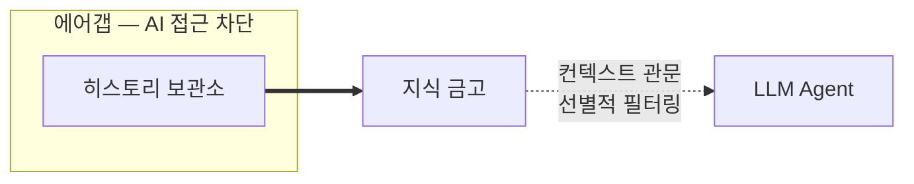

# 지식 증류소(Knowledge Distillery): 에이전트에게 핵심만 전달하는 지식 증류 체계

**AI 에이전트 기반 개발의 운영 철학 — 확실한 정보를 최소한으로, 핵심만 전달하는 원칙**

---

코딩 에이전트를 도입하는 순간, 두 가지 선택지가 놓입니다.

- **선택지 A:** 에이전트에게 풍부한 컨텍스트를 제공하고, 모델의 추론 능력이 필요한 정보를 스스로 선별할 것으로 본다.
- **선택지 B:** 컨텍스트 증가에 따른 성능 저하 리스크를 인정하고, 검증된 정보만 선별하여 제공한다.

이 글은 **B를 선택하게 만든 근거와 철학**, 그리고 그 의도를 설명합니다.

> **범위 참고:** 이 문서는 지식 증류소(Knowledge Distillery) — 수집에서 전달까지, 에이전트를 위한 지식 증류 체계의 설계 철학을 다룹니다. CLAUDE.md나 AGENTS.md 같은 특정 구현 수단은 지식 금고를 활용할 수 있지만, 이 설계와 상호의존적이지 않으며 별도의 요소로 존재합니다.

---

## 1. 정보의 홍수는 "지식"이 아니라 "소음"이 된다

매일 Slack에서 오가는 말, Linear에서 바뀌는 요구사항, PR 코멘트에 스쳐 지나가는 가설들은 인간에게 자연스럽습니다. 대화를 보면서 누가 말했는지, 어떤 맥락이었는지, 어느 정도 확신이었는지를 감각적으로 판단합니다. 즉, 인간은 **불완전한 정보에서도 핵심을 파악**할 수 있습니다.

하지만 LLM/에이전트는 다릅니다. 물론 관련성 높은 컨텍스트가 충분히 주어지면 모델의 성능은 향상됩니다. 문제는 **관련성을 통제하지 않은 채 양만 늘릴 때** 발생합니다.

- 무관한 정보의 비율이 높아지면 모델은 **핵심을 놓칠** 수 있습니다. ([arXiv](https://arxiv.org/abs/2404.08865))
- 입력이 길어질수록 성능이 균일하게 좋아지는 게 아니라 오히려 불안정해지는 현상이 관찰됩니다(**Context Rot**). ([research.trychroma.com](https://research.trychroma.com))
- 더 결정적인 문제는, 중요한 정보가 긴 컨텍스트의 "중간"에 묻히면 성능이 유의미하게 떨어지는 **위치 편향**이 반복적으로 보고된다는 점입니다(**Lost in the Middle**). ([arXiv](https://arxiv.org/abs/2307.03172))

즉, 핵심은 "많이 넣으면 나빠진다"가 아니라 **"관련성을 통제하지 않은 정보의 증가는 오히려 해가 된다"**는 것입니다. 정보의 홍수는 에이전트에게 지식이 아니라 노이즈가 되고, 환각·오해·잘못된 확신을 일으켜 비용과 리스크를 초래합니다.

그러나 이 날것의 정보가 가치 없다는 뜻은 아닙니다. 손실 없이 보존해 둔다면 목적에 따라 다양한 방식으로 가공하여 활용할 수 있습니다. 문제는 날것의 존재가 아니라, 그것이 정제 없이 에이전트에게 노출되는 것입니다.

---

## 2. 컨텍스트는 "모델이 집중할 대상"을 결정하는 기준으로 사용되어야 한다

컨텍스트 윈도우는 "큰 메모리"로 종종 오해되지만, 모델의 병목은 윈도우 크기가 아니라 **한 번에 효과적으로 처리할 수 있는 정보의 양**에서 발생합니다. 입력이 길어지면 모델은 모든 정보에 균등하게 집중하지 못하고, 중요한 정보가 덜 중요한 정보에 묻힙니다.

Anthropic이 컨텍스트 엔지니어링에서 일관되게 강조하는 원칙 중 하나는 다음과 같습니다.

> 모델이 한 번에 집중할 수 있는 범위는 유한하다. 그 안에서 원하는 결과 확률을 최대화하려면, 불필요한 정보를 걷어내고 꼭 필요한 정보만 남긴 최소한의 입력을 찾아야 한다. — [Anthropic](https://www.anthropic.com)

이 시스템은 위 운영 원칙을 따릅니다.

- 컨텍스트는 **"관련된 모든 것을 담는 저장소"**가 아니라
- **"지금 이 작업에서 모델에게 무엇을 집중시킬지 결정하는 수단"**이 되어야 합니다.

이 원칙은 특히 **컨텍스트 관문을 통해 에이전트에게 무엇을 노출할지**를 결정할 때 가장 엄격하게 적용됩니다.

---

## 3. 날것의 정보는 에이전트에게 위험하다 — 구조적 격리가 필요한 이유

LLM은 텍스트의 사실여부를 판별하지 못합니다. Slack에서 "이건 A로 가야 할 것 같아"라는 가설과 팀이 합의한 확정 사항은 에이전트에게 동일한 무게로 읽힐 수 있습니다. 다음 날 "B로 가는게 낫겠어"로 방향이 바뀌어도, 컨텍스트에 반영되지 않은 이상 에이전트는 철회된 가설 위에서 코드를 작성합니다.

따라서 에이전트에게 확정되지 않거나 검증되지 않은 것을 전달하면 의도하지 않은 결과를 발생시킬 수 있습니다.

이 문제는 프롬프트로 해결되지 않습니다. "확실하지 않으면 질문해"라는 지시는 에이전트가 스스로 불확실함을 인지할 때만 작동합니다. 그런데 검증되지 않은 정보의 사실 여부는 검증이 완료되기 전까지 참도 거짓도 아닌 미결정 상태로 존재합니다. 에이전트는 이 미결정 상태를 인식하지 못합니다 — 주어진 텍스트를 곧바로 사실로 확정하고 그 위에 행동을 쌓아 올립니다. 스스로 의심할 수 없는 대상에 대해 "질문해"라는 지시는 작동할 수 없습니다.

따라서 이 설계는 **구조적 격리를 지향**합니다. 에이전트의 일반 동선에서 날것의 정보에 접근할 경로를 분리하고, 정제를 통과한 정보만 제공합니다. 에이전트의 자체 필터링에 의존하지 않는 이유는, 그 필터링이 실패할 때 **조용히 실패**하기 때문입니다 — 작은 오해가 큰 변경으로 번지고, 발견이 늦어질수록 피해가 커집니다.

---

## 4. 지식 에어갭의 구조

이 아키텍처는 정보의 성격에 따라 세 개의 층을 두고, 에어갭을 경계로 노이즈와 지식을 구조적으로 분리합니다.

### 4.1 히스토리 보관소 — 날것의 보존

날것의 정보는 먼저 **히스토리 보관소**에 적재됩니다. 이 층의 원칙은 단순합니다: **아무것도 버리지 않는다.**

히스토리 보관소는 AI가 접근할 수 없는 격리된 공간입니다. 원시 데이터를 있는 그대로 보존하며, 정제 과정의 입력 자료이자, 나중에 판단의 근거로 돌아갈 수 있는 증거 저장소입니다. 가설도, 잘못된 추측도, 뒤집힌 결정도 모두 원본 그대로 남아 있습니다. 불확실한 정보가 에이전트의 판단에 영향을 줄 경로 자체가 차단되어 있으므로, 여기에는 어떤 정보든 안전하게 존재할 수 있습니다.

모든 작업마다 "이것은 남길 가치가 있는가?"의 판단 절차를 거치는 것은 과도한 주의를 요구합니다. 또한, 단일 작업의 시야에서는 연속된 작업 맥락 속에 담긴 패턴이나 인사이트를 발견하기 어렵습니다. 날것은 날것대로 보존해두고, 통합된 정제 과정을 별도로 수행합니다.

### 4.2 에어갭 — 구조적 격리

히스토리 보관소와 지식 금고 사이에는 **에어갭**이 존재합니다. 사이버보안의 에어갭에서 개념을 빌려온 용어이지만, 물리적 망분리 수준의 격리를 의미하지는 않습니다. 핵심은 **코딩 에이전트의 기본 동선에서 히스토리 보관소에 접근할 경로가 존재하지 않는 것**입니다. 에이전트가 의도적으로 도구를 활용해야만 닿을 수 있는 수준 — 즉, 일반적인 코딩 작업 흐름에서는 자연스럽게 접촉하지 않는 수준이면 충분합니다. '지식 에어갭'이라는 아키텍처 이름의 유래입니다.

정제는 코딩 에이전트의 일반 동선과 분리된 별도의 파이프라인이 수행합니다. 사이버보안의 데이터 다이오드(data diode) — 단방향 전송 장치 — 와 개념적으로 유사합니다. 정제 파이프라인은 히스토리 보관소를 읽어 지식 금고에 쓰되, 코딩 에이전트는 오직 지식 금고만 참조할 수 있습니다. 정제 파이프라인이 동일한 LLM 런타임을 사용하더라도, 명시적으로 허용된 도구와 접근 경로를 통해서만 히스토리 보관소에 접근하므로 단방향 흐름이 유지됩니다.

정제에서 불확실한 정보의 필터링은 AI에게 확신도를 명시적으로 분류시키는 방식이 아니라, **추출 기준과 품질 게이트의 조합**으로 작동합니다. "확정된 결정만 추출하고, 가설이나 논의 중인 사항은 추출하지 말라"는 추출 기준을 적용하면, AI는 근거가 약한 정보를 애초에 후보로 생성하지 않거나 근거 필드를 빈약하게 채웁니다. 이렇게 암시적으로 반영된 확신 수준은 이후 품질 게이트 — 근거 충분성, 범위 명확성, 대안 병기, 고려사항 심사숙고 등의 구조적 기준 — 에서 객관적으로 걸러집니다.

에어갭은 "AI가 정보의 확실성을 스스로 판별하지 못한다"는 전제 위에 세워졌습니다. 정제 과정에서 AI에게 확신도의 명시적 분류를 요구하는 것은 그 전제를 스스로 부정하는 것입니다. 대신, 추출 기준으로 AI의 행동을 제약하고, 품질 게이트가 결과를 구조적으로 검증합니다. AI의 판별력이 아닌 **구조의 제약**으로 불확실성을 통제한다는 원칙이 정제 단계에도 동일하게 적용됩니다.

### 4.3 지식 금고 — 정제된 인사이트

히스토리 보관소에는 작업이 종료(완료)될 때 정보를 남깁니다. 특정 작업이 마무리되었다는 것은 우리가 그 작업을 수행할 최소한의 합의와 확정된 컨텍스트를 확보했다는 전제가 갖추어졌다고 볼 수 있습니다. 따라서 작업이 완수되어 적용(배포)되는 시점까지의 맥락을 종합하여 불확실한 정보를 대부분 걷어낼 수 있습니다.

히스토리 보관소의 원시 데이터는 **정제(distillation)**를 거쳐 지식 금고에 도달합니다. 정제란 극도로 보수적인 gatekeeping이 아닙니다. 원시 데이터의 군더더기를 깔끔하게 덜어내고, 더 가치 있고 함축적인 의사결정과 인사이트를 기록하는 과정입니다.

지식 금고는 절대적으로 완벽한 정보만을 적재하는 것을 목표로 하지 않습니다. 정보의 가치는 시간에 따라 변하고, 어제의 사실이 오늘 완전히 다른 상황으로 변하기도 합니다. 금고의 현실적 목표는 정확도가 낮은 방대한 원시 정보를 정제하여, 에이전트가 신뢰하고 행동할 수 있는 수준의 압축된 컨텍스트로 만드는 것입니다. 완벽이 아니라 **충분한 정확도를 구조적으로 유지하는 것**이 이 설계의 지향점이며, 이를 시간에 걸쳐 유지하기 위한 운영 방향으로 주기적 검증(6.1)을 제안합니다.

지식 금고에는 **확신도를 나타내는 메타데이터가 존재하지 않습니다.** 금고에 있다는 것 자체가 정제를 통과했다는 뜻입니다. 기록되는 정보는 두 가지 유형뿐입니다. 이 이분법은 정보의 구조(단순/조건부)를 제한하려는 것이 아니라, **불확실성이 은폐된 채 전달되는 것을 방지**하기 위한 설계입니다. 조건이 명시적으로 병기된 규칙이나 추정임이 명확히 표기된 정보는 오히려 높은 가치의 항목으로 취급됩니다. 배제 대상은 검증되지 않은 추정이 사실인 것처럼 기술되는 경우입니다.

- **Fact** (확정된 사실): 팀이 합의하고, 코드/테스트/운영 기록으로 검증된 규칙이나 결정. 검토했으나 채택하지 않은 대안과 그 이유도 함께 기록합니다.
- **Anti-Pattern** (기각된 시도): 과거에 시도했으나 실패한 접근 방식과 그 이유, 대안.

불확실성이 표기되지 않은 추정은 금고에 넣지 않습니다. 에이전트는 주어진 텍스트의 불확실성을 스스로 판별하지 못하므로, 불확실한 정보가 사실처럼 기술되면 그대로 사실로 취급하고 행동합니다. 반면, 불확실성이나 조건이 명시적으로 드러나 있다면 에이전트도 그에 맞게 행동할 수 있습니다.

지식 금고는 AI가 접근할 수 있는 지식 소스입니다. 다만, 작업에 관련된 항목만 조회되도록 **인덱싱과 메타데이터 관리**가 된 상태로 존재합니다. 전체를 한꺼번에 읽히는 것이 아니라, 현재 작업의 도메인과 맥락에 맞는 항목만 선택적으로 참조됩니다.

### 4.4 컨텍스트 관문 — 선별적 노출

에어갭이 접근 경로를 분리하는 격리라면, **컨텍스트 관문**은 성격이 다릅니다. 지식 금고의 모든 내용이 LLM에 한 번에 전달되지는 않습니다. 에이전트가 작업 직전에 관련 도메인을 질의하면, 해당 도메인에 매칭되는 항목만 선택적으로 노출됩니다.

> 완벽함이란 더 이상 추가할 것이 없을 때가 아니라, 더 이상 제거할 것이 없을 때 달성된다. — Antoine de Saint-Exupéry

AI도 사람도 100가지 규칙보다 3가지 규칙을 잘 따릅니다. 지침이 많아질수록 각각의 무게는 가벼워지고, 정작 중요한 규칙이 덜 중요한 규칙 사이에 묻힙니다. 컨텍스트 관문은 이 원칙의 구조적 적용입니다 — **모든 것이 중요하면 아무것도 중요하지 않기** 때문입니다.

이 원칙은 지식 금고의 전달 방식에 대한 근본적 제약으로 이어집니다. 지식 금고에는 프로젝트 전체에 걸쳐 축적된 다양한 도메인의 Fact와 Anti-Pattern이 담기며, 그 총량은 어떤 단일 작업에서도 전부 참조할 필요가 없는 규모입니다. 이 내용을 파일시스템에 스킬 파일이나 마크다운으로 내보내면, 에이전트가 모든 파일을 직접 읽을 수 있게 되어 컨텍스트 관문의 선별적 필터링이 무력화됩니다. 결과적으로 현재 작업과 무관한 규칙까지 컨텍스트에 적재되어, 1절과 2절에서 설명한 바로 그 문제 — 관련성을 통제하지 않은 정보의 증가로 인한 성능 저하 — 가 재현됩니다. 따라서 **사람이 승격하지 않은 지식은 컨텍스트 관문(knowledge-gate CLI)을 통해서만 접근 가능**해야 합니다. 인간이 전략적으로 승격한 콘텐츠(예: `.claude/rules/`에 배치한 최고 가치 지침)는 정제 파이프라인과 별개로 에이전트에게 전달될 수 있으며, 이는 인간의 판단에 의한 정당한 경로입니다. 다만 이러한 보조 경로가 컨텍스트 관문을 우회하여 금고 전체를 노출하는 수단으로 확장되지 않도록 주의가 필요합니다.

이렇게 불확실성 통제는 프롬프트 한 줄이 아니라, 히스토리 보관소의 격리 → 정제의 추출 기준과 품질 게이트 → 금고의 유형 제한 → 컨텍스트 관문의 선별적 노출이라는 **네 겹의 구조**로 작동합니다.

---

## 5. 정제의 원칙: 수집은 넓게, 증류는 자율적으로

지식 에어갭을 유지하려면, 히스토리 보관소와 지식 금고 사이에 정제 과정이 필요합니다.

### 5.1 증거는 넓게 모은다

코드 변경, 리뷰 논의, 이슈 추적, 팀 대화 등 작업 과정에서 발생하는 정보는 히스토리 보관소에 원시 데이터로 적재합니다. 증거를 잃으면 나중에 판단할 근거 자체가 사라지기 때문입니다.

이때 정보 접근을 돕는 도구들(Slack 아카이브, 이슈 트래커, 코드 리뷰 도구 등)의 역할을 재정의합니다. 이 도구들은 **"진실을 생산하는 도구"가 아니라 "증거를 수집하고 연결하는 도구"**입니다. 도구가 찾아낸 정보는 히스토리 보관소의 입력일 뿐, 곧바로 지식 금고에 들어가지 않습니다.

### 5.2 정제는 AI가 자율적으로 수행한다

히스토리 보관소에서 지식 금고로의 정제는 **사람의 개입 없이 AI/LLM이 수행**합니다. AI는 원시 데이터를 다각도로 분석하여 유효성과 가치를 검증하고, 중복을 제거하며, 확실하거나 최소한 타당한 개념과 주장만을 선별합니다.

이것은 표면적으로 역설처럼 보입니다 — 노이즈에 취약한 AI를 격리하면서, 정제 작업은 AI에게 맡기기 때문입니다. 그러나 두 작업은 본질적으로 다릅니다. 코딩 에이전트는 미결정 상태가 혼재한 컨텍스트 속에서 추론하고 행동해야 하지만, 정제의 입력은 작업이 완수된 시점의 결과물 — 즉, 불확실성이 대부분 해소된 상태의 데이터입니다. 방대한 컨텍스트에서 확정된 결론을 추출하고 압축하는 작업은 LLM이 강점을 보이는 영역이며, 사람이 정의한 정제 기준(유형 분류, 추출 기준, 품질 게이트 규칙)이 증류의 자유도를 제약합니다. 더구나 사람이 이 방대한 원시 데이터를 하나하나 정제하고 검토하는 것은 현실적으로 불가능합니다. 핵심은 AI를 신뢰하느냐의 문제가 아니라, **AI가 잘할 수 있는 작업과 그렇지 않은 작업을 구분하여 적재적소에 활용하는 것**입니다.

이 정제의 본질은 gatekeeping이 아니라 **증류(distillation)**입니다.

- 가설과 논의에서 **합의와 결정**을 추출합니다
- 산발적인 실패 경험에서 **반복 가능한 교훈**을 도출합니다
- 장황한 맥락에서 **함축적인 인사이트**로 응축합니다
- 기존 금고와의 충돌·중복을 검출하여 정합성을 유지합니다

AI 자율 정제에는 리스크가 있습니다. AI가 잘못된 합의를 추출하거나, 뉘앙스를 소실시키거나, 중요한 맥락을 군더더기로 오판할 수 있습니다. 이 리스크는 6.3절에서 설명하는 인간의 전략적 검토와, 지식 금고의 주기적 유효성 검증으로 완화합니다.

---

## 6. 지식의 수명과 인간의 역할

지식은 시간이 지나면 유효성을 잃습니다. 코드베이스는 변하고, 결정은 뒤집히고, 한때 유효했던 Anti-Pattern이 오히려 정답이 되기도 합니다.

> **범위:** 6.1과 6.2는 지식 증류소를 운영할 때 권장하는 방향성입니다. 이 아키텍처의 핵심 설계가 아니라, 증류된 지식의 품질을 시간에 걸쳐 유지하기 위한 운영 원칙을 제안합니다.

### 6.1 유효성은 예측이 아니라 검증으로 관리한다

지식의 유효 기간을 미리 예측하는 것은 불가능합니다. 지식 금고의 유효성은 코드베이스와의 정합성, 항목 간 일관성, 사문화 여부를 주기적으로 검증하여 유지하는 방향을 권장합니다.

### 6.2 피드백은 허용하되, 같은 과정을 거친다

에이전트가 작업 중 발견한 문제점이나 실패 패턴을 다음 정제 사이클의 입력으로 활용할 수 있습니다. 핵심 제약은 하나입니다: 피드백도 동일한 정제 과정을 거쳐야 하며, 에이전트가 지식 금고를 직접 수정하는 경로는 에어갭을 깨뜨리므로 허용되지 않습니다.

### 6.3 인간의 역할: 개별 항목의 승인자가 아니라 전략적 감독자

이 설계에서 인간은 개별 지식 항목을 하나하나 승인하는 gatekeeper가 아닙니다. 인간의 역할은 **전체를 조망하는 전략적 감독자**입니다.

인간이 수행하는 핵심 활동:

- **지식 금고의 전반적 검토:** 종종 지식 금고 전체를 검토하여, 잘못되었거나 중복되거나 낮은 가치의 항목을 정리합니다. 이것은 확정된 스케줄이 아니라 인간이 필요하다고 판단할 때 수행합니다.
- **금고 콘텐츠의 품질 관리:** 더 이상 유효하지 않은 항목을 `deprecated`로 전환하거나, 충돌하는 항목을 정리합니다. 컨텍스트 관문은 에이전트가 런타임에 도메인 기반으로 자동 질의하는 인터페이스이므로, 인간은 금고에 적재된 콘텐츠의 품질을 관리하는 역할을 맡습니다.
- **에어갭 검토 보고의 활용:** 이 작업의 근거 자료이자 시발점으로서, 지식 금고의 상태를 주기적으로 보고하는 도구가 필요합니다. 이 도구는 금고의 변화 추이, 새로 추가된 인사이트, 주의가 필요한 영역 등을 요약하여 인간의 전략적 검토를 지원합니다.

지식 금고 자체는 AI가 자율적으로 관리하지만, 에이전트의 **상시 컨텍스트에 무엇이 들어가는지**는 인간이 결정합니다. 이것이 인간 개입의 최소화와 품질 통제 사이의 균형점입니다.

---

## 7. 작동 여부의 판단

이 시스템이 "작동하고 있다"는 것을 어떻게 아는가?

### 7.1 1차 판단: 사용자의 경험

지식 금고를 반영한 코딩 에이전트를 실제로 사용하는 개발자가 **체감하는 품질 변화**는 중요한 출발점입니다. 에이전트가 맥락을 더 잘 이해하는지, 같은 실수를 반복하지 않는지, 불필요한 질문이 줄었는지는 사용하는 사람이 가장 빠르게 감지합니다.

다만 설계자 본인이 평가자일 때 확증편향에 취약합니다. "잘 작동하는 것 같다"는 느낌이 실제 품질 향상인지 플라시보인지 구분이 어렵기 때문입니다. 따라서 주관적 경험은 아래의 객관적 지표와 반드시 병행합니다.

초기 운영 단계에서는 목표 수치를 먼저 고정하기보다, 관찰 항목의 **기준선(baseline)**을 먼저 측정합니다. 이후 같은 항목을 동일한 방식으로 반복 측정해 개선 여부를 판단합니다.

### 7.2 보조 검증: 객관적 지표

주관적 경험의 한계를 보완하기 위해, 다음과 같은 객관적 지표를 병행합니다.

- 지식 금고 적용 전/후 동일 작업에서의 **에이전트 재시도 횟수** 비교
- 에이전트가 "질문"을 생성한 **빈도와 적절성**
- 가능하다면, 지식 금고 유무를 모르는 상태에서의 **결과물 품질 비교**(blind test)

### 7.3 구조 검증: 연구 기반 자동 검토

컨텍스트 관리에 관한 연구 결과와 공인된 가이드를 기준으로, 지식 금고의 구조와 내용이 알려진 모범 사례에 부합하는지를 자동으로 검토할 수 있습니다.

- 지식 금고의 총 토큰 수가 권장 범위 내인지
- 에이전트가 스스로 파악하기 어려운 정보 위주로 구성되어 있는지
- 금지문에 대안이 병기되어 있는지
- 중요한 정보가 컨텍스트의 앞부분과 뒷부분에 배치되어 있는지

이 자동 검토는 **보조 수단**이며, 최종 판단은 사용자 경험과 객관적 지표의 교차 검증에 근거합니다.

---

## 8. 이 설계의 알려진 트레이드오프

모든 설계에는 비용이 있습니다. 이 접근법이 선택한 트레이드오프를 명시합니다.

### 8.1 AI 자율 정제의 체계적 한계

5.2절에서 설명했듯이 정제는 AI가 강점을 보이는 작업이지만, 리스크가 없는 것은 아닙니다. AI가 잘못된 합의를 추출하거나, 중요한 뉘앙스를 소실시키거나, 상충하는 정보를 잘못 해소할 수 있습니다. 특히 이 오류는 인간의 실수와 달리 **체계적이고 일관된 편향**으로 나타날 수 있어, 발견이 더 어렵습니다.

이 리스크는 인간의 전략적 검토(6.3), 지식 금고의 주기적 유효성 검증(6.1), 그리고 에이전트 피드백 루프(6.2)로 완화합니다. 그러나 완전히 제거할 수는 없으며, AI 정제 품질 자체가 지속적으로 모니터링되어야 합니다.

### 8.2 Unknown Unknowns

에이전트가 "모르면 질문한다"는 전제는, 에이전트가 자신이 모른다는 사실을 인지할 수 있을 때만 성립합니다. 지식 금고의 경계 밖에 대한 인식 자체가 없는 경우에는 질문도 발생하지 않습니다. 이 한계는 지식 금고의 범위를 명시적으로 선언하고, 에이전트가 해당 범위를 인지하도록 설계함으로써 줄일 수 있지만, 본질적으로 해소되지는 않습니다.

### 8.3 운영 비용

수집→정제→검증→폐기의 전체 사이클에는 운영 비용이 따릅니다. AI 자율 정제로 인간의 시간 부담은 크게 줄지만, LLM API 호출 비용과 자동화 인프라 유지 비용이 발생합니다. 이 비용이 에이전트 품질 향상으로 정당화되는지는 지속적으로 검증해야 합니다.

### 8.4 정보 신선도

코드는 실시간으로 바뀌지만, 정제는 비동기적으로 수행됩니다. AI 자율 정제는 인간 배치보다 빈번하게 실행할 수 있지만, 정제 시점과 코드 변경 시점 사이의 간극은 여전히 존재합니다. 코드베이스 대조(6.1)가 이를 사후에 잡아내지만, 실시간 정합성은 보장하지 않습니다.

이 트레이드오프들은 이 설계의 약점이 아니라, **이 설계가 의식적으로 수용한 비용**입니다. 각 항목의 실제 영향은 운영하면서 측정하고, 비용이 편익을 초과하는 지점이 발견되면 설계를 수정합니다.

---

## 9. 이 설계의 의도

이 설계는 에이전트를 더 똑똑하게 만들기 위한 것이 아닙니다. **에이전트가 접하는 정보의 품질을 구조적으로 보장하는 것**입니다.

히스토리 보관소는 "모든 증거를 보존하는 아카이브"이고, 지식 금고는 "정제된 인사이트의 저장소"이며, 컨텍스트 관문은 **"에이전트에게 무엇을 노출할지 결정하는 경계"**입니다.

이 설계가 추구하는 것은 다음과 같습니다.

- 확정된 규칙은 빠르게 따르고
- 허가된 범위 밖에서는 멈추고 질문하고
- 근거를 남기며
- 실수를 반복하지 않도록 기록을 갱신하는 에이전트

이때 핵심은 "에이전트를 많이 알게 만드는 것"이 아니라 **"모른다는 사실을 정확히 알게 만드는 것"**입니다.

---

## 10. 맺음말

에이전트는 주어진 정보 속에서 스스로 의미를 구성할 수 있습니다. 하지만 정보의 양이 늘어날수록 판단은 부정확해지고, 고비용·저효율·저품질의 결과를 초래합니다.

따라서 에이전트에게 모든 것을 보여주는 대신, 계층적으로 정제된 정보를 적재적소에 제공합니다. 에이전트가 더 훌륭하게 일할 수 있는 환경을 만드는 것, 이것이 이 설계의 목적입니다.

- **Raw는 넓게 모으되** — 히스토리 보관소에 증거를 빠짐없이 보존한다
- **정제는 AI가 자율적으로** — 군더더기를 덜어내고 인사이트를 응축하여 지식 금고에 적재한다
- **상시 컨텍스트는 최소로** — 인간이 전략적으로 선별한 최고 가치의 지침만 컨텍스트 관문을 통해 노출한다
- **예측이 아닌 검증으로** — 주기적으로 검토하고, 유효하지 않으면 제거한다
- **인간은 전략적 감독자로** — 개별 항목의 승인이 아니라, 전체 조망과 최고 가치 추출에 집중한다

지식 증류소(Knowledge Distillery)는 수집에서 전달까지 — **"계층적으로 정제된 최소한의 입력"**이라는 원칙을 체계로*서 구현합니다.*
