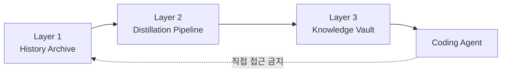

# 지식 증류소(Knowledge Distillery) 구현 설계서

**정제 파이프라인 설계 개요**

> 이 문서는 구현 상세 스펙의 원문이 아니라, 시스템의 전체 구조와 흐름을 빠르게 이해하기 위한 설계 개요서다.
> 정확한 스키마는 [`schema/vault.sql`](../../plugins/knowledge-distillery/schema/vault.sql), CLI 사용법은 `knowledge-gate help` 또는 [README CLI 빠른 참조](../../README.md#cli-quick-reference), 파이프라인 동작은 [`skills/`](../../plugins/knowledge-distillery/skills/)를 기준으로 본다.

---

## 1. 전체 아키텍처

Knowledge Distillery는 원시 정보와 에이전트 실행 컨텍스트를 분리하기 위해 3개 레이어로 구성된다.



- **Layer 1: History Archive**
  Slack, Linear, PR, 리뷰, AI 세션 요약처럼 정제 전의 원시 증거를 보관한다.
- **Layer 2: Distillation Pipeline**
  원시 증거에서 반복 가능한 규칙과 실패 패턴만 추출한다.
- **Layer 3: Knowledge Vault**
  정제 결과를 SQLite 금고에 저장하고, 에이전트는 이 레이어만 조회한다.

핵심 제약은 단순하다. 에이전트는 Layer 1을 직접 읽지 않고, 정제를 통과한 지식만 Layer 3에서 받는다. 이 분리가 지식 에어갭의 핵심이다.

---

## 2. 도구별 역할

이 설계에서 외부 도구는 모두 "정답 생성기"가 아니라 "증거 수집기"로 취급한다.

### 2.1 Slack Archive — Layer 1 전용, 근거의 원천

- 팀 대화의 원문을 보관하는 저장소다.
- 지식 금고에 Slack 원문을 직접 싣지 않는다.
- PR이나 이슈에 연결된 관련 스레드만 정제 입력으로 사용한다.

### 2.2 Linear — 정제의 앵커, 보조 트리거

- PR과 연결된 이슈를 통해 맥락을 고정하는 역할을 한다.
- 상태 변화, 본문, 코멘트는 정제 품질을 높이는 보조 증거다.
- Slack보다 구조화된 결정 흔적을 남기는 기준점으로 본다.

### 2.3 Greptile — PR 단위 코드 근거 공급

- PR 변경을 코드베이스 맥락에서 해석한 리뷰 결과를 제공한다.
- 정제 파이프라인에서는 "이번 변경에서 무엇이 규칙으로 굳어졌는가"를 읽는 보조 입력으로 사용한다.

### 2.4 Unblocked — 근거 링크 제공자

- 관련 코드, 문서, 대화를 탐색하기 위한 링크 수집 도구다.
- 결과를 사실로 채택하지 않고, 추가 검증이 필요한 참조로만 사용한다.

### 2.5 git-memento — AI 세션 컨텍스트 캡처

- AI 코딩 세션의 의사결정 요약을 커밋에 연결하는 선택적 입력이다.
- 없더라도 파이프라인은 동작하지만, 있으면 "왜 이렇게 바뀌었는가"를 더 잘 복원할 수 있다.

---

## 3. 정제 파이프라인 (Layer 2) 상세

정제 파이프라인의 목적은 "많이 모으는 것"이 아니라 "에이전트에게 전달할 만큼 확정된 것만 남기는 것"이다.

### 3.1 트리거: 2단계 파이프라인

정제는 머지 직후의 경량 마킹과, 이후의 배치 정제로 나뉜다.

1. **머지 시점 마킹**
   PR에서 정제에 필요한 식별자만 남긴다. 이 단계에서는 실제 수집보다 "무엇을 나중에 수집할지"를 고정하는 데 집중한다.
2. **배치 수집 + 정제**
   `knowledge:pending` 상태의 PR들을 모아 증거를 수집하고 후보를 추출한 뒤, 품질 게이트를 통과한 항목만 금고 승격 대상으로 만든다.

이 구조를 택한 이유는 두 가지다.

- 머지 직후의 과도한 동기식 처리를 피할 수 있다.
- 시간이 지난 뒤 성숙한 추가 맥락(후속 코멘트, 리뷰 결과, 회고)을 함께 포함할 수 있다.

### 3.2 Evidence Bundle: 수집 단위

정제의 입력은 "대화 로그 덩어리"가 아니라, PR 또는 이슈를 중심으로 묶인 **Evidence Bundle**이다.

번들은 보통 다음 성격의 입력을 포함한다.

- 기본 증거: PR 메타데이터, 커밋 메시지, 리뷰 논의, 연결된 Linear 이슈
- 선택 증거: Slack 스레드, Greptile 결과, git-memento 요약
- 온디맨드 증거: PR diff 같은 대용량 변경 정보

중요한 원칙은 원시 데이터를 에이전트에게 그대로 넘기지 않는 것이다. 번들은 오직 정제 파이프라인의 입력 단위로만 존재한다.

### 3.3 1차 정제: LLM이 후보를 추출한다

1차 정제는 Evidence Bundle에서 가치 있는 지식 후보를 뽑아내는 단계다. 추출 대상은 두 가지뿐이다.

- **Fact**: 팀이 실제로 채택했고 코드·리뷰·운영으로 뒷받침되는 규칙
- **Anti-Pattern**: 실패 메커니즘과 대안이 분명한 금지 패턴

#### 정제 후보 필수 스키마

후보는 최소한 아래 정보를 가져야 한다.

- `id`
- `type`
- `title`
- `claim`
- `body`
- `applies_to.domains`
- `evidence`
- `alternative` (anti-pattern인 경우)
- `considerations`

정확한 필드 제약과 적재 형식은 CLI와 스키마 문서를 기준으로 삼고, 이 문서에서는 "후보가 어떤 정보 덩어리여야 하는가"만 정의한다. 핵심은 후보가 단순 요약이 아니라, 금고에 적재 가능한 구조를 이미 갖춘 상태여야 한다는 점이다.

### 3.4 2차 정제: 자동 품질 게이트가 체리픽 기준을 집행한다

2차 정제는 추출된 후보를 자동으로 걸러내는 단계다. 사람의 개별 승인 대신, 파이프라인이 동일한 규칙을 반복 적용한다.

주요 판단 기준은 다음과 같다.

- 근거가 실제 증거와 연결되는가
- 적용 도메인이 명확한가
- 금지문이라면 대안이 있는가
- 고려사항이 비어 있지 않은가
- 기존 금고 항목과 의미적으로 중복되지 않는가

중복은 거절하고, 충돌은 인간 큐레이션 대상으로 남긴다. 즉, 품질 게이트의 역할은 "모든 것을 완벽히 판별"하는 것이 아니라 "에이전트에게 보내면 위험한 것"을 구조적으로 막는 데 있다.

---

## 4. 지식 금고 (Layer 3) 설계

### 4.1 저장 위치 및 형식

- 저장 위치는 `repo/.knowledge/vault.db`다.
- 형식은 SQLite 단일 파일이다.
- 에이전트는 금고를 직접 읽지 않고 `knowledge-gate`를 통해 조회한다.

이 선택의 목적은 복잡한 배포 체계보다, `git pull`만으로 최신 금고를 함께 배포할 수 있는 운영 단순성에 있다. 바이너리 파일이라는 점은 에이전트가 임의로 내용을 읽기 어렵게 만들어, 컨텍스트 관문을 사실상 강제하는 부수 효과도 제공한다.

#### 4.1.1 스키마 마이그레이션 전략

스키마 진화는 SQLite의 `PRAGMA user_version`을 기준으로 관리한다.

- 현재 버전을 읽고
- 필요한 마이그레이션만 순서대로 적용한 뒤
- 최신 버전으로 갱신한다

즉, 별도 마이그레이션 프레임워크보다 SQLite 자체 기능을 활용하는 단순한 경로를 택한다.

### 4.2 지식 금고 스키마

지식 금고의 정확한 DDL은 [`schema/vault.sql`](../../plugins/knowledge-distillery/schema/vault.sql)에 있다. 개념적으로는 다음 다섯 축으로 이해하면 된다.

- **entries**: Fact / Anti-Pattern 본문
- **domain_registry / domain_paths**: 통제된 도메인 어휘와 파일 경로 해소 규칙
- **entry_domains**: 항목과 도메인의 연결
- **evidence**: 항목을 뒷받침하는 근거 링크
- **curation_queue**: 인간 검토가 필요한 충돌/정리 대상

이 스키마는 "정확한 사실 저장"보다 "에이전트가 작업 전 관련 지식을 빠르게 질의"하는 흐름에 맞춰 설계되었다.

### 4.3 출력 포맷

금고 항목은 단순 텍스트 메모가 아니라, 에이전트가 빠르게 읽고 행동으로 연결할 수 있는 구조를 가져야 한다.

기본 원칙은 다음과 같다.

- 상단에는 `claim`으로 TL;DR을 둔다.
- 본문은 배경, 규칙, 기각된 대안, 열린 질문, 중단 조건처럼 읽기 순서를 고정한다.
- 중요한 요지를 앞부분에 배치해 긴 컨텍스트 중간에서 묻히지 않게 한다.

즉, 출력 포맷은 미관이 아니라 위치 편향과 과잉 컨텍스트 문제를 줄이기 위한 런타임 최적화다.

### 4.4 가드레일 원칙

금고의 표현 자유도는 일부러 제한한다.

- 항목 유형은 Fact와 Anti-Pattern만 사용한다.
- 확신도 점수는 두지 않는다.
- 기본 동작은 append-only에 가깝게 유지한다.

이 제한의 목적은 세밀한 분류 체계를 만드는 것이 아니라, 불확실성이 모호하게 섞여 들어오는 일을 줄이는 데 있다.

### 4.5 도메인 레지스트리 생애주기

이 설계는 파일 경로에 항목을 직접 매다는 대신, **도메인**을 중간 계층으로 둔다.

- 파일 경로는 `domain_paths`로 도메인에 해소된다.
- 항목은 `entry_domains`를 통해 도메인에 연결된다.
- 도메인은 필요에 따라 추가, 병합, 분리, 폐기될 수 있다.

이 모델을 택한 이유는 횡단 관심사 때문이다. 예를 들어 결제 규칙, 테스트 전략, ActiveRecord 제약처럼 여러 경로를 가로지르는 지식은 파일 단위 직접 매핑으로 관리하면 곧바로 폭발한다. 도메인 레이어는 이 문제를 완화한다.

### 4.6 도메인 도출 (LLM 기반)

정제 파이프라인이 `entry_domains` 테이블의 항목을 생성하는 흐름. 도메인 배정은 **LLM이 판단**한다. `domain_paths`의 경로 패턴은 참조 자료이지 기계적 매칭 규칙이 아니다 — 경로 매칭만으로는 횡단 관심사, 비즈니스 문맥, 적절한 추상화 수준을 판단할 수 없다.

```
PR 변경 맥락 (커밋 메시지, 리뷰 논의, Linear 이슈)
+ 기존 도메인 레지스트리 (domain_registry)
+ 경로 패턴 참조 (domain_paths)
    ↓
  추출 LLM은 먼저 registry를 controlled vocabulary로 보고,
  맞는 기존 도메인이 있으면 우선 재사용하며, 현재 registry로는
  경계가 맞지 않을 때만 새 도메인을 제안한다. 또한 merge/split/
  rename/scope cleanup 필요성도 후속 검토 신호로 남긴다.
    ↓
  추출 LLM이 종합적으로 판단하여 도메인 배정
    예: 결제 서비스 리팩토링 PR → domain: payment
    예: AR callback 장애 수정 PR → domain: payment, activerecord
    ↓
  배정된 도메인으로 entry_domains 테이블에 INSERT
    ↓
  매칭 도메인이 없는 경우:
    → LLM이 {name, description, suggested_patterns}를 제안
    → knowledge-gate domain-add + domain-paths-set으로 반영
    → 이후 수동 검토에서 merge/deprecate/path cleanup 필요 여부 판단
  기존 도메인을 재사용했지만 naming/scope 문제가 드러난 경우:
    → LLM이 `_domain_maintenance` annotation을 남김
    → batch report가 merge/split/rename/scope cleanup 후속 과제로 요약
```

**도메인 정의 가이드라인 (추출 프롬프트에 포함):**

- **입도(granularity):** 팀이 독립적으로 의사결정하는 단위. "payment"은 적절하지만 "payment-refund"와 "payment-charge"로의 과분할은 지양
- **횡단 관심사:** 특정 디렉토리에 국한되지 않는 규칙(보안 정책, 테스트 관행, 에러 처리 등)은 기술적 횡단 도메인으로 분류
- **명명 규칙:** 소문자 kebab-case, 비즈니스 도메인과 기술 도메인을 구분 (예: `payment` vs `activerecord`)
- **짧음보다 트리거 품질 우선:** 경량 인덱스에서 ID만 보여도 의미를 추론할 수 있는 이름을 우선한다. 조금 길더라도 자기 설명적인 이름이 짧지만 모호한 이름보다 낫다.
- **경계 명확성:** 어떤 작업/파일이 이 도메인을 트리거해야 하고, 인접한 어떤 관심사는 제외되어야 하는지가 이름만으로도 어느 정도 드러나야 한다. `core`, `system`, `processing` 같은 이름은 저장소에서 이미 정밀한 의미를 갖는 경우가 아니라면 약하다.
- **지속성 있는 용어:** 일시적인 구현 세부나 특정 단계 이름보다, 오래 유지될 책임/워크플로 용어를 우선한다.
- **registry-aware reuse:** 정제 시 전체 active domain registry를 controlled vocabulary로 조회하고, 맞는 도메인이 있으면 먼저 재사용한 뒤 부족할 때만 새 도메인을 제안한다.
- **개선 신호는 churn이 아니라 후속 정비로:** 기존 도메인 이름이나 범위가 완벽하지 않더라도 현재 배치에서 가장 가까운 도메인이라면 우선 재사용하고, merge/split/rename/scope cleanup 필요성은 후속 검토 신호로 남긴다.
- **구조화된 후속 신호:** 이런 후속 신호가 서술형 기억에만 머물지 않도록, 추출 출력에 명시적 annotation을 담아 downstream report가 같은 내용을 결정적으로 요약할 수 있어야 한다.

매 정제 배치 후 도메인 셋업에서 `domain-report` 결과를 참조하여 도메인 레지스트리와 `domain_paths` 패턴을 함께 검토·갱신한다.

---

## 5. 지식 금고 관리 주기

### 5.1 진입 정책: 추가에 보수적, Append-only

거짓 양성(false positive)이 금고에 들어오면 에이전트 행동이 바로 오염된다. 따라서 이 시스템은 "많이 넣는 것"보다 "잘못 넣지 않는 것"을 우선한다.

운영 기본값은 다음과 같다.

- 승격은 보수적으로 한다.
- 본문보다 상태 전환으로 관리한다.
- 새 판단은 수정 대신 새 항목 추가와 archive 조합으로 처리한다.

### 5.2 인간 큐레이션 UX

인간의 역할은 개별 항목 승인자가 아니라 전략적 검토자다.

사람이 보는 핵심 신호는 다음과 같다.

- 충돌하는 항목
- 더 이상 유효하지 않은 항목
- 중복되거나 가치가 낮은 항목
- 도메인 구조가 과밀하거나 과소한 영역

즉, 인간 큐레이션은 일상적인 병목이 아니라, 금고의 방향성과 품질을 가끔 바로잡는 후속 공정이다.

### 5.3 상태 관리: 제거가 아닌 전환

금고 항목은 가능한 한 삭제보다 상태 전환으로 관리한다.

- `active`: 현재 런타임에 노출 가능한 항목
- `archived`: 역사적 맥락은 남기되 기본 질의에서는 제외되는 항목

이 방식은 "왜 빠졌는가"라는 맥락을 보존해 이후 판단 비용을 줄인다.

---

## 6. 피드백 루프 (운영 방향)

에이전트가 작업 중 발견한 실패 사례나 새로운 제약도 다시 정제 입력이 될 수 있다. 다만 중요한 제약은 같다. 피드백 역시 Layer 1로 돌아가 같은 정제 과정을 거쳐야 하며, 에이전트가 금고를 직접 고치는 경로는 허용하지 않는다.

---

## 7. 에이전트 런타임 정책

### 7.1 지식 금고만 읽는다

에이전트의 표준 지식 조회 경로는 금고뿐이다. 원시 증거, 대화 로그, 정제 중간 산출물은 런타임 기본 경로에 두지 않는다.

### 7.2 Soft Miss 원칙

관련 지식이 조회되지 않더라도 모든 작업을 멈추지는 않는다.

- **비구조적 수정**
  버그 수정, 좁은 범위의 리팩토링, 기존 패턴을 따르는 변경은 일반적으로 진행한다.
- **구조적 변경**
  새 모듈, 새 추상화, 아키텍처 이동, 패턴 도입처럼 장기 영향을 남기는 변경은 질문 프로토콜로 넘긴다.

즉, Soft Miss는 "지식이 없으면 무조건 멈춤"이 아니라 "불확실성이 큰 변경만 보수적으로 다룬다"는 운영 규칙이다.

### 7.3 질문 프로토콜

에이전트는 다음 조건에서 질문해야 한다.

- 구조적 변경이 필요한데 금고 근거가 없을 때
- 기존 금고 항목끼리 충돌하는데 어느 쪽이 최신인지 불명확할 때
- 현재 변경이 프로젝트 관례를 새로 만드는 성격일 때

질문의 목적은 모든 판단을 인간에게 넘기는 것이 아니라, 금고 밖 결정을 런타임에서 임의로 확정하지 않도록 하는 데 있다.

### 7.4 CLAUDE.md / AGENTS.md와의 관계

`CLAUDE.md`나 `AGENTS.md`는 에이전트 운영 지침이고, 지식 금고는 정제된 프로젝트 지식 저장소다. 둘은 보완 관계지만 같은 레이어가 아니다.

- 운영 지침은 에이전트 행동 방식을 규정한다.
- 지식 금고는 프로젝트별 규칙과 실패 패턴을 전달한다.

### 7.5 컨텍스트 관문: knowledge-gate Skill + CLI

컨텍스트 관문은 "금고 전체를 읽히지 않고, 현재 작업에 맞는 항목만 질의한다"는 원칙의 구현체다.

- Skill은 에이전트가 어떤 순서로 질의할지 안내한다.
- CLI는 실제 질의와 적재를 수행한다.
- 정확한 커맨드 사용법은 `knowledge-gate help`를 실행하거나 [README CLI 빠른 참조](../../README.md#cli-quick-reference)를 참고한다.

즉, 이 문서가 설명하는 것은 커맨드 문법이 아니라, 왜 `knowledge-gate`가 유일한 접근 경로여야 하는가다.

**CLI를 지배하는 설계 원칙:**

- **벤더 중립 지향(런타임) / Claude-first(배포)**: 에이전트 런타임 커맨드는 `sqlite3`(사전 설치)만 사용하여 벤더 중립을 유지한다. 파이프라인/관리 커맨드는 `jq`를 추가로 요구한다 (JSON 처리용). 배포는 Claude Code Plugin으로 제공하되, CLI 자체는 어떤 에이전트에서든 실행 가능.
- **표준 plugin 패키징**: 레포지토리가 marketplace를 겸한다 (`.claude-plugin/marketplace.json`). 플러그인은 `plugins/knowledge-distillery/` 하위에 위치하며, `skills/`, `scripts/`, `schema/` 같은 번들 자산은 `${CLAUDE_PLUGIN_ROOT}`를 통해 참조한다.
- **규격화된 DB 조작**: LLM이 판단하고, CLI가 DB를 조작한다. 직접 SQL 실행 금지.

### 7.6 에이전트 Skill 템플릿

CLI와 데이터는 모든 에이전트가 공유하고, Skill 파일만 에이전트별로 제공한다.

```markdown
# knowledge-gate Skill 예시 (Claude Code용)

---
description: 코드 수정 전 지식 금고에서 관련 규칙을 조회한다.
  파일을 수정하거나 구조적 변경을 할 때 반드시 사용할 것.
---

## 사용 시점

- 코드 파일을 수정하기 전
- 새 파일/모듈을 생성하기 전
- 아키텍처 결정이 필요한 작업 시

## 쿼리 프로토콜

### 단일 파일 수정 시
bin/knowledge-gate query-paths "<수정할 파일 경로>"

### 다중 파일 수정 시 (PR 규모 변경)
# 1. 관련 도메인 확인 (대표 파일 몇 개로 충분)
bin/knowledge-gate domain-resolve-path "<파일 경로>"
# 2. 도메인 단위로 규칙 조회 (중복 없이 효율적)
bin/knowledge-gate query-domain "<도메인명>"

### 키워드로 검색 (경로 매칭이 없을 때)
bin/knowledge-gate search "<키워드>"

### 상세 규칙 확인이 필요할 때
bin/knowledge-gate get "<항목 ID>"

### 도메인/키워드를 모를 때 (탐색용 레퍼런스)
bin/knowledge-gate list
# → 전체 활성 항목 요약 목록. 여기서 관련 도메인이나 키워드를 파악한 후
#   query-paths / query-domain / search로 정밀 조회

### 도메인 확인
bin/knowledge-gate domain-info "<도메인명>"
bin/knowledge-gate domain-resolve-path "<파일 경로>"

## 행동 규칙

- knowledge-gate 결과가 없으면:
  - 비구조적 수정(버그 수정, 로컬 리팩토링 등): 기존 코드 구조를 유지하고 진행
  - 구조적 변경(새 모듈, 아키텍처 변경, 패턴 도입 등): 질문 프로토콜 발동 ([§7.3](./design-implementation.md#73-질문-프로토콜))
- MUST-NOT 규칙이 있으면: 반드시 준수. alternative를 따를 것
- Stop Conditions에 해당하면: 사람에게 확인 후 진행
- .knowledge/ 디렉토리의 파일을 직접 읽지 말 것
```

---

## 8. 운영/거버넌스

### 8.1 권한 최소화

수집 도구와 파이프라인에는 가능한 한 읽기 중심 권한을 부여한다. 원시 데이터 수집과 금고 적재 권한을 분리해, 한 경로의 오동작이 전체 경계를 무너뜨리지 않게 한다.

### 8.2 보안 경계

보안의 핵심은 절대적 차단보다, 기본 동선에서 원시 데이터에 닿지 않게 만드는 것이다. PoC 단계에서는 이 운영적 경계를 우선하고, 강제 장치는 필요가 확인될 때 강화한다.

### 8.3 기술적 격리 수단 구현 방향 (TBD)

파일시스템, 네트워크, 실행 환경 수준의 강제 격리는 향후 선택지로 남겨둔다. 현재 단계에서는 설계 유연성을 해치지 않는 수준의 convention-based 격리를 기본값으로 둔다.

---

## 9. 구현 로드맵

현재 로드맵은 "완전 자동화"보다 "실제 운영 가능한 최소 흐름"을 먼저 확보하는 데 초점이 있다.

### 9.1 수동 정제로 시작

초기에는 수집과 승격 일부가 수동이어도 괜찮다. 중요한 것은 정제 기준, 금고 구조, 런타임 조회 경험이 실제로 유용한지 검증하는 것이다.

### 9.2 자동 수집 + AI 자율 정제로 전환

유용성이 확인되면, 머지 마킹, 배치 수집, 후보 추출, 품질 게이트, 리포트 생성을 점진적으로 자동화한다. 자동화의 목적은 사람을 제거하는 것이 아니라, 반복되는 기계적 검사를 파이프라인으로 이전하는 데 있다.

---

## 10. 작동 여부 판단 (운영 방향)

### 10.1 1차 판단: 사용자 경험

가장 먼저 봐야 할 것은 체감이다. 에이전트가 같은 실수를 덜 반복하는지, 불필요한 질문이 줄었는지, 작업 전 필요한 규칙을 더 빠르게 찾는지가 핵심 지표다.

### 10.2 보조 지표

체감만으로는 부족하므로 다음을 함께 본다.

- 동일 유형 작업에서의 재시도 횟수 변화
- 질문 빈도와 질문의 적절성
- 금고 적용 전후 결과물 비교

정량 지표의 목적은 완벽한 점수화를 만드는 것이 아니라, "이 구조가 실제로 에이전트 품질을 개선하는가"를 검증하는 데 있다.

---

## 부록

이 문서에서 의도적으로 생략한 구현 세부는 아래 문서를 기준으로 본다.

- CLI 명령과 입출력: `knowledge-gate help` 및 [README CLI 빠른 참조](../../README.md#cli-quick-reference)
- 정확한 SQLite 스키마: [`schema/vault.sql`](../../plugins/knowledge-distillery/schema/vault.sql)
- 파이프라인 Skill 세부: [`skills/`](../../plugins/knowledge-distillery/skills/)
- 채택/비채택 도구 비교: [`docs/ko/tool-evaluation.md`](./tool-evaluation.md)
