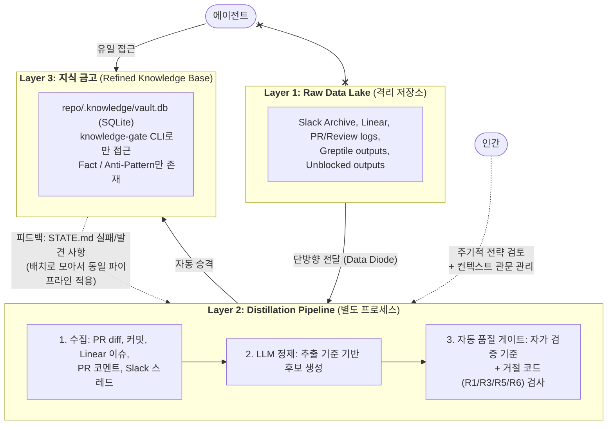

# 지식 증류소(Knowledge Distillery) 구현 설계서  
  
**정제 파이프라인 설계 — Rails + Claude Code 기준**  
  
> 본 문서는 [지식 증류소(Knowledge Distillery): 에이전트에게 핵심만 전달하는 지식 증류 체계](./design-philosophy.md)에서 정의한 철학을 구현하기 위한 설계를 다루는 문서이다.  
  
---  
  
## 1. 전체 아키텍처  
  

  
**핵심 제약:** 에이전트는 Layer 1에 직접 접근할 수 없다. 지식 금고에 없는 영역에 대해서는 비구조적 수정은 정상 진행하고, 구조적 변경에 한해 질문 프로토콜을 발동한다 (Soft miss 원칙, §7.2).  
  
---  
  
## 2. 도구별 역할  
  
모든 도구는 **"진실 생산"이 아니라 "증거 수집"** 용도로만 사용한다. 도구의 출력을 곧바로 지식 금고로 받아들이면 지식 에어갭이 깨진다.  
  
### 2.1 Slack Archive — Layer 1 전용, 근거의 원천  
  
**수집 방법**  
  
- Workspace export (JSON) — 플랜/권한에 따라 주기적 export 가능  
- API: `conversations.history` (채널), `conversations.replies` (스레드), `chat.getPermalink` (링크)  
  
**운영 규칙**  
  
- **Layer 1에만 저장.** 지식 금고에 Slack 원문 덤프 금지.  
- 코드 관련 대화가 실제로 일어나는 채널만 선택 (나머지는 정보 가치가 낮음)  
- DM/프라이빗 채널은 기본 제외. 필요 시 승인형 워크플로우로만 사용.  
  
**정제 파이프라인에서의 위치:** PR에 연결된 Slack 스레드가 있을 때, 해당 스레드만 Evidence Bundle에 포함  
  
### 2.2 Linear — 정제의 앵커, 보조 트리거  
  
**역할**  
  
- PR과 연결된 이슈의 본문/코멘트/상태 변화를 Evidence Bundle에 포함  
- Slack 논의를 Linear 이슈에 연결하면, Slack 전체를 뒤질 필요가 줄어듦  
  
**연동**  
  
- Webhook: 이슈 상태 변경, 라벨 추가(`decision`, `postmortem`) 시 알림  
- API 키는 Read-only로 시작. 최소 범위 원칙.  
- Slack↔Linear 연결 (Slack에서 이슈 생성 + 스레드 동기화) 강력 권장  
  
**정제 파이프라인에서의 위치:** 기본 브랜치 병합 시점에 Evidence Bundle을 수집하고, 연결된 Linear 이슈의 컨텍스트로 번들의 품질을 높인다.  
  
### 2.3 Greptile — PR 단위 코드 근거 공급  
  
**역할**  
  
- PR을 레포 전체 맥락으로 리뷰하여 변경의 의미/위험/패턴을 추출  
- 변경 요약, 라인 코멘트, 수정 제안 제공  
  
**정제 파이프라인에서의 사용법**  
  
1. **PR 머지 시점에 Greptile 리뷰 결과를 Evidence Bundle에 포함** — "이번 PR에서 새로 생긴 규칙/안티패턴/테스트 전략"을 추출하는 입력  
2. **지식 금고를 Greptile Custom Context로 업로드** — PR 리뷰 단계에서 기존 규칙 위반을 조기 감지. 정제 지식이 "문서로만 존재"하지 않고 "리뷰에서 집행"됨.  
3. **API/MCP로 PR/코멘트 데이터를 자동 수집** — Distiller가 "최근 머지된 PR + Greptile 코멘트"를 묶어 지식 후보 생성  
  
### 2.4 Unblocked — 근거 링크 제공자 (지식 금고가 아님)  
  
**역할**  
  
- Slack/Linear/코드 등 교차 소스에서 관련 문서/대화/코드의 **참조 링크**를 제공  
- "어디를 봐야 하는지"에 대한 탐색 비용 절감  
  
**운영 규칙**  
  
- Distiller가 Unblocked에 질의할 때 목표는 **"정답"이 아니라 "근거 링크 수집"**  
- 에이전트가 Unblocked를 직접 질의해서 그 결과로 코딩하면 **에어갭이 깨짐** → 금지  
- 경로: Unblocked → 근거 링크 → Distiller → 검증/분해 → 지식 금고  
  
**보안**  
  
- Data Shield: 질의한 사용자의 접근 권한 범위 내에서만 답변  
- RBAC로 데이터 소스 설정 변경 제한, Audit Logs 활용  

### 2.5 git-memento — AI 세션 컨텍스트 캡처 (Layer 1 인프라)

**의존성 수준: 선택적(optional).** git-memento가 설치되지 않은 환경에서도 정제 파이프라인은 정상 동작한다. memento 노트가 없으면 Evidence Bundle에서 AI 세션 컨텍스트가 빠질 뿐, 나머지 증거(PR diff, 커밋 메시지, Linear 이슈, PR 코멘트)로 정제를 수행한다 (graceful degradation).

**역할**

- AI 코딩 세션의 트랜스크립트를 `git notes`로 커밋에 부착하여 "왜 이렇게 변경했는가"의 맥락을 보존
- `git memento commit <session-id> -m "message"` — 커밋 생성과 세션 노트 부착을 원자적으로 수행
- 프로바이더 확장: Codex, Claude Code 지원 (`MEMENTO_AI_PROVIDER=claude`)

**저장 구조**

- `refs/notes/commits` — LLM 요약 (커스텀 Summary Skill로 구조화)
- `refs/notes/memento-full-audit` — 전체 트랜스크립트 (감사용)
- 이중 저장으로 "읽기 쉬운 요약"과 "감사 가능한 원본"을 분리

**notes 보존 정책**

- 두 ref 모두 메인 리포지토리에 그대로 push한다 (`git memento push`가 `refs/notes/*` 전체를 push하므로 별도 설정 불필요)
- 일 20세션 기준 연간 ~1.5GB (packfile 압축 후 30-40% 수준). Git 사용에 실질적 영향 없음
- **정제 완료 기준 아카이빙:** 정제 파이프라인이 처리를 완료한 notes(`knowledge:collected` 라벨이 부착된 PR에 연관된 커밋)는 텍스트 형식으로 외부 스토리지에 아카이빙한 후 리포지토리에서 정리한다. `knowledge:collected` 라벨은 **파이프라인 처리(vault INSERT) + Report PR 생성이 모두 완료**된 상태를 의미한다 (§3.1 B-7단계에서 Report PR 생성 후 전환). 정제 후의 entries가 최종 산출물이므로, 원료인 notes는 리포지토리에 영속할 필요가 없다. 저장소는 프로젝트 환경에 맞게 선택한다 (S3, GCS, NAS, 별도 repo 등)
- 정리: `git notes --ref=<ref> remove <commit>` + `git push --force origin refs/notes/<ref>` (두 ref 모두 동일)
- 정리 주기 1~3개월 권장. notes가 리포지토리에 장기 누적되면 git object 크기 증가로 clone/fetch 성능이 저하되고, GitHub 리포지토리 용량 한도(soft 1GB)에 접근할 수 있다. `knowledge:collected` 라벨을 참조하여 정제 미완료 notes의 실수 삭제를 방지

**squash merge 생존**

- `git memento notes-carry --onto <merge-commit> --from-range <base>..<head>` — 개별 커밋의 노트를 머지 커밋으로 이관
- GitHub Action `mode: merge-carry` — PR 머지 시 자동 이관
- git trailer 방식의 squash merge 소실 문제를 근본적으로 해결

**CI 게이트 (선택적)**

- `git memento audit --range main..HEAD --strict` — 노트 커버리지 검증
- GitHub Action `mode: gate` — 노트 미부착 커밋이 있으면 PR 실패
- CI gate는 git-memento를 도입한 프로젝트에서만 활성화한다. 미도입 프로젝트에서는 이 단계를 건너뛴다

**커스텀 Summary Skill (필수)**

기본 요약 스킬(Goal/Changes/Decisions/Validation/Follow-ups)은 범용 요약이므로, Knowledge Distillery에 최적화된 커스텀 스킬을 작성하여 Fact/Anti-Pattern 후보 추출에 적합한 컴팩션 컨텍스트(compaction context) 구조로 요약을 생성한다. 이 스킬이 Layer 1 → Layer 2 경계에서 evidence 품질을 결정하는 핵심 컴포넌트다. 출력 구조와 추출 규칙의 상세는 부록 "커스텀 Summary Skill" 참조.

**에어갭 호환성**

- `git notes`는 `git fetch` 시 명시적 refspec 지정 없이는 가져오지 않음
- 에이전트 런타임 환경에서 `refs/notes/*`를 fetch하지 않으면 에어갭이 자연스럽게 유지됨
- 정제 파이프라인(Layer 2)에서만 `git fetch origin 'refs/notes/commits:refs/notes/commits'`로 요약 노트만 명시적 수집 (full-audit는 fetch하지 않음)

**보안**

- 세션 트랜스크립트는 untrusted data로 취급 (요약 프롬프트에 injection 방어 내장)
- 전체 트랜스크립트(`memento-full-audit`)는 Layer 1에만 존재, Layer 3 진입 금지

**정제 파이프라인에서의 위치:** PR 머지 시점에 `merge-carry`로 노트를 머지 커밋에 이관한 후, Evidence Bundle 수집 시 `refs/notes/commits`의 요약을 AI 세션 컨텍스트로 포함한다.

**참조:** [mandel-macaque/memento](https://github.com/mandel-macaque/memento)
  
---  
  
## 3. 정제 파이프라인 (Layer 2) 상세  
  
### 3.1 트리거: 2단계 파이프라인  

정제 파이프라인은 **머지 시점 마킹**과 **배치 시점 수집+정제**의 2단계로 구성한다. 원천 데이터(PR diff, Linear 이슈, Slack 스레드, git notes)는 머지 후에도 원본 소스에 영속적으로 존재하므로, 중간 저장소 없이 식별자만 기록하고 실제 수집은 정제 시점에 수행한다.

**A. 머지 시점 마킹 (PR merge 트리거, 경량 Action)**

병합된 PR에 대해 Evidence Bundle의 **식별자만 추출**하고 PR에 기록한다. 실제 데이터 수집은 수행하지 않는다.

1. PR 메타데이터에서 Evidence Bundle 식별자 추출:
   - Linear 이슈 ID (PR title/body/commits에서 추출)
   - Slack 스레드 링크 (PR body 또는 Linear 이슈에서 추출)
   - git-memento 노트가 부착된 커밋 SHA
   - Greptile 리뷰 ID (연결된 경우)
2. **PR comment**로 구조화된 식별자 목록(Evidence Bundle Manifest) 기록
3. **`knowledge:pending` 라벨** 부착 — 수집 대상으로 마킹

**B. 배치 수집 + 정제 (cron 트리거, 주간/격주)**

`knowledge:pending` 라벨이 붙은 PR들을 대상으로 실제 증거를 수집하고 정제를 실행한다.

1. `knowledge:pending` 라벨이 붙은 PR 목록 조회
2. 각 PR의 Evidence Bundle Manifest(PR comment)를 읽어 식별자 확인
3. 식별자를 기반으로 실제 evidence 수집 (GitHub API, Linear API, git notes fetch 등)
4. Evidence Bundle 구성 → 1차 정제(LLM 후보 추출) → 2차 정제(품질 게이트) → 기존 항목 비교
5. 별도 브랜치에서 승격된 항목을 `knowledge-gate _pipeline-insert`로 `.knowledge/vault.db`에 일괄 INSERT (도메인이 `domain_registry`에 없으면 자동 생성). 수동/인간용 적재는 `knowledge-gate add`를 사용
5.5. **배치 리포트 파일 생성:** `.knowledge/reports/batch-YYYY-MM-DD.md`를 항상 생성한다. 승격 0건이어도 리포트 파일을 생성하여 git diff를 보장하고, Report PR 생성이 항상 가능하도록 한다
6. vault.db 변경(있는 경우) + 배치 리포트 파일을 커밋·푸시하고 **Report PR** 생성 (배치당 1회). PR body에 추가/거절 항목 요약(항목명, 유형, 거절 사유) 기재. **Report PR이 머지되는 시점이 L3(지식 금고) 승격 시점이다** — 머지 전까지 항목은 브랜치에만 존재하며 에이전트에게 노출되지 않는다
7. 처리된 PR의 라벨을 `knowledge:collected`로 교체 (Report PR 생성 이후에 전환하여, 라벨만 전환되고 Report PR이 누락되는 상태를 방지)
8. **도메인 검토/재편:** `domain-report`로 도메인 레지스트리를 진단하고, 과밀/과소/고아 도메인을 검토·갱신한다 (§4.5 참조). 실제 구현에서는 `domain-report` 출력을 Report PR body에 포함하기 위해 6단계(Report PR) 이전에 실행한다 (상세 순서는 `batch-refine.prompt.md` 참조). 최초 실행 시 도메인이 미구축이면 1단계(시드 셋업) → 4단계(정제) → 8단계(도메인 검토/재편) 순으로 실행

**시간차 수집의 이점:** 머지 직후가 아닌 배치 시점에 수집하므로, Linear 이슈의 후속 코멘트나 Slack의 추가 논의 등 시간 경과에 따른 성숙한 경험 자료를 포함할 수 있다.

**동시성 정책:** 배치 실행이 중복되거나 mark-evidence와 겹치는 경우를 위한 별도 잠금 메커니즘은 두지 않는다. `knowledge:pending` → `knowledge:collected` 라벨 전환이 멱등적이므로, 경쟁 발생 시 처리되지 못한 PR은 다음 배치에서 자연스럽게 처리된다. 이는 의도적인 낙관적 설계이며, 운영 데이터에서 실제 경쟁이 문제가 되는 시점에 잠금을 추가할 수 있다.

**보조 트리거 (선택적, 배치 우선순위 조정용)**

- `decision` / `postmortem` / `incident` 라벨이 추가된 Linear 이슈
- 특정 Slack 채널에서 결정 태그/이모지가 포함된 스레드 (가능하면 Linear로 앵커링)  
  
### 3.2 Evidence Bundle: 수집 단위  
  
정제의 입력은 "대화 로그 덩어리"가 아니라 **구조화된 증거 묶음**이다.  
  
```  
bundle_id: PR#1234 (또는 Linear Issue ID)  
  
사전 수집 증거 (pre-collected):
├── 커밋 메시지
├── 연결된 Linear 이슈 본문/코멘트/상태 변화 (연결 이슈가 있는 경우)
└── PR 코멘트 (리뷰 논의) — 없는 경우 `no_review_discussion` 표기

온디맨드 증거 (git 영속 — 프롬프트에 직접 전달하지 않음):
└── PR diff — git history에 영속하므로 추출 LLM이 도구(`gh pr diff`, `git diff`, `git show`)로 필요한 변경만 선택적으로 조회한다. diff 전체를 프롬프트에 주입하는 것은 안티패턴이다.

선택 증거 (optional):
├── AI 세션 컨텍스트 (git-memento notes) — §2.5 참조
│   ├── refs/notes/commits: 커스텀 Summary Skill로 구조화된 요약
│   └── refs/notes/memento-full-audit: 전체 트랜스크립트 (감사용)
├── 연결된 Slack 스레드  
├── Greptile 리뷰 결과 (요약/라인 코멘트/수정 제안)  
└── Unblocked 근거 링크 (관련 문서/대화 참조)  

배치 수집 시점에 사전 수집 증거가 확보되지 않으면 해당 PR의 라벨을 `knowledge:insufficient`로 변경하고, 후보 생성 단계로 넘기지 않는다. 온디맨드 증거(PR diff)는 git history에 항상 존재하므로 충분성 판정 대상이 아니다.

보류된 PR의 수명 정책:
- **자동 재시도**: 다음 정제 사이클에서 `knowledge:insufficient` PR을 재수집하여 증거 보강 시도
- **SLA**: 최대 2회 정제 사이클(약 2~4주) 내 필수 증거 미확보 시 `knowledge:abandoned`로 전환
- **에스컬레이션**: 높은 가치가 예상되는 PR(보조 트리거 이슈 연결)은 인간에게 증거 보충 요청
- **보고**: 보류/포기 PR 현황은 에어갭 검토 보고에 포함
  
### 3.3 1차 정제: LLM이 후보를 추출한다  
  
**추출 원칙: 단순 요약 금지, 유형별 분해**  
  
LLM은 Evidence Bundle에서 다음 두 유형의 후보를 추출한다.  
  
| 유형 | 설명 | 예시 |  
|---|---|---|  
| **Fact** | 팀이 합의했고, 코드/테스트/운영으로 뒷받침되는 규칙 | "결제 트랜잭션은 Service Object에서만 수행" |  
| **Anti-Pattern** | 실패했던 접근 + 실패 메커니즘 + 반복 금지 조건 + 대안 | "AR callback에서 외부 API 호출 → DB 락 장애. 대안: Service Object" |  
  
LLM은 **추출 기준**에 따라 후보 생성 여부를 판단한다. 확신도를 명시적으로 분류시키지 않는다.

- **추출 대상**: 머지된 PR + CI 통과, 리뷰 합의가 확인된 결정, 문서/ADR로 명시된 규칙
- **추출 제외**: Slack 논의 수준의 가설, 진행 중인 실험, 명시적 합의 없는 의견

근거가 약한 정보는 후보로 생성되지 않거나 evidence 필드가 빈약하게 채워지며, 이후 품질 게이트(R1/R3/R5/R6)에서 객관적으로 걸러진다.
  
추가로 LLM은:  
- 기존 지식 금고와의 **충돌/중복 여부**를 표시  
- 중복/불필요/낮은 가치 정보를 **사전 필터링**  

#### 정제 후보 필수 스키마 (Candidate Required Schema)

```yaml
# 정제 후보 필수 스키마 (Candidate Required Schema)
id: "kebab-case slug (LLM이 title 기반으로 생성, 3-5 단어). 충돌(UNIQUE constraint) 시 숫자 접미사 부여 (예: payment-service-object-2)"
type: fact | anti-pattern
title: "항목 제목 (entries.title에 매핑, NOT NULL)"
claim: "핵심 주장 한 줄"
body: "상세 내용 — §4.3 body 템플릿에 따라 LLM이 생성 (entries.body에 매핑, NOT NULL)"
applies_to:
  domains: ["LLM 도메인 도출(cli.md §6)로 부여. 기존 도메인 레지스트리와 domain_paths를 참조하되, 최종 판단은 LLM이 수행. 매칭 도메인이 없으면 신규 도메인을 제안"]
evidence:
  - { type: pr|linear|slack|greptile|memento, ref: "참조" }
alternative: "대안 (MUST-NOT인 경우 필수)"
conflict_check: "기존 금고 충돌 여부 (경고 태그 용도, 거절 사유 아님)"
considerations: "고려사항 — 우려, 주의점, 적용 조건 등. 해당 없으면 '특별한 고려사항 없음' 명시"
```

이 스키마를 충족하지 않는 후보는 자동 품질 게이트 진입 전 탈락한다.
  
**구현 도구: Claude Code 네이티브 (Skill + Subagent)**  
  
1차 정제의 "LLM에 Evidence Bundle을 통과시켜 후보 추출" 단계는 Claude Code의 Skill 시스템으로 구현한다. Skill 파일 자체가 추출 프롬프트이며, `anthropics/claude-code-action`을 통해 GitHub Actions에서 실행한다. Claude Code 자체가 LLM이므로 별도 API 래퍼나 외부 프롬프트 러너가 불필요하다.

> **Fabric CLI 불채택 사유:** [Fabric](https://github.com/danielmiessler/fabric)은 시스템 프롬프트를 파일로 관리하고 CLI로 LLM API를 호출하는 프롬프트 러너다. 이 프로젝트에서 Fabric이 담당할 역할은 "추출 프롬프트 1회 실행"뿐인데, Claude Code 네이티브 경로에서는 Skill이 곧 프롬프트이고 LLM이 자기 자신이므로 Fabric이 제공하는 가치가 없다. Go 바이너리 의존성, 별도 API 키 설정, Fabric 출력 파싱을 위한 접착 코드, 셸/Rake 오케스트레이션 등 불필요한 복잡도만 추가된다.

추출 프롬프트 설계 시 [obra/claude-memory-extractor](https://github.com/obra/claude-memory-extractor)의 다차원 추출 구조(Five Whys, 심리적 동기, 예방 전략, 불확실성 표기)를 참고한다. 특히 "근거가 부족하면 억지로 교훈을 만들지 말 것"이라는 제약이 본 설계의 "확정된 결정만 추출하고, 가설은 추출하지 않는다"는 추출 기준과 일치한다. 다만 Node.js/TypeScript 기반의 Claude CLI 로컬 로그 전용 도구이므로, 직접 통합이 아닌 프롬프트 패턴 차용으로 활용한다. 또한 코딩 에이전트와 Distiller의 과업이 다르다는 점(결정이 진행 중인 맥락에서 행동 vs 완료된 결과에서 결론을 증류)을 전제로 프롬프트를 분리 설계한다.  
  
**1차 정제의 결과는 자동 품질 게이트로 전달되는 중간 산출물이다.**  
  
### 3.4 2차 정제: 자동 품질 게이트가 체리픽 기준을 집행한다  

LLM이 남긴 후보 목록은 정제 파이프라인의 자동 품질 게이트에서 검증한다. 개별 항목을 사람이 승인하는 방식이 아니라, 정의된 기준을 파이프라인이 동일하게 적용해 통과 항목만 지식 금고로 승격한다.  

- 가치가 높은 핵심 정보만 **자동 선별**  
- 불필요하거나 잘못된 정보를 **자동 탈락**  
- 통과된 것만 지식 금고로 **자동 승격**  

**인간의 역할은 개별 승인자가 아니라, 주기적 전략 검토와 컨텍스트 관문 관리다.**  

**체리픽 승인 기준 (파이프라인 자동 검증 기준, 모두 충족해야 승격 가능)**

- 근거 충분성: evidence에 연결된 정보원(PR diff, 리뷰 코멘트, Linear 이슈 등)에 해당 주장에 대한 근거 또는 작업자 간 합의가 존재하는가
- 적용 범위: `applies_to`의 도메인이 지정되어 있는가. LLM 도메인 도출(cli.md §6)에 의해 항상 부여되므로 별도 거절 코드 없음 — 매칭 도메인이 없으면 신규 도메인을 active로 추가한다 (무죄 추정 원칙: 사후 교정 가능, 과차단 비용 > 허용 비용)
- 금지문 완결성: MUST-NOT에는 대안이 함께 제시되어 있는가
- 고려사항 심사숙고: considerations 필드에 우려/주의점/적용 조건이 기록되어 있거나, 해당 사항이 없음이 명시되어 있는가 (빈 값 불허)

**거절 코드 (자동 품질 게이트에서 사용 — 미충족 시 적재 차단)**

- `R1_EVIDENCE_INSUFFICIENT`: evidence 정보원에 해당 주장을 뒷받침하는 근거 또는 작업자 간 합의가 불충분
- `R3_NO_ALTERNATIVE`: 대안 없는 금지문
- `R5_UNCONSIDERED`: considerations 필드가 비었거나 심사숙고 흔적이 없음
- `R6_DUPLICATE`: 기존 항목 비교 단계에서 의미적으로 동일한 항목이 감지됨

> **PoC 유연성 참고:** R3(대안 없는 금지문 거절)과 R5(고려사항 미기재 거절)는 PoC 단계에서는 가이드라인으로 운용하며, 운영 데이터를 기반으로 점진적으로 강화할 예정이다.

**기존 항목 비교 (R6 + 충돌 감지 통합):** 품질 게이트의 마지막 단계로, 새 후보를 기존 지식 금고의 관련 항목과 비교한다.

1. **비교 대상 축소:** 새 후보의 도메인(`entry_domains`)으로 기존 active 항목을 필터링하여 관련 항목만 추출한다
2. **LLM 3분류 판정:** 후보와 관련 기존 항목을 LLM에 통과시켜 각 쌍을 분류한다
   - **동일(duplicate):** 의미적으로 같은 주장 → `R6_DUPLICATE` 거절, 적재 차단
   - **충돌(conflict):** 상충하는 방향성 또는 모순 → append-only 적재 허용, `curation_queue`에 충돌 쌍(새 항목 + 관련 기존 항목)을 기록
   - **무관(unrelated):** 관계 없음 → 통과
3. **충돌 처리:** 충돌은 인간이 개입해 바로잡아야 할 가치 높은 신호이므로, 인간 큐레이션의 최우선 검토 대상이 된다

비교 대상이 없는 경우(새로운 도메인 영역의 첫 항목) 이 단계를 건너뛴다.
  
---  
  
## 4. 지식 금고 (Layer 3) 설계  
  
### 4.1 저장 위치 및 형식

- **저장소:** `repo_root/.knowledge/vault.db` (SQLite)
- **포맷:** SQLite 단일 파일. Markdown + YAML frontmatter 이중 관리를 하지 않는다.
- **원칙:** Append-only 지향. 항목의 본문(claim, body, evidence)은 INSERT 후 수정하지 않는 것을 기본으로 한다. 관리 메타데이터(status, 도메인 매핑)는 큐레이션과 도메인 변경 시 UPDATE를 허용한다. 시스템이 append-only를 강제하지는 않으며, 예외적 상황에서의 본문 수정도 허용하되 기본 동작은 추가(INSERT)를 원칙으로 한다. 옳은 것을 추려내는 것은 인간이 비주기적으로 큐레이션할 때 수행한다.
- **배포:** master 브랜치에 바이너리로 커밋한다. `git pull`만으로 최신 지식 금고를 사용할 수 있어야 한다.
- **Git 바이너리 트레이드오프:** Git은 바이너리 파일에 delta diff를 적용하지 못한다. 따라서 vault.db가 변경될 때마다 전체 파일의 새 스냅샷이 `.git/objects`에 저장되며, `git diff`로 내용 변경을 확인할 수 없다(Binary files differ만 표시). 이는 커밋 횟수 × 파일 크기만큼 저장소가 선형 증가함을 의미한다.
  - **현재 판단:** vault.db는 수십~수백 KB 수준이고, 커밋 빈도는 주간/격주 배치이므로 연간 수십 회다. 연간 누적 수~수십 MB는 현대 Git 저장소에서 무시 가능한 수준이며, 배포 단순성(`git pull`만으로 최신 금고 사용)의 이점이 이 비용을 상회한다.
  - **전환 시점:** vault.db 크기가 수 MB를 초과하거나 clone 시간에 체감 영향이 생기는 시점. 전환 후보와 상세는 [배치 항목 A-1](#a-1-vaultdb-배포-방식-전환) 참조.
- **컨텍스트 관문의 사실상 강제:** 바이너리 포맷이라 LLM이 `Read`해도 무의미하다. knowledge-gate CLI를 통해서만 접근 가능하다. 이는 convention-based access prohibition과 별개로, 바이너리 포맷 자체의 특성이 제공하는 부수적 격리다.
   > **참고:** 설계 철학(§4.2)에서 "에어갭"은 히스토리 보관소(원시 데이터)를 에이전트의 동선에서 격리하는 구조를 가리킨다. vault.db의 바이너리 포맷은 이와 별개로, **컨텍스트 관문(knowledge-gate CLI)이 vault ↔ 에이전트 사이의 유일한 접근 경로가 되도록 사실상 강제**하는 역할을 한다. 에어갭(원시 데이터 격리)과 컨텍스트 관문(정제된 지식의 선별적 전달)은 서로 다른 경계에서 작동하는 별개의 메커니즘이다.

#### 4.1.1 스키마 마이그레이션 전략

vault.db는 master 브랜치에 바이너리로 배포되므로, 스키마 변경 시 기존 vault.db를 자동으로 마이그레이션해야 한다. **`PRAGMA user_version` 기반 마이그레이션**을 채택한다.

**동작 방식:**
1. 스키마 DDL에 현재 버전 번호를 명시 (예: `PRAGMA user_version = 1;`)
2. knowledge-gate CLI 또는 정제 파이프라인이 vault.db 접근 시 `PRAGMA user_version`으로 현재 버전 조회
3. 현재 버전 == 최신 버전이면 즉시 반환 (fast path)
4. 현재 버전 < 최신 버전이면 순차적으로 `ALTER TABLE` 등 마이그레이션 실행
5. 마이그레이션 완료 후 `PRAGMA user_version = {최신 버전}` 설정

**장점:**
- SQLite 내장 기능이므로 외부 마이그레이션 도구 불필요
- 벤더 중립 원칙 유지 (모든 sqlite3 CLI에서 동작)
- 멱등성 보장 (버전 비교로 중복 실행 방지)

**버전 관리:**
- 스키마 버전은 지식 금고 버전과 연동한다. 스키마 breaking change 발생 시 지식 금고 메이저 버전을 올린다.
- 마이그레이션 경로는 설계서 또는 별도 마이그레이션 가이드에 기술한다.
   
### 4.2 지식 금고 스키마

지식 금고에는 **확신도를 나타내는 메타데이터가 없다.** 여기 존재하는 것 자체가 정제 파이프라인을 통과했다는 뜻이다. 절대적 사실의 보증이 아니라, 에이전트가 신뢰하고 행동할 수 있는 수준으로 정제된 지식이다.

```sql
PRAGMA user_version = 1;
PRAGMA foreign_keys = ON;

-- 지식 항목 (Fact / Anti-Pattern)
CREATE TABLE entries (
  id              TEXT PRIMARY KEY,
  type            TEXT NOT NULL CHECK(type IN ('fact', 'anti-pattern')),
  status          TEXT NOT NULL DEFAULT 'active'
                  CHECK(status IN ('active', 'archived', 'deprecated', 'superseded')),
  title           TEXT NOT NULL,
  claim           TEXT NOT NULL,        -- TL;DR 한 줄 (MUST/MUST-NOT 핵심)
  body            TEXT NOT NULL,        -- 상세 내용 (배경, 규칙, 대안, Stop Conditions)
  alternative     TEXT,                 -- MUST-NOT인 경우 필수: 대안
  considerations  TEXT NOT NULL,        -- 고려사항 (우려, 주의점, 적용 조건). 해당 없으면 '특별한 고려사항 없음'
  archived_at     TEXT,                 -- 상태 전환 시점
  archive_reason  TEXT,                 -- 왜 빠졌는지 (큐레이션 맥락 보존)
  created_at      TEXT NOT NULL DEFAULT (datetime('now')),
  updated_at      TEXT NOT NULL DEFAULT (datetime('now')),
  CHECK(type != 'anti-pattern' OR alternative IS NOT NULL),
  CHECK((status = 'active' AND archived_at IS NULL) OR (status IN ('archived','deprecated','superseded') AND archived_at IS NOT NULL))
);

-- 도메인 사전 (통제 어휘)
CREATE TABLE domain_registry (
  domain      TEXT PRIMARY KEY,
  description TEXT NOT NULL,
  status      TEXT NOT NULL DEFAULT 'active'
              CHECK(status IN ('active', 'deprecated')),
  created_at  TEXT NOT NULL DEFAULT (datetime('now'))
);

-- 도메인-경로 매핑 (1-depth 위계)
CREATE TABLE domain_paths (
  domain  TEXT NOT NULL REFERENCES domain_registry(domain),
  pattern TEXT NOT NULL,  -- 디렉토리 프리픽스: 'app/services/payments/', 'tests/'. 전역 도메인은 '*' 사용
  PRIMARY KEY (domain, pattern)
);

-- 엔트리-도메인 매핑
CREATE TABLE entry_domains (
  entry_id TEXT NOT NULL REFERENCES entries(id),
  domain   TEXT NOT NULL REFERENCES domain_registry(domain),
  PRIMARY KEY (entry_id, domain)
);

-- 근거 링크
CREATE TABLE evidence (
  entry_id TEXT NOT NULL REFERENCES entries(id),
  type     TEXT NOT NULL CHECK(type IN ('pr', 'linear', 'slack', 'greptile', 'memento')),
  ref      TEXT NOT NULL CHECK(length(trim(ref)) > 0),
  PRIMARY KEY (entry_id, type, ref)
);

-- 인간 의사결정 큐 (충돌 등 인간 개입이 필요한 항목)
CREATE TABLE curation_queue (
  id           TEXT PRIMARY KEY,
  type         TEXT NOT NULL,  -- conflict
  entry_id     TEXT NOT NULL REFERENCES entries(id),  -- 새로 적재된 항목
  related_id   TEXT REFERENCES entries(id),            -- 관련 기존 항목
  reason       TEXT NOT NULL,                          -- 큐 진입 사유
  status       TEXT NOT NULL DEFAULT 'pending'
               CHECK(status IN ('pending', 'resolved')),
  resolved_at  TEXT,
  created_at   TEXT NOT NULL DEFAULT (datetime('now'))
);

-- 전문 검색 (FTS5) — id 제외, 외부 콘텐츠 모드
CREATE VIRTUAL TABLE entries_fts USING fts5(
  title, claim, body,
  content='entries',
  content_rowid='rowid'
);

-- FTS5 동기화 트리거
CREATE TRIGGER entries_ai AFTER INSERT ON entries BEGIN
  INSERT INTO entries_fts(rowid, title, claim, body)
  VALUES (new.rowid, new.title, new.claim, new.body);
END;

CREATE TRIGGER entries_ad AFTER DELETE ON entries BEGIN
  INSERT INTO entries_fts(entries_fts, rowid, title, claim, body)
  VALUES ('delete', old.rowid, old.title, old.claim, old.body);
END;

CREATE TRIGGER entries_au AFTER UPDATE ON entries BEGIN
  INSERT INTO entries_fts(entries_fts, rowid, title, claim, body)
  VALUES ('delete', old.rowid, old.title, old.claim, old.body);
  INSERT INTO entries_fts(rowid, title, claim, body)
  VALUES (new.rowid, new.title, new.claim, new.body);
END;

-- 인덱스
CREATE INDEX entries_status_idx ON entries(status);
CREATE INDEX entry_domains_domain_idx ON entry_domains(domain, entry_id);
CREATE INDEX domain_paths_pattern_idx ON domain_paths(pattern);
CREATE INDEX curation_queue_status_idx ON curation_queue(status, created_at);
```

**스키마 설계 원칙:**

- **도메인 전용 매핑:** `entry_domains` 테이블은 `domain_registry`에 등록된 도메인만 참조한다. 파일 경로 기반 매핑을 사용하지 않으며, 파일 경로 → 도메인 해소는 `domain_paths`의 프리픽스 매핑을 통해 쿼리 시점에 수행한다.
- **도메인 레지스트리 생명주기:** `domain_registry`는 도메인의 일관성을 유지하는 통제 어휘 사전이다. 도메인 생성은 허용하되 스마트 병합으로 증식을 관리한다. 매 정제 배치 후 AGENTS.md, 디렉토리 구조, 기존/신규 entries를 참조하여 밀도 적정성을 평가하고 도메인을 병합/분할/신규/폐기한다. 최초 실행 시에는 정제 전에 시드 셋업을 수행한다.
  - `deprecated`: 병합/분할로 더 이상 사용하지 않는 도메인.
- **도메인 변경 시 entries 도메인 일괄 보정:** 도메인 병합/분할 시 영향받는 entries의 도메인을 새 도메인으로 일괄 UPDATE한다. 도메인은 entry의 "내용"이 아닌 "분류"이므로, append-only 원칙의 예외로 명시적으로 허용한다.
- `domain_paths`는 도메인과 디렉토리 프리픽스의 N:N 매핑이다. `pattern` 컬럼은 `'/'`로 끝나는 디렉토리 프리픽스 문자열이며, glob이나 정규식은 사용하지 않는다. 한 경로 패턴이 등록되면 해당 패턴으로 시작하는 모든 하위 경로가 매칭된다 (순수 접두사 매칭). `query-paths`와 `domain-resolve-path` 모두 전역 도메인(`*`)을 결과에 포함한다. 한 파일이 여러 도메인에 속할 수 있고, 한 도메인이 여러 프리픽스를 커버한다. 새 서비스가 추가되면 domain-path 관계만 추가하면 관련 항목 전체가 자동으로 적용된다.
- `alternative`은 Anti-Pattern 유형에서 필수다. `CHECK` 제약과 품질 게이트 R3이 이를 이중 검증한다.
- `status`와 `archived_at`의 정합성을 `CHECK` 제약으로 강제한다 — active이면 archived_at이 NULL, archived/deprecated이면 archived_at이 NOT NULL.
- `evidence`에 복합 PK와 type CHECK를 적용하여 중복 근거 삽입과 미지원 타입을 구조적으로 방지한다.
- FTS5는 `id`를 인덱싱하지 않는다 (검색 노이즈 제거). INSERT/DELETE/UPDATE 트리거로 entries 테이블과 동기화한다.
- `status`는 `active` → `archived` / `deprecated`로만 전환된다 (append-only, §5 참조).

#### FTS5 한국어 검색 한계와 대응 (PoC)

SQLite FTS5의 기본 토크나이저는 공백/구두점 기반 분리로 동작하며, 한국어 형태소 분석을 지원하지 않는다. 이로 인해 한국어 텍스트의 전문 검색 품질은 제한적이다 (예: "결제"로 검색 시 "결제서비스"를 매칭하지 못할 수 있음). PoC 단계에서는 이 한계를 인정하고, 다음 대응으로 영향을 제한한다:

1. **도메인 기반 조회가 주요 발견 경로:** 에이전트의 기본 쿼리 패턴은 `query-paths` → `domain-resolve-path` → `query-domain`이며, FTS5 `search`는 보조 경로다. 도메인 기반 조회는 FTS5에 의존하지 않으므로 한국어 한계의 영향이 제한적이다
2. **검색 키워드의 영어 기술로 부분 보완:** 기술 용어(Service Object, ActiveRecord, callback 등)뿐 아니라, 비즈니스 용어와 서비스 내 용어(Payment, Subscription, Fulfillment 등)도 코드에 구현체가 있으므로 영어 표기가 자연스럽다. claim/title/body에서 검색어로 활용될 용어를 영어로 기술하면 FTS5 기본 토크나이저로 충분히 작동한다. 다만 한국어 ↔ 영어 용어 대응이 일관되려면 프로젝트별 용어집(glossary)이 필요할 수 있다 — 이는 도메인 레지스트리의 description 필드나 별도 용어 매핑으로 운영 중 점진적으로 구축한다
3. **claim 필드 활용:** `claim` 필드에 핵심 키워드를 명시적으로 포함하여 FTS5 매칭 확률을 높인다
4. **향후 형태소 분석기 통합 경로:** mecab 또는 kiwi 기반 FTS5 custom tokenizer 통합으로 한국어 검색 품질을 개선할 수 있다. PoC 운영에서 FTS5 miss rate가 문제가 되는 시점에 착수한다
5. **PoC 운영 중 miss rate 모니터링:** `search` 커맨드의 사용 패턴과 miss 빈도를 관찰하여 형태소 분석기 도입의 필요성을 판단한다

**항목 예시 (Fact):**

| 필드 | 값 |
|---|---|
| id | `payment-service-object` |
| type | `fact` |
| title | 결제 트랜잭션은 Service Object에서만 처리 |
| claim | MUST: 결제 트랜잭션(승인/취소/환불)은 Service Object에서만 수행. MUST-NOT: AR callback/컨트롤러에서 외부 결제 API 호출 금지. |
| body | (§4.3 body 템플릿 참조 — Background: 결제 로직 분산으로 인한 장애 발생 맥락과 팀 합의 과정. Details: 대상 오퍼레이션, callback 금지 범위, 테스트 방식. Rejected Alternatives: Concern 모듈, 이벤트 기반 비동기. Stop Conditions: 결제 외 도메인 확장 시, 멀티 PG 도입 시) |
| alternative | PaymentService를 사용 |
| considerations | 결제 외 도메인(배송, 정산 등)에서도 동일 패턴 적용 여부는 미확정. 현재는 결제 도메인에 한정. |
| entry_domains | `{payment}` |
| evidence | `{pr, PR#1234}`, `{linear, LIN-123}` |

**항목 예시 (Anti-Pattern):**

| 필드 | 값 |
|---|---|
| id | `no-ar-callback-external-api` |
| type | `anti-pattern` |
| title | AR callback에서 외부 API를 호출하지 말 것 |
| claim | MUST-NOT: AR callback(after_save 등)에서 외부 API 호출 금지. DB 트랜잭션 내 외부 호출 시 락 유지 + 타임아웃 → 장애. |
| body | (§4.3 body 템플릿 참조 — Background: after_save에서 PG API 호출로 인한 커넥션 풀 고갈 장애 경위. Details: 금지 대상 callback 목록, 금지 행위 범위, 감지 방법. Open Questions: gRPC 호출 적용 여부, Turbo broadcast 해당 여부. Stop Conditions: 기존 callback 리팩토링 시 우선순위 확인, 외부 API 경계 불분명 시 확인) |
| alternative | PaymentVerificationService로 분리. AR 저장 후 비동기 또는 명시적 호출. |
| considerations | 내부 마이크로서비스 간 gRPC 호출은 외부 API와 동일한 제약이 적용되는지 추가 논의 필요. |
| entry_domains | `{activerecord}`, `{payment}` |
| evidence | `{pr, PR#1201}`, `{linear, INC-45}` |
  
### 4.3 위치 편향 대응: 출력 구조

Lost in the Middle 위치 편향을 고려하여, knowledge-gate CLI의 출력과 `body` 필드 구조에 배치 규칙을 적용한다:

- **CLI 출력 (claim)**: 에이전트가 먼저 읽는 핵심 한 줄. MUST/MUST-NOT 핵심.
- **body 상단**: 배경, 상세 규칙 (primacy effect — 첫인상에 핵심 맥락)
- **body 중단**: 기각된 대안, Open Questions (보조 정보)
- **body 하단**: Stop Conditions (recency effect — 행동 지침으로 마무리)

> `considerations`는 독립 필드로 CLI가 `claim`과 함께 반환하므로, body 내 재기재는 하지 않는다.

#### body 필드 구조 템플릿

body는 아래 템플릿에 따라 구조화한다. 섹션 헤딩은 영어로 고정하여 토큰 효율성과 LLM의 네이티브 해석 성능을 확보한다. 본문 내용은 evidence와 대화 맥락에서 주로 사용된 언어로 작성한다 (한국어 팀이면 한국어, 영어 팀이면 영어).

```markdown
## Background
[Fact: context and rationale behind the agreed rule]
[Anti-Pattern: what happened and why it failed]

## Details
[specific conditions, exceptions, scope, code-level constraints beyond the claim]
[if applicability conditions exist, state them explicitly:
 "applies only when ~", "does not apply to ~"]

## Rejected Alternatives
[approaches considered but not adopted, and why. omit section if none]

## Open Questions
[unresolved items requiring further discussion. omit section if none]

## Stop Conditions
[conditions under which the agent must stop and ask a human before proceeding.
 omit section if none]
```

**필수 섹션:** Background, Details
**선택 섹션:** Rejected Alternatives, Open Questions, Stop Conditions (해당 없으면 섹션 자체를 생략)

**콘텐츠 원칙:**
- 에이전트가 repo 스캔으로 파악할 수 있는 정보(디렉토리 구조, 기술 스택, 기존 코드 패턴)는 기재하지 않는다
- 적용 조건/예외가 존재하면 Details에 반드시 명시한다 — 조건이 명시된 규칙은 높은 가치 항목이다
- claim과 Details에는 확정된 내용만 남기고, 미합의 사항은 Open Questions로 분리한다
  
### 4.4 가드레일 원칙  
  
- **"대안 없는 금지문" 금지.** 모든 MUST-NOT에는 대안을 병기.  
- **에이전트가 스스로 파악할 수 없는 정보만 기재.** repo 스캔으로 알 수 있는 내용(디렉토리 구조, 기술 스택)은 넣지 않는다.
- **미합의/검토중 항목은 `body`의 Open Questions 섹션으로 분리.** claim과 규칙 본문에는 확정된 내용만 남긴다.

### 4.5 횡단 관심사 해소: 통합 스코핑 모델

**문제:** 이전 `file_scopes` 직접 매핑 모델은 횡단 관심사(cross-cutting concern)에서 경로가 폭발하고, 경로로 표현 자체가 부적절한 규칙(보안 정책, 테스트 관행 등)을 처리할 수 없었다. path prefix 자동 추출도 단일 디렉토리 변경 외에는 의미 있는 결과를 도출하기 어려웠다.

**해소:** §4.2의 도메인 전용 모델(`entry_domains` + `domain_registry` + `domain_paths`)이 이 문제를 구조적으로 해소한다:

- **도메인 전용 매핑:** entries는 도메인만 가진다. 파일 경로 → 도메인 해소는 `domain_paths`를 통해 쿼리 시점에 수행한다. path prefix 추출 문제가 근본적으로 소멸한다.
- **`domain_registry`의 통제 어휘와 생명주기:** 매 정제 배치 후 AGENTS.md, 디렉토리 구조, entries를 참조하여 도메인의 밀도 적정성을 평가하고 병합/분할/신규/폐기한다. 정제 시점에 매칭 도메인이 없으면 신규 도메인을 `active`로 추가하고, 후속 도메인 리뷰에서 불필요하면 병합/폐기한다.

**도메인 증식 허용 + 스마트 병합:** 도메인 생성의 진입 장벽을 낮추되, 사후 병합으로 증식을 관리한다. 과도한 사전 통제는 도메인 모델의 유연성을 해치므로, "생성은 열어두고 병합은 강화한다"는 원칙을 따른다.

스마트 병합 워크플로우:
1. `knowledge-gate domain-report` — 과소/유사 도메인 후보 표면화
2. LLM이 의미적 유사성 분석 — 이름·설명·entries 내용 기반으로 병합 대상 판단
3. `knowledge-gate domain-merge <source> <target>` — entries, domain_paths 일괄 이관
4. `knowledge-gate domain-deprecate <domain>` — 병합 완료 후 source 폐기
5. 병합 결과를 Report PR에 포함하여 인간에게 통지

- **`domain_paths`의 N:N 매핑:** 한 파일이 여러 도메인에 속하고, 한 도메인이 여러 경로 패턴을 커버한다. 새 서비스가 추가되면 domain-path 관계만 추가하면 관련 Entry 전체가 자동으로 적용된다.

이 모델은 원래 Graph DB의 Concept 중간 계층이 제공하려던 가치(Entry × Path 곱 축소, 자동 전파)를 순수 관계형 모델로 달성한다.

**도메인 관리 도구:** 도메인 레지스트리 변경(병합/분할/추가/폐기)과 패턴 관리는 knowledge-gate CLI의 규격화된 커맨드로 수행한다. LLM이 판단하고, CLI가 DB를 기계적으로 조작하여 일관성을 보장한다. `domain-report` 커맨드는 밀도 평가 기준(과밀/과소/고아/신규 저활용/패턴 과대/구조 불일치)에 따라 조정 후보를 표면화하고, 최근 PR diff가 필요한 "패턴 미커버"는 batch-refine가 배치 리포트에 추가한다. 도구 상세는 [docs/cli.md §3-4](cli.md#3-도메인-관리-커맨드-정제-파이프라인--llm-skill용) 참조.

**도메인 셋업 절차 (§3.2 B단계 8항):**

1. `knowledge-gate domain-report` 실행 — 현재 상태 진단
2. LLM이 리포트 + AGENTS.md + 디렉토리 구조 + 기존/신규 entries를 참조하여 조정 판단
3. 판단에 따라 CLI 커맨드 실행: `domain-merge`, `domain-split`, `domain-add`, `domain-paths-set` 등
4. 최초 실행 시(도메인 미구축): LLM이 코드베이스를 분석하여 시드 도메인 + 패턴을 `domain-add` + `domain-paths-set`으로 일괄 등록

**도메인 도출 원칙:** 후보의 도메인 배정은 LLM이 수행한다. `domain_paths`의 경로 패턴은 참조 자료이지 기계적 매칭 규칙이 아니다 — 경로 매칭만으로는 횡단 관심사, 비즈니스 문맥, 적절한 추상화 수준을 판단할 수 없기 때문이다. 추출 LLM이 PR 변경 맥락, 기존 도메인 레지스트리, `domain_paths` 패턴을 종합적으로 참조하여 도메인을 판단한다. 이를 위해 도메인의 정의 수준을 명확히 하는 **도메인 정의 가이드라인**을 추출 프롬프트(extract-candidates Skill)에 포함해야 한다:

- **도메인 입도(granularity):** 팀이 독립적으로 의사결정하는 단위. "payment"은 적절하지만 "payment-refund"와 "payment-charge"로의 과분할은 지양
- **횡단 관심사:** 특정 디렉토리에 국한되지 않는 규칙(보안 정책, 테스트 관행, 에러 처리 등)은 기술적 횡단 도메인으로 분류
- **명명 규칙:** 소문자 kebab-case, 비즈니스 도메인과 기술 도메인을 구분 (예: `payment` vs `activerecord`)
- **신규 도메인 제안:** 기존 도메인에 매칭되지 않을 때 LLM이 `{name, description, suggested_patterns}` 형태로 제안. batch-refine이 `domain-add` + `domain-paths-set`으로 반영

**전환 시점:** 현재 모델로 충분하지 않은 시점이 오면 그래프 DB 전환을 검토한다. 상세는 [배치 항목 B-1](#b-1-스코핑-모델-그래프-db-전환) 참조.

---

## 5. 지식 금고 관리 주기

### 5.1 진입 정책: 추가에 보수적, Append-only

- 정제 파이프라인을 거치지 않은 정보는 진입 불가
- Fact 또는 Anti-Pattern 유형만 허용
- 고려사항(considerations)이 심사숙고되지 않은 항목은 넣지 않음 — 우려/주의점/적용 조건이 명시된 항목이나, 해당 없음이 확인된 항목은 높은 가치의 항목으로 취급
- **Append-only 지향:** 항목의 본문(claim, body, evidence)은 INSERT 후 수정하지 않는 것을 기본으로 한다. 예외적 수정은 허용하되, 추가를 기본 동작으로 한다.

### 5.2 인간 큐레이션 (비주기적)

지식 금고에 쌓인 항목에서 옳은 것만 추려내는 것은 **인간이 필요할 때 비주기적으로 수행**한다. 주기적 의무가 아니라, 필요에 따른 큐레이션이다.

**큐레이션 작업:**
- `curation_queue`의 `pending` 항목을 우선 검토 — 충돌 등 인간 의사결정이 필요한 항목이 관련 entry와 함께 기록되어 있다
- `SELECT`로 쌓인 항목을 검토
- 잘못된 것, 중복, 낮은 가치 항목을 `archived` 또는 `deprecated`로 상태 전환
- 보안·장애 고위험 항목은 발견 즉시 제거

### 5.3 상태 관리: 제거가 아닌 전환

항목을 삭제하지 않고 상태를 전환하여 히스토리를 보존한다. archived/deprecated 항목은 인간 큐레이션 과정에서 참고 자료로 활용할 수 있다.

**상태 흐름:**

```
파이프라인 INSERT → active
                      ↓
        인간 큐레이션: active → archived  (잘못됨/중복/낮은 가치 — 복원 가능)
                             → deprecated (더 이상 유효하지 않음 — 히스토리 가치)
                      ↓
        필요 시 복원:  archived → active
                      ↓
        repo 정리:    deprecated → DELETE (선택적, 장기 축적 시)
```

- **archived**: "지금은 안 쓰지만 틀리진 않았음" — 복원 가능성 있음
- **deprecated**: "더 이상 사실이 아님" — 히스토리로만 가치 있음
- knowledge-gate CLI는 `WHERE status = 'active'`만 반환한다. archived/deprecated는 에이전트에 노출되지 않는다.
- 지식 금고가 커지는 것 자체가 리스크 — active 항목 수를 주시한다.
  
---  
  
## 6. 피드백 루프 (운영 방향)  
  
> 피드백 루프는 지식 증류소(Knowledge Distillery)를 효과적으로 운영하기 위한 방향성이며, 아키텍처 핵심이 아닌 운영 지침이다.  
  
에이전트가 작업 중 발견한 실패 패턴이나 문제점을 다음 정제 사이클의 입력으로 활용할 수 있다.  
  
**핵심 제약:**  
  
| 제약 | 설명 |  
|---|---|  
| **동일 프로세스** | 역류된 정보도 동일한 정제 파이프라인(LLM 자율 정제 + 품질 검증)을 반드시 거침 |  
| **배치 처리** | 실시간 역류 아님. 정제 사이클 단위로 모아서 처리 |  
| **중복 검출** | 기존 지식 금고 또는 이전 피드백과 동일한 내용은 자동 탈락 |  
  
에이전트가 지식 금고를 직접 수정하는 경로는 허용되지 않는다 — 정제 파이프라인을 우회하는 어떤 경로도 에어갭을 깨뜨린다. 에이전트의 작업 상태 기록(STATE.md 등)을 피드백의 입력 매체로 활용하는 방향을 권장한다. 역류 경로의 상세 설계는 [배치 항목 A-2](#a-2-피드백-루프-역류-경로-상세-설계) 참조.  
  
---  
  
## 7. 에이전트 런타임 정책  
  
### 7.1 지식 금고만 읽는다  
  
에이전트의 유일한 지식 소스는 `knowledge-gate` CLI를 통한 지식 금고(`.knowledge/vault.db`)이다.  
  
- Slack/Unblocked/Linear를 에이전트가 직접 질의하면 에어갭이 깨진다.  
- 필요한 정보가 지식 금고에 없으면, Soft miss 원칙(§7.2)에 따라 변경 범위에 맞는 대응을 한다.

### 7.2 Soft Miss 원칙

지식 금고에서 매칭 결과가 없는 것(miss)은 정상 상태다. 금고가 모든 코드 경로를 커버하지는 않으며, miss 자체가 에이전트의 작업을 차단하지 않는다. 대신, **변경의 구조적 범위**에 따라 대응이 달라진다:

- **비구조적 수정** (버그 수정, 로컬 리팩토링, 기존 패턴 내 변경): 기존 코드 구조를 유지하며 정상 진행
- **구조적 변경** (새 모듈 추가, 아키텍처 변경, 새로운 패턴 도입): 사람에게 의도를 확인하고, `STATE.md`에 "지식 금고에 관련 정보가 없어 판단을 보류함"을 기록 → §7.3 질문 프로토콜 발동  
  
### 7.3 질문 프로토콜  
  
지식 금고 범위 밖에서 질문이 필요할 때는 아래 형식으로 기록하고 전달한다.  
  
```yaml  
question_type: "scope_gap | conflict | risk_check"  
blocking_scope: "영향 범위(파일/모듈/기능)"  
needed_decision: "사람이 선택해야 하는 결정"  
fallback: "답변 전까지 유지할 안전한 기본 동작"  
evidence_link:  
  - "관련 PR/이슈/로그"  
```  
  
질문은 `STATE.md`와 리뷰 코멘트에 동일하게 남겨 다음 정제 사이클의 입력으로 재사용한다.  
  
### 7.4 CLAUDE.md / AGENTS.md와의 관계  
  
CLAUDE.md는 에이전트의 **세션 레벨 행동 규칙** (커맨드, 테스트 방법, 금지사항)이고, 지식 금고는 **도메인 레벨 지식** (아키텍처 결정, 안티패턴, 검증 기준)이다.  
  
CLAUDE.md(또는 동등한 에이전트 설정 파일)에 Knowledge Vault 섹션을 추가하여 에이전트가 지식 금고를 참조하도록 강제한다. 구체적인 코드 블록과 Skill 템플릿은 §7.5 참조.

### 7.5 컨텍스트 관문: knowledge-gate Skill + CLI

컨텍스트 관문은 에이전트가 코드 수정 전 관련 규칙을 조회하는 인터페이스다. **knowledge-gate CLI**(셸 스크립트, Plugin의 `scripts/knowledge-gate`)가 SQLite를 쿼리하고, **에이전트 Skill 파일**(Plugin의 `skills/knowledge-gate/SKILL.md`)이 쿼리 프로토콜을 제공한다.

> **상세 스펙:** CLI 커맨드 전체 목록, SQL 구현, 도메인 관리/리포트 커맨드는 **[docs/cli.md](cli.md)** 참조.

#### 설계 원칙

- **벤더 중립 지향(런타임) / Claude-first(배포)**: 에이전트 런타임 커맨드는 `sqlite3`(사전 설치)만 사용하여 벤더 중립을 유지. 파이프라인/관리 커맨드는 `jq`를 추가로 요구 (별도 설치 필요). 배포는 Claude Code Plugin으로 제공하되, CLI 자체는 어떤 에이전트에서든 실행 가능
- **컨텍스트 관문 강제**: 에이전트는 `.knowledge/vault.db`를 직접 `Read`할 수 없다 (바이너리). knowledge-gate CLI만이 유일한 접근 경로 (§4.1 참조)
- **도메인 매칭**: 파일 경로를 `domain_paths`로 도메인에 해소한 후, 해당 도메인의 entries를 조회
- **Soft miss 원칙**: 매칭 결과가 없을 때, 비구조적 수정은 기존 코드 구조를 유지하며 정상 진행. 구조적 변경에 한해 §7.3 질문 프로토콜을 발동 (§7.2 참조)
- **규격화된 DB 조작**: LLM이 판단하고, CLI가 DB를 조작한다. 직접 SQL 실행 금지.

#### 커맨드 개요

| 범주 | 커맨드 | 용도 |
|---|---|---|
| **지식 조회** | `query-paths`, `query-domain`, `search`, `get`, `list` | 에이전트가 코드 수정 전 규칙 조회 |
| **지식 적재** | `add` | 항목 추가 (수동 적재 및 파이프라인 적재용). 필수 필드 검증 + vault.db INSERT |
| **도메인 조회** | `domain-info`, `domain-list`, `domain-resolve-path` | 도메인 상세/역조회 |
| **도메인 관리** | `domain-add`, `domain-merge`, `domain-split`, `domain-deprecate` | 도메인 레지스트리 변경 (정제 파이프라인용) |
| **패턴 관리** | `domain-paths-set`, `domain-paths-add`, `domain-paths-remove` | 도메인-경로 매핑 관리 |
| **리포트** | `domain-report` | 밀도 평가 + 조정 후보 표면화 |

#### 에이전트 Skill

CLAUDE.md(또는 동등한 에이전트 설정 파일)에 다음을 추가하여 에이전트가 지식 금고를 참조하도록 강제한다. Skill 템플릿은 [docs/cli.md §5](cli.md#5-에이전트-skill-템플릿) 참조.

```markdown
## Knowledge Vault
- 코드 수정 전 `knowledge-gate query-paths <파일경로>`로 관련 규칙을 조회할 것
- 도메인 단위 규칙 조회: `knowledge-gate query-domain <도메인명>`
- 도메인 확인: `knowledge-gate domain-info <도메인명>`, `domain-resolve-path <경로>`
- 관련 규칙의 MUST/MUST-NOT을 반드시 준수
- 관련 규칙이 없는 영역의 구조적 변경은 사람에게 먼저 확인
- .knowledge/ 디렉토리의 파일을 직접 읽지 말 것
```

> **경로 해소:** `knowledge-gate` CLI는 Plugin의 `scripts/knowledge-gate`에 위치하며, Skill 내부에서 `${CLAUDE_PLUGIN_ROOT}/scripts/knowledge-gate`로 호출한다. CLAUDE.md에는 사용자 편의를 위해 단축 형태로 기재하고, 실제 경로 해소는 knowledge-gate Skill이 담당한다.

#### 보조 경로: `.claude/rules/` 등 인간 승격 콘텐츠

`.claude/rules/`(또는 동등한 에이전트 설정 디렉토리)는 인간이 전략적으로 승격한 콘텐츠를 에이전트에게 전달하는 보조 경로다. 이것은 컨텍스트 관문 원칙과 양립한다 — 컨텍스트 관문이 통제하는 대상은 **정제 파이프라인을 거친 지식 금고의 접근 경로**이며, 인간이 직접 판단하여 승격한 콘텐츠는 정제 파이프라인 외의 정당한 경로이기 때문이다.

다만 이 보조 경로가 지식 금고의 내용을 대량으로 복제하여 파일시스템에 노출하는 수단으로 확장되면 컨텍스트 관문의 선별적 필터링이 무력화된다. `.claude/rules/`에는 금고 전체가 아닌, 인간이 선별한 최고 가치의 행동 지침만 배치한다.

---  
  
## 8. 운영/거버넌스  
  
### 8.1 권한 최소화  
  
| 도구 | 권한 원칙 |  
|---|---|  
| Linear API | Read-only로 시작. 코멘트 필요 시 최소 범위 확장 |  
| Slack API | 필요 최소 채널/범위만. DM/프라이빗은 기본 제외 |  
| Unblocked | RBAC로 데이터 소스 설정 변경 제한. Audit Logs 활용 |  
| Greptile | 리뷰 결과 읽기 + Custom Context 업로드 |  
  
### 8.2 보안 경계  
  
- 에이전트는 Layer 1에 접근 불가 (운영적 격리 — 개념적 에어갭)  
- 정제 파이프라인만 Layer 1을 읽고, 지식 금고에 쓰는 권한을 가짐  
- 지식 금고 변경은 정제 파이프라인을 통해서만 가능 (append-only INSERT)  

히스토리 보관소는 에이전트가 접근 권한을 갖지 않는 별도 저장소에 적재되며, 정제 파이프라인만이 이를 읽어 지식 금고에 단방향으로 전달한다 (데이터 다이오드 원리). Convention-based access prohibition이 이 단방향 흐름을 유지하며, 운영 데이터에서 규약 위반이 관찰되면 실행 환경의 권한 제어로 추가 강화할 수 있다.  
  
### 8.3 기술적 격리 수단 구현 방향 (TBD)

현재는 convention-based access prohibition으로 격리를 유지한다. 아래는 운영 데이터에서 규약 위반이 관찰될 때 단계적으로 적용할 수 있는 방어 심화(defense-in-depth) 레이어다.

- 파일 경계: 에이전트 런타임에서 `knowledge-gate` CLI만 지식 접근 경로로 허용. `.knowledge/vault.db`는 바이너리이므로 직접 Read가 무의미 (§4.1 참고)
- 도구 경계: 런타임 에이전트와 Layer 1 수집 도구 권한을 분리
- 네트워크/토큰 경계: 런타임 세션에는 Layer 1 데이터 소스 토큰을 주입하지 않음
- 데이터 다이오드 경계: Layer 1 → 정제 파이프라인 → Layer 3 단방향 전달만 허용, 역방향 쓰기/조회 경로 차단
- 감사 경계: 정책 위반 시도는 감사 로그로 남겨 정제 파이프라인에서 재검토  
  
구체적인 구현 기술은 인프라 환경 확정 후 결정한다. 상세는 [배치 항목 B-2](#b-2-기술적-강제-구현-기술-선택) 참조.  
  
---  
  
## 9. 구현 로드맵  

로드맵의 목표 상태는 **AI 자율 정제 + 자동 품질 게이트 + 인간의 전략적 감독**이다. 아래 두 단계는 이 목표로 수렴하기 위한 전환 구간이다.  

### 9.1 수동 정제로 시작

**목표:** Plugin 구조 확립, 스키마 확정, 최소 10개 지식 금고 항목 수동 작성

**Plugin 빌드:**
- `plugin.json`, `schema/vault.sql`, `scripts/knowledge-gate` CLI 구현
- `@creating-skills`로 `skills/knowledge-gate/SKILL.md`, `skills/init/SKILL.md` 생성

**도입 프로젝트에서의 검증:**
- `claude plugin install` → `/knowledge-distillery:init` 실행으로 vault.db + CLAUDE.md 블록 자동 생성
- 최근 결정/장애/아키텍처 변경이 있었던 PR 10개를 골라 `knowledge-gate add` CLI로 수동 적재. CLI가 필수 필드 검증(스키마 CHECK 제약 + R3/R5 규칙)을 수행하여 수동 적재도 품질 기준을 충족하도록 보장
- 팀원이 에이전트 사용 시 체감 품질 변화를 기록
  
### 9.2 자동 수집 + AI 자율 정제로 전환  
  
**목표:** 인간 중심 수동 선별에서 AI 자율 정제 + 자동 품질 게이트 체계로 전환  
  
- GitHub webhook: 기본 브랜치 병합 시 식별자 자동 수집 (Evidence Bundle Manifest)
  - PR diff/커밋 메시지 + 연결된 Linear 이슈/코멘트 + PR 코멘트의 **식별자**를 기록하고, 실제 수집은 배치 시점에 수행 (§3.1 A단계 참조)  
- 배치 주기(주간/격주)로 수집된 번들을 정제 큐에 올려 후보 생성  
- LLM에 Evidence Bundle을 통과시켜 추출 기준 기반 Fact/Anti-Pattern 후보 생성  
- 후보를 자동 품질 게이트(R1/R3/R5/R6 + 승인 기준)로 검증해 승격/탈락 결정  
- **전환기 운영:** 초기에는 샘플링 리뷰로 자동 정제 품질을 점검하고, 개별 항목 승인 없이 전략적 감독으로 이동  
  
**구현 도구:** Claude Code Plugin으로 배포 (Skill + `anthropics/claude-code-action`). 추출 프롬프트는 Plugin 내 Skill 파일로 관리하고, GitHub Actions 배치에서 claude-code-action으로 실행한다. 추출 프롬프트는 obra/claude-memory-extractor의 다차원 구조를 참고하여 설계한다. 상세 구현 사양은 부록 참조.  
  
본 설계 범위 이후의 확장 항목(증거 수집 효율화, 자동 유효성 검증, 피드백 루프 운영 등)은 운영 경험 축적 후 착수한다. 각 항목의 착수 트리거와 구체화 필요 사항은 [배치 항목](#배치-항목-deferred-items) 참조.  
  
---  
  
## 10. 작동 여부 판단 (운영 방향)  
  
> 아래는 지식 증류소(Knowledge Distillery)의 효과를 평가하기 위한 방향성이다. 구체적 목표치는 기준선 측정 후 확정한다 ([배치 항목 A-4](#a-4-평가-목표치-확정) 참조).  
  
### 10.1 1차 판단: 사용자 경험  
  
지식 금고를 사용하는 개발자가 체감하는 품질 변화가 최우선 신호다. 에이전트가 맥락을 더 잘 이해하는지, 같은 실수를 반복하지 않는지, 불필요한 질문이 줄었는지를 관찰한다. 확증편향에 유의하여 객관적 지표와 병행한다.  
  
### 10.2 보조 지표  
  
| 지표 | 의미 |  
|---|---|  
| 에이전트 재시도 횟수 | 감소하면 정보 품질 향상의 직접 지표 |  
| 에이전트 질문 빈도 및 적절성 | 불필요한 질문 감소 + 적절한 질문 유지 |  
| 지식 금고 문서 수 추이 | 지속 증가만 하면 제거가 작동하지 않는 신호 |  
| 유효성 검증 문제 발견 비율 | 높으면 정제 품질 재검토 필요 |  
  
---  
  
## 부록

- [도구 검토 결과 문서](./tool-evaluation.md): 채택/불채택 판단과 근거를 정리한 문서
- [knowledge-gate CLI 스펙](./cli.md): CLI 커맨드 전체 목록, SQL 구현, 도메인 관리/리포트
- [Skill 설계 스펙](../skill-prompts/README.md): 파이프라인 Skill 프롬프트 스펙 및 의존성 그래프

### 배치 항목 (Deferred Items)

> 본 설계 범위에서 제외된 항목들. 두 가지 사유로 분류한다.
>
> - **A. 운영 데이터 기반:** 실제 운영 데이터가 축적되어야 의사결정이 가능한 항목
> - **B. 기능적 보류:** 현시점에서는 기능적으로 과도하여 적용을 보류한 항목

| ID | 항목 | 분류 | 착수 트리거 |
|---|---|---|---|
| A-1 | vault.db 배포 전환 | 운영 데이터 | DB 크기 수 MB 초과 시 |
| A-2 | 피드백 루프 역류 상세 | 운영 데이터 | 자동 정제 운영 후 패턴 파악 시 |
| A-3 | 자동 유효성 검증 | 운영 데이터 | 금고 50+ 항목 축적 시 |
| A-4 | 평가 목표치 | 운영 데이터 | 기준선 측정 완료 시 |
| A-5 | 에어갭 검토 보고서 | 운영 데이터 | 운영 후 보고 필요 시 |
| A-6 | curation_queue 인터페이스 | 운영 데이터 | 큐 항목 축적 시 |
| B-1 | 그래프 DB 전환 | 기능적 보류 | 3-hop+ 관계 탐색 필요 시 |
| B-2 | 기술적 강제 구현 | 기능적 보류 | 인프라 환경 확정 시 |
| B-3 | 증거 수집 효율화 | 기능적 보류 | 정제 파이프라인 안정화 후 |

#### A-1. vault.db 배포 방식 전환

**현재:** `.knowledge/vault.db`를 master 브랜치에 바이너리로 커밋. `git pull`만으로 최신 금고 사용.

**착수 트리거:** vault.db 크기가 수 MB를 초과하거나, 커밋 빈도가 높아져 clone 시간에 체감 영향이 생기는 시점.

**전환 후보:** Git LFS, shallow clone (`--depth 1`), CI artifact 분리 배포

#### A-2. 피드백 루프 역류 경로 상세 설계

**현재:** 방향성만 정의 (§6). 핵심 제약 3가지(동일 프로세스, 배치 처리, 중복 검출) 확정.

**착수 트리거:** 자동 정제 운영 후 에이전트가 실제로 발견하는 실패 패턴의 양과 유형이 파악된 시점.

**구체화 필요:** STATE.md 기록 형식 표준화, 역류 수집 트리거, 에이전트 → 정제 파이프라인 입력 경로

#### A-3. 자동 유효성 검증 + 관리 주기 자동화

**현재:** 인간의 비주기적 큐레이션(§5.2)과 domain-report(cli.md §4)가 일부 담당.

**착수 트리거:** 지식 금고 항목이 50개 이상 축적되어 수동 검토의 비효율이 체감되는 시점.

**구체화 필요:** 지식 금고 ↔ 코드베이스 대조, 사문화 탐지, 피드백 루프 입력, 구조 검증 자동화

#### A-4. 평가 목표치 확정

**현재:** 평가 방향성과 보조 지표 정의됨 (§10). 1차 판단은 사용자 경험, 보조 지표 4개.

**착수 트리거:** 운영 초기 기준선(baseline) 측정이 완료된 시점.

**구체화 필요:** 각 보조 지표의 구체적 목표치, 측정 방법/도구, 평가 주기

#### A-5. 에어갭 검토 보고서 형식

**현재:** 필요성만 언급. 보류/포기 PR 현황을 에어갭 검토 보고에 포함한다는 방향.

**착수 트리거:** 자동 정제 운영 후 에어갭 위반 사례 또는 보고 필요성이 구체화된 시점.

**구체화 필요:** 보고서 생성 주기/형식, 포함 항목, 생성 자동화 여부

#### A-6. curation_queue 운영 인터페이스

**현재:** 기본 CLI 인터페이스 구현됨 (`knowledge-gate curate` — 인터랙티브 순차 검토, [cli.md §7](./cli.md#7-유틸리티-커맨드) 참조).

**착수 트리거:** curation_queue에 실제 항목이 축적되어 운영 패턴이 드러나는 시점.

**구체화 필요:** 운영 경험 기반으로 액션 유형 확장, 배치 처리 모드, 우선순위 정렬 등 고도화

#### B-1. 스코핑 모델 그래프 DB 전환

**현재:** 도메인 전용 매핑 (`entry_domains` + `domain_registry` + `domain_paths`). 순수 관계형 모델.

**착수 트리거:** 3-hop 이상 관계 탐색, 도메인 간 의존성 그래프 등 현재 모델로 표현할 수 없는 쿼리가 필요한 시점.

**전환 후보:** SQLite 그래프 확장, 별도 그래프 DB 도입

#### B-2. 기술적 강제 구현 기술 선택

**현재:** 강제 방향 5가지(파일/도구/네트워크·토큰/데이터 다이오드/감사 경계)는 정의됨 (§8.3). 구체적 구현 기술은 미확정.

**착수 트리거:** 인프라 제약이 구체화되고, 에이전트 런타임 환경이 확정된 시점.

**구체화 필요:** MCP 게이트웨이/프록시/권한 브로커 등 기술 선택, 환경별 구현 차이

#### B-3. 증거 수집 효율화 (Greptile / Unblocked 통합)

**현재:** PR diff, Linear 이슈, git-memento 노트가 주요 evidence 소스.

**착수 트리거:** 정제 파이프라인이 안정화되고, evidence 품질 향상의 필요성이 확인된 시점.

**구체화 필요:** Greptile PR 리뷰 결과 자동 포함, 지식 금고 → Greptile Custom Context, Unblocked 근거 링크 수집 연동, Linear webhook 보조 트리거

### 배포 형태: Claude Code Plugin

Knowledge Distillery는 **Claude Code Plugin**으로 배포한다. 도입 프로젝트에서 `claude plugin install`로 설치하면 런타임 Skill, 파이프라인 Skill, CLI 도구가 일체로 제공된다.

#### Plugin 디렉토리 구조

```
knowledge-distillery/
├── .claude-plugin/
│   └── plugin.json               # Plugin 매니페스트 (name, version, description)
├── skills/
│   ├── init/                     # 도입 프로젝트 초기 셋업
│   │   └── SKILL.md              #   vault.db 생성 + 워크플로우 + CLAUDE.md 블록
│   ├── knowledge-gate/           # Runtime: 에이전트가 vault 조회
│   │   └── SKILL.md
│   ├── mark-evidence/            # Pipeline A: 머지 시점 마킹
│   │   └── SKILL.md
│   ├── collect-evidence/         # Pipeline B-1: 증거 수집
│   │   └── SKILL.md
│   ├── extract-candidates/       # Pipeline B-2: 후보 추출
│   │   └── SKILL.md
│   ├── quality-gate/             # Pipeline B-3: 품질 게이트
│   │   └── SKILL.md
│   ├── batch-refine/             # Pipeline B-orch: 배치 오케스트레이터
│   │   └── SKILL.md
│   └── memento-summary/          # Pre-pipeline: 세션 요약
│       └── SKILL.md
├── scripts/
│   └── knowledge-gate            # CLI (bash + sqlite3)
├── schema/
│   └── vault.sql                 # DDL (PRAGMA user_version 포함)
├── docs/                         # 설계 문서
│   ├── skill-prompts/            # Skill 설계 스펙 (구현 시 @creating-skills의 입력)
│   └── ...
└── README.md
```

#### Skill 실행 컨텍스트

| 컨텍스트 | Skills | 실행 주체 | 호출 예시 |
|---|---|---|---|
| **런타임** (개발 중) | `knowledge-gate`, `memento-summary` | 개발자의 Claude Code 세션 | `/knowledge-distillery:knowledge-gate` |
| **파이프라인** (CI) | `mark-evidence`, `collect-evidence`, `extract-candidates`, `quality-gate`, `batch-refine` | GitHub Actions `claude-code-action` | `"Use skill /knowledge-distillery:batch-refine"` |
| **초기 도입** | `init` | 개발자의 Claude Code 세션 (1회) | `/knowledge-distillery:init` |

- Plugin이 project scope(`.claude/settings.json`)로 설치되면 `claude-code-action`에서도 Skill 사용 가능
- 모든 Skill은 `knowledge-distillery:` 네임스페이스로 호출
- CLI는 `${CLAUDE_PLUGIN_ROOT}/scripts/knowledge-gate`로 접근

#### init Skill

도입 프로젝트에서 `/knowledge-distillery:init` 실행 시 아래를 자동 생성한다:

1. `.knowledge/vault.db` — `schema/vault.sql`로 초기화
2. `.github/workflows/mark-evidence.yml` — Pipeline A 워크플로우
3. `.github/workflows/batch-refine.yml` — Pipeline B 워크플로우
4. CLAUDE.md에 Knowledge Vault 섹션 삽입 (§7.5)
5. `.gitignore`에 `.knowledge/` 관련 설정 추가

#### Skill 파일 생성 경로

`docs/skill-prompts/` 아래의 프롬프트 스펙(`.prompt.md`)은 Skill 설계 문서이며, 실제 `skills/*/SKILL.md` 파일은 구현 시 `@creating-skills` 스킬을 사용하여 생성한다.

```
docs/skill-prompts/*.prompt.md  →(설계 입력)→  @creating-skills  →(산출물)→  skills/*/SKILL.md
```

### Claude Code 네이티브 구현 레퍼런스

전체 파이프라인은 Claude Code 네이티브 기능(Skill + Subagent + claude-code-action)으로 구현한다. 별도 외부 도구(Fabric CLI, Ruby Rake 등)는 불필요하다 (§3.3 불채택 사유 참조). 아래는 검증된 기술 사양이다.

#### 설계 컴포넌트 매핑

| 설계 컴포넌트 | 검토된 대안 | 채택 (Claude Code 네이티브) |
|---|---|---|
| **배포** | npm 패키지, GitHub Action, 템플릿 | **Claude Code Plugin** (`claude plugin install`) |
| 트리거 | GitHub webhook | GitHub Actions + `anthropics/claude-code-action` |
| 증거 수집 | Ruby Rake + API | Skill + `gh` CLI + MCP 서버 |
| LLM 추출 | Fabric CLI | Skill (추출 프롬프트 자체가 skill 내용) |
| 품질 게이트 | 커스텀 코드 | Subagent + hooks |
| 지식 금고 | `docs/agent_context/` | `.knowledge/vault.db` (SQLite) |
| 컨텍스트 관문 | 커스텀 필터 | knowledge-gate Skill + CLI (`sqlite3`). `.claude/rules/` path-scoping은 보조적 활용 가능 |
| 에어갭 (개념적 격리) | 저장소 격리 | 바이너리 DB + 환경/토큰 분리 + `disallowedTools` |

핵심 인사이트: Claude Code 자체가 LLM이므로 별도 프롬프트 러너(Fabric)가 불필요하다. Skill이 곧 추출 프롬프트이고, Layer 2 파이프라인 전체를 skills + subagents + hooks로 표현할 수 있다. Layer 3 컨텍스트 관문은 knowledge-gate Skill + CLI(`sqlite3`)로 런타임 벤더 중립으로 구현하되, 배포는 Claude-first(Claude Code Plugin)로 제공한다. Claude Code 환경에서는 `.claude/rules/` path-scoping을 보조적으로 병행할 수 있다.

#### MCP 서버 구성 (검증됨)

**GitHub MCP** — HTTP transport:
```json
{
  "type": "http",
  "url": "https://api.githubcopilot.com/mcp/",
  "headers": {
    "Authorization": "Bearer ${GITHUB_TOKEN}",
    "X-MCP-Toolsets": "pull_requests",
    "X-MCP-Readonly": "true"
  }
}
```

**Linear MCP** — stdio transport:
```json
{
  "type": "stdio",
  "command": "npx",
  "args": ["-y", "mcp-linear"],
  "env": {
    "LINEAR_API_KEY": "${LINEAR_API_KEY}"
  }
}
```

- `.mcp.json`은 레포에 커밋하지 않는다 — CI 워크플로우에서 런타임에 동적 생성 (에어갭 원칙)
- Claude Code는 `${ENV_VAR}` 구문으로 환경변수를 확장한다 (headers, url, env, args, command 필드)

#### GitHub Actions 워크플로우 패턴

```yaml
# A. 머지 시점 마킹 (경량 — 식별자 추출 + PR comment + 라벨)
on:
  pull_request:
    types: [closed]
    branches: [main, master]

jobs:
  mark-evidence:
    if: github.event.pull_request.merged == true
    steps:
      - uses: actions/checkout@v4
        with: { fetch-depth: 0 }
      - name: Write dynamic MCP config
        run: cat > .mcp.json << 'EOF'
        # ... MCP 서버 구성 ...
        env:
          GITHUB_TOKEN: ${{ secrets.GITHUB_TOKEN }}
          LINEAR_API_KEY: ${{ secrets.LINEAR_API_KEY }}
      - uses: anthropics/claude-code-action@beta
        with:
          anthropic_api_key: ${{ secrets.ANTHROPIC_API_KEY }}
          prompt: "Use skill /knowledge-distillery:mark-evidence for PR #${{ github.event.pull_request.number }}. Extract evidence identifiers, write Evidence Bundle Manifest as PR comment, and add 'knowledge:pending' label."
          claude_args: "--allowedTools mcp__github__*,mcp__linear__*,Bash(gh:*),Read,Glob,Grep"
```

```yaml
# B. 배치 수집 + 정제 (cron — 실제 증거 수집 + 정제 + vault.db 적재)
on:
  schedule:
    - cron: '0 9 * * 1'  # 매주 월요일 09:00 UTC
  workflow_dispatch:       # 수동 실행도 허용

jobs:
  collect-and-refine:
    steps:
      - uses: actions/checkout@v4
        with: { fetch-depth: 0 }
      - name: Write dynamic MCP config
        run: cat > .mcp.json << 'EOF'
        # ... MCP 서버 구성 ...
        env:
          GITHUB_TOKEN: ${{ secrets.GITHUB_TOKEN }}
          LINEAR_API_KEY: ${{ secrets.LINEAR_API_KEY }}
      - uses: anthropics/claude-code-action@beta
        with:
          anthropic_api_key: ${{ secrets.ANTHROPIC_API_KEY }}
          prompt: "Use skill /knowledge-distillery:batch-refine. Find all PRs with 'knowledge:pending' label, collect evidence using each PR's Evidence Bundle Manifest, run refinement pipeline, insert into vault.db via knowledge-gate _pipeline-insert, update labels to 'knowledge:collected', and create a Report PR with change summary."
          claude_args: "--allowedTools mcp__github__*,mcp__linear__*,Bash(gh:*,sqlite3:*,git:*),Read,Write,Glob,Grep"
```

- `anthropics/claude-code-action` 검증된 입력: `prompt`, `claude_args`, `settings`, `anthropic_api_key`
- `mcp_config` 입력은 없음 — MCP는 `.mcp.json`으로 구성해야 함
- A단계는 경량 Action으로 LLM 토큰 소비 최소화. B단계는 배치로 실행하여 별도 브랜치에서 vault.db 변경 후 Report PR을 생성한다. 인간이 Report PR을 검토·머지하면 vault.db가 기본 브랜치에 반영

#### AI 세션 컨텍스트 캡처: git-memento

AI 코딩 세션의 의사결정 맥락을 커밋에 부착하는 단일 경로로 [git-memento](https://github.com/mandel-macaque/memento)를 채택한다.

**동작 흐름:**
1. 개발자가 `git memento commit <session-id> -m "message"` 또는 `git memento commit <session-id> --summary-skill default -m "message"`로 커밋
2. git-memento가 프로바이더 CLI(`claude sessions get <id> --json`)로 세션 수집
3. 커스텀 Summary Skill로 구조화된 요약 생성 → `refs/notes/commits`에 저장
4. 전체 트랜스크립트는 `refs/notes/memento-full-audit`에 저장
5. PR 머지 시 `merge-carry` 액션이 노트를 머지 커밋으로 이관 (squash merge 생존)
6. Evidence Bundle 수집 시 `git fetch origin 'refs/notes/commits:refs/notes/commits'`로 요약 노트 수집 → 번들에 포함

**이전 A+B+E 전략 대체:**
- A(CLAUDE.md trailer 규칙) + B(PreToolUse deny hook) + E(Stop hook → PR description) 전략은 git-memento로 완전 대체
- git notes가 squash merge를 생존하므로 trailer 소실 문제 자체가 해소됨
- CI gate(`mode: gate`)가 노트 커버리지를 머지 전에 강제

**커스텀 Summary Skill (필수 구현):**

기본 스킬(Goal/Changes/Decisions/Validation/Follow-ups) 대신 Knowledge Distillery에 최적화된 커스텀 스킬을 작성한다. 세션 대화의 컴팩션 컨텍스트(compaction context) 형태를 채택하여, 정제 파이프라인 입력으로 최적화된 구조를 생성한다.

```markdown
# Knowledge Distillery Session Summary

## Output Structure
- `## Decisions Made` — 확정된 설계/구현 결정과 그 근거 (Fact 후보)
- `## Problems Encountered` — 실패한 접근, 원인, 교훈 (Anti-Pattern 후보)
- `## Constraints Identified` — 발견된 제약조건, 적용 조건, 사용자 명시 요구사항
- `## Open Questions` — 미결 사항, 후속 논의 필요 항목
- `## Context` — 관련 파일, 변경 범위, 연관 이슈/PR 식별자

## Extraction Rules
- 확정된 결정만 기록. 탐색/실험 과정은 제외.
- 각 결정에 근거(코드, 테스트, 문서, 대화)를 명시.
- MUST-NOT에는 반드시 대안을 병기.
- 결정의 적용 조건/예외가 있으면 Constraints에 명시.
- 본문은 세션에서 주로 사용된 언어로 작성.
```

#### Evidence Bundle 수집 스킬 패턴

Skill을 통한 증거 수집 절차:

1. `gh pr view <number> --json ...`로 PR 메타데이터 + 커밋 메시지 수집
2. PR title/body/commits에서 Linear 이슈 ID 추출 → Linear MCP로 이슈 컨텍스트 수집
3. `gh api repos/{owner}/{repo}/pulls/<number>/comments`로 리뷰 코멘트 수집
4. `git fetch origin 'refs/notes/commits:refs/notes/commits'` → 머지 커밋의 git notes에서 AI 세션 요약 추출
5. Evidence sufficiency 판정 → `ready_for_refinement` 또는 `insufficient_evidence`
6. Evidence Bundle 출력 (구조화된 중간 산출물 — 사전 수집 증거 + 온디맨드 접근 참조)

> **PR diff는 사전 수집하지 않는다.** diff는 git history에 영속하므로, 추출 LLM이 `gh pr diff`, `git diff`, `git show` 등으로 필요한 변경만 선택적으로 조회한다. diff 전체를 프롬프트에 주입하는 것은 토큰 낭비이자 안티패턴이다.
